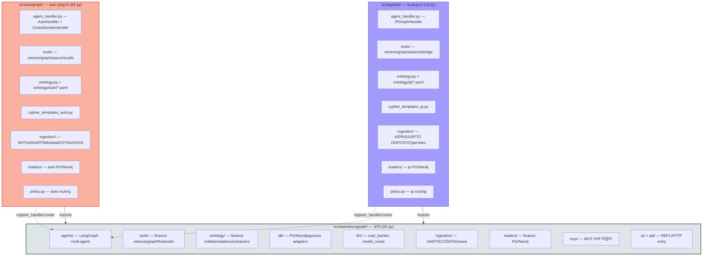
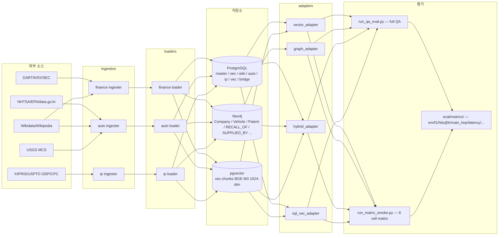
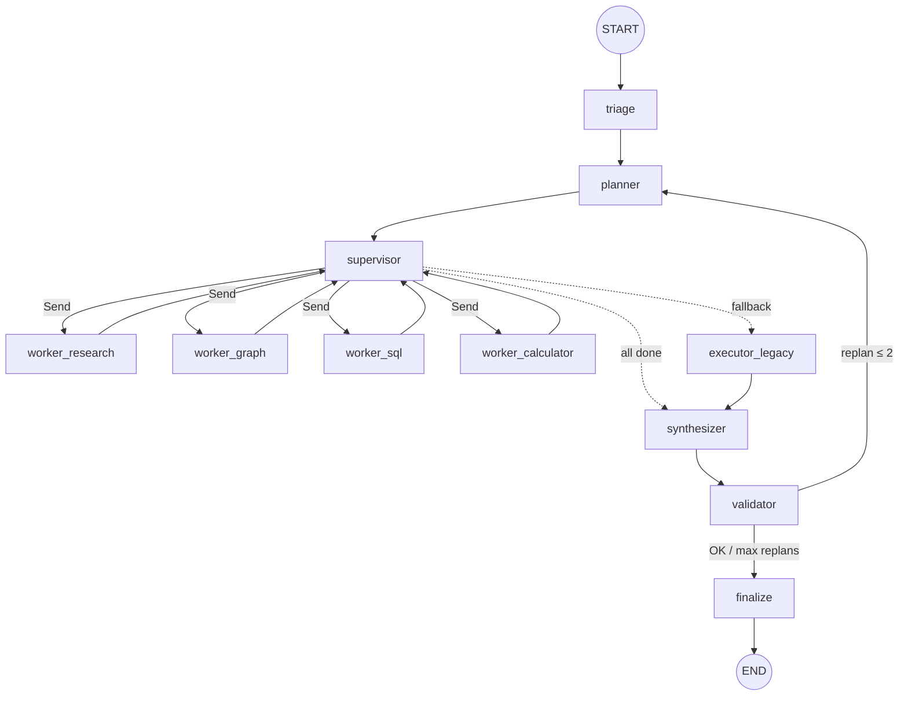

# AutoNexusGraph 시스템 아키텍처

> **본 문서의 위치**: 시스템 **구조 SSOT**. 패키지 토폴로지 / 도메인 모듈 / 데이터 흐름 /
> LangGraph 노드 / plug-in 등록 메커니즘 / SSOT 위치 색인을 한 자리에 모은다.
> 수치 + 요구사항 + DoD 20항 모두 [README.md](../README.md) (통합 SSOT v3.0) 가 SSOT, 결정·열린 질문은
> [docs/mental_model.md](mental_model.md), 도메인 상세는 [docs/autograph.md](autograph.md) /
> [docs/process_graph.md](process_graph.md) / [docs/ipgraph.md](ipgraph.md) 가 분담.
>
> **v3.0 — 2026-06-02**. 3 도메인 (finance / auto + process / ip) + plug-in 확장 모델.

---

## 1. 한 줄 정의

AutoNexusGraph 는 **N-domain GraphRAG umbrella** — 단일 코어 (LangGraph multi-agent + 3-store
PG/Neo4j/pgvector + cost/cypher guard) 위에 **도메인 plug-in** 을 import-side-effect 로
자동 등록하는 구조. 현재 1 코어 + 2 plug-in (finance 는 코어 내장):

| 패키지 | py 파일 | 역할 | 상태 |
|---|---:|---|---|
| `src/autonexusgraph/` | 106 | 코어 (finance 도메인 + LangGraph + 공통 인프라) | ✅ 완료 |
| `src/autograph/` | 97 | auto plug-in (자동차 OEM/부품/리콜 + BoP 공정) | ✅ MVP 안정 |
| `src/ipgraph/` | 21 | ip plug-in (특허·기술혁신, 보조축) | ✅ 코드/온톨로지/스키마 완료, 특허 데이터 (KIPRIS/USPTO ODP) 적재 대기 |

핵심 정책: **코어는 plug-in 을 직접 import 하지 않는다** (역의존 0건). plug-in 이 import 되는
순간 부작용으로 `register_handler` / `register_router` 가 호출되어 코어 라우터에 합류.
ENV `AUTONEXUSGRAPH_DOMAIN_PLUGINS` (csv, 기본 `autograph`) 가 import 대상 모듈을 지정.

---

## 2. 패키지 토폴로지



**의존 방향 (검증)**: `grep -rn '^from autograph\|^import autograph' src/autonexusgraph/` → 0 건.
`grep -rn '^from ipgraph\|^import ipgraph' src/autonexusgraph/ src/autograph/` → 0 건.
**코어는 plug-in 을 모른다.** 코어 변경 없이 새 도메인 추가 가능 (README §10.15 baseline reset).

---

## 3. 도메인별 모듈 매트릭스

| 모듈 카테고리 | autonexusgraph (코어/finance) | autograph (auto) | ipgraph (ip) |
|---|---|---|---|
| **agent_handler** | (코어 자체) | `agent_handler.py` `AutoHandler` + `CrossDomainHandler` | `agent_handler.py` `IPGraphHandler` |
| **policy / router** | `agents/_domain_handler.py` registry | `policy.py` `route_domain_auto` | `policy.py` `route_domain_ip` |
| **tools (LLM 호출)** | `tools/` finance retrieve/graph/financials | `tools/` retrieve/graph/specs/recalls | `tools/` retrieve/graph/patents/bridge |
| **cypher 템플릿** | (코어 SafeCypher) | `cypher_templates_auto.py` `auto_*` | `cypher_templates_ip.py` `ip_*` |
| **ontology** | `ontology/` + `ontology/entities.yaml` / `relations.yaml` | `ontology.py` + `ontology/auto/*.yaml` | `ontology.py` + `ontology/ip/*.yaml` |
| **ingestion (raw 수집)** | `ingestion/` DART/ECOS/FSS/news | `ingestion/` NHTSA/Wikidata/KOTSA/USGS/Wikipedia/DART 부록 | `ingestion/` KIPRIS/USPTO ODP/CPC/OpenAlex |
| **loaders (PG/Neo4j 적재)** | `loaders/` finance | `loaders/` (+ `_neo4j_helpers.py` 공통, BoP: `load_auto_process_*` / `load_factoryon_plants` / `load_performed_at` / `load_recall_process_map` / `load_process_resources` / `load_produced_by`) | `loaders/` (`load_cpc` / `load_openalex` / `load_kipris` / `load_uspto_odp`) |
| **gold QA** | `eval/qa_gold/gold_qa_v0.jsonl` (30) | `eval/qa_gold/gold_qa_auto_v0.jsonl` (46) | `eval/qa_gold/gold_qa_ip_v0.jsonl` (30, gold_answer 채우기는 KIPRIS/USPTO 적재 후) |
| **cross_domain QA** | `eval/qa_gold/gold_qa_cross_v0.jsonl` (44 실측. level: CD-L1=10 / L2=8 / L3=12 / L4=8 + 6 row IP 결합 변형) — 공통 영역 |||

**onlogy SSOT**: `ontology/<domain>/relations.yaml` 헤더 1곳에 `schema_version` 정의. 로더는
`default_schema_version()` 로 동적 회수 — 코드에 박지 않는다 (README §3.7).

**의무 메타 강제** (README §3.7): 모든 Neo4j 엣지 적재 시 `source_type` / `source_id` /
`confidence_score` / `snapshot_year` / `schema_version` 필수. `_neo4j_helpers.py:edge_meta_cypher()`
가 통합 진입점. `scripts/audit/edge_meta_invariants.py` 가 사후 검증.

---

## 4. 데이터 흐름 (end-to-end)



### 4.1 SQL 마이그레이션 30개 (`infra/postgres/init/` — 01~29 + 12a/12b 별도)

| Prefix | 파일 | 도메인 | 역할 |
|---|---|---|---|
| 01 | `01_schema.sql` | core | 기본 메타·스키마 정의 |
| 02 | `02_entity_resolution.sql` | core | corp_code/QID/LEI 다형 마스터 |
| 03 | `03_news_articles.sql` | finance | 뉴스·보도자료 |
| 04 | `04_external_data.sql` | finance | ESG/KOSIS/특허 슬롯·운영 메트릭 |
| 05 | `05_vec_chunks_meta.sql` | vec | RAG 필터 메타 |
| 06 | `06_llm_usage.sql` | ops | LLM 사용량·비용 |
| 07 | `07_autograph.sql` | auto | 자동차 도메인 스키마 |
| 08 | `08_bridge.sql` | bridge | finance ↔ auto 매칭 |
| 09 | `09_vec_chunks_auto_meta.sql` | vec | auto 메타 추가 |
| 10 | `10_autograph_bom.sql` | auto | BOM 계층 L0~L5 |
| 11 | `11_autograph_staging.sql` | auto | suppliers 마스터 + P3 staging |
| 12a | `12a_autograph_inspections.sql` | auto | KOTSA 수리검사 (data.go.kr 15155857) |
| 12b | `12b_autograph_investigations.sql` | auto | NHTSA ODI 조사 |
| 13 | `13_autograph_oem_sec.sql` | auto | 글로벌 OEM SEC EDGAR |
| 14 | `14_master_entities.sql` | core | master.entities 다형 ER |
| 15 | `15_autograph_production.sql` | auto | DART 사업보고서 생산·설비 |
| 16 | `16_autograph_kama_macro.sql` | auto | KAMA 매크로 통계 |
| 17 | `17_autograph_oem_news.sql` | auto | OEM IR/뉴스룸 본문 |
| 18 | `18_ipgraph.sql` | ip | IPGraph 핵심 스키마 |
| 19 | `19_ipgraph_bridge.sql` | ip-bridge | `ip.assignee_corp_map` |
| 20 | `20_auto_minerals.sql` | auto-L6 | USGS MCS 결정적 SSOT |
| 21 | `21_auto_ev_chargers.sql` | auto | EV 충전 인프라 |
| 22 | `22_ip_works.sql` | ip | OpenAlex Work/Institution 슬롯 |
| 23 | `23_ip_cpc.sql` | ip | CPC 분류 bulk |
| 24 | `24_auto_factoryon.sql` | auto | 팩토리온 공장등록 |
| 25 | `25_auto_process_metrics.sql` | auto-BoP | KAMP 공정 metrics 슬롯 |
| 26 | `26_bridge_review.sql` | bridge | bridge candidate 검토 SOP |
| 27 | `27_auto_kamp_catalog.sql` | auto-BoP | KAMP 카탈로그 |
| 28 | `28_auto_defect_matches.sql` | auto | Recall ↔ DefectType 유사도 |
| 29 | `29_auto_failure_modes.sql` | auto | FailureMode / SUBJECT_TO / MANIFESTS_AS |

**적용 메커니즘**: postgres `docker-entrypoint-initdb.d` 가 알파벳 순으로 1회 실행
(빈 볼륨 첫 부팅 시). 데이터 보존된 환경에는 `make migrate-schema-pg
MIGRATE_FILE=<파일>` 으로 hot-apply ([docs/operations/migrations.md](operations/migrations.md)).

### 4.2 어댑터 4종 (`eval/adapters/`)

모든 어댑터는 `base.AgentResponse` (evidence / cypher / tokens_used / cost_usd) 통일 인터페이스.

| 어댑터 | 사용 store | 용도 |
|---|---|---|
| `vector_adapter` | pgvector | 단순 RAG 베이스라인 (BGE-M3 1024dim cosine + HNSW ef_search=400) |
| `graph_adapter` | Neo4j | Cypher 템플릿 multi-hop (vector 무시) |
| `hybrid_adapter` | pgvector + Neo4j | vector + cypher 병렬 후 머지 |
| `sql_vec_adapter` | PG 정형 + pgvector | 정량 SQL 조회 + 보조 RAG |

### 4.3 평가 runner

- `eval/runners/run_qa_eval.py` — full QA 평가 (LLM 실호출, predictions.jsonl, manifest.json,
  cost 누적, em/f1/hits@k/cypher_execution_accuracy 산정)
- `eval/runners/run_matrix_smoke.py` — README §10.17(d) 축소 매트릭스 (4 어댑터 × rerank{on/off} = 8 셀,
  simulation/full 모드, thesis headline 자동 계산)

---

## 5. LangGraph 노드 토폴로지

`src/autonexusgraph/agents/graph.py` 가 진입점. langgraph 설치 시 StateGraph, 미설치 시 함수 체인 폴백.



**노드 책임 + AgentState 34 필드 read/write 매트릭스** (`agents/state.py:99-161`):

| 노드 | 책임 | read 필드 (entry-only / 누적) | write 필드 |
|---|---|---|---|
| `triage` | 사용자 발화 → 도메인 분류 + 의도 추출 + 모호성 감지 | `question` / `history` / `domain` (hint) | `question_rewritten` / `temporal_audit` / `rewrite_audit` / `safety_signals` / `pending_interrupt` (모호성 시) / `domain` (auto_detect 결과) |
| `planner` | task DAG 생성 (multi-hop 분해) — handler 의 `plan_tasks()` 호출 | `question_rewritten` / `domain` / `target_*` / `safety_signals` | `question_kind` / `target_companies` / `session_carryover` / `plan` / `tasks` |
| `supervisor` | 의존성 없는 task 병렬 Send dispatch (langgraph 활성 시) | `tasks` (의존성 그래프) | `_current_task` (Send 한정, 결과 누적 후 제거) |
| `worker_research` | LLM Q&A (자유 회신) — `tools/retrieve.py` 호출 가능 | `_current_task` / `domain` (toolbox 선택) / `evidence_chunks` | `task_results[id]` / `tool_results[]` / `evidence_chunks[]` |
| `worker_graph` | Cypher 템플릿 호출 (`tools/graph.py` + `cypher_templates_*`) — `cypher_guard.assert_read_only` 강제 | `_current_task` / `domain` | `task_results[id]` / `tool_results[]` / `graph_subgraph` |
| `worker_sql` | PG 정형 조회 (`tools/financials.py` / `spec.py` / `patents.py`) | `_current_task` / `domain` | `task_results[id]` / `tool_results[]` |
| `worker_calculator` | 산술 sandbox (`numexpr`) — 그래프·SQL 결과 후처리 | `_current_task` / `tool_results` | `task_results[id]` |
| `executor_legacy` | tasks DAG 비어 있고 plan 만 있을 때 호환 경로 | `plan` (legacy) | `tool_results` / `evidence_chunks` |
| `synthesizer` | worker 결과 통합 + 답안 생성 + number_guard 마스킹 | `question_rewritten` / `tool_results` / `evidence_chunks` / `graph_subgraph` / `tasks` | `answer` / `citations` / `visualizations` / `llm_usage_usd` (증가) |
| `validator` | 6 검사 (length / self-report bypass / language / grounding / hallucinated_numbers / edge_confidence) + replan 트리거 | `answer` / `tool_results` / `evidence_chunks` / `graph_subgraph` / `n_replans` | `validation_status` / `validation_issues` / `grounding` / `n_replans` (replan 시 증가) |
| `finalize` | 실패 응답 패키징 (`⚠️ 검증 실패 (replan n/MAX 후)` 프리픽스) | `validation_status` / `validation_issues` / `answer` / `n_replans` | `answer` (프리픽스 추가) |

**AgentState 34 필드 그룹** (state.py:99-161 의 `Annotated[..., _last_wins|_list_extend]` 필드):

| 그룹 | 필드 수 | 필드 이름 | 채우는 노드 |
|---|---:|---|---|
| **입력** | 7 | `thread_id`, `question`, `history`, `domain`, `target_vehicles`, `target_models`, `target_makes` | 외부 호출자 / `run_agent` |
| **전처리·평가 메타** | 4 | `rerank`, `question_rewritten`, `temporal_audit`, `rewrite_audit` | triage |
| **안전 신호** | 1 | `safety_signals` (reducer: `_list_extend`) | 모든 노드 누적 |
| **Triage·Planner 산출** | 5 | `question_kind`, `target_companies`, `session_carryover`, `plan`, `tasks` | triage(부분) + planner |
| **Worker 누적** | 5 | `task_results`, `tool_results`, `evidence_chunks`, `graph_subgraph`, `fallback_used` | research / graph / sql / calculator + executor_legacy |
| **합성** | 3 | `answer`, `citations`, `visualizations` | synthesizer |
| **검증** | 3 | `validation_status`, `validation_issues`, `grounding` | validator |
| **HITL** | 3 | `pending_interrupt`, `interrupt_response`, `interrupt_handled` | triage(clarification) / planner(cost) / synthesizer(sensitive) |
| **메타** | 3 | `llm_usage_usd`, `n_replans`, `aborted_reason` | tracing / validator / 모든 노드 |

→ 합 7+4+1+5+5+3+3+3+3 = **34 필드**. 안전 신호만 `_list_extend` (병렬 worker 신호 누적), 나머지는 `_last_wins` reducer (병렬 worker 의 entry-only 필드 충돌 회피).

**replan 사이클** — `validator` 실패 → `mark_replan()` 이 `tool_results / evidence_chunks / plan / tasks / answer` 초기화 + `n_replans += 1` → `planner` 재진입 (`validator.py:184-195`). `n_replans >= MAX_REPLANS (=2)` 면 `finalize` 로.

**도메인 라우팅**: `triage` 노드가 `_domain_handler.auto_detect_domain(question)` 호출 (`_domain_handler.py:246`) → 등록된 라우터 (autograph: `route_domain_auto`, ipgraph: `route_domain_ip`, finance: 코어 기본) 가 순차 평가 → 최초 match 되는 도메인의 `DomainHandler` 가 worker 호출 시 사용됨.

**Tracing**: `agents/tracing.py` `start_turn_context(thread_id, state)` 가 ContextVar 로 turn 단위 격리. cost_tracker 통합 (README §10.17(b)).

**PG checkpoint**: `chat` 스키마에 langgraph state 저장 ([docs/operations/agents.md](operations/agents.md)). multi-turn thread 보존.

---

### 5.1 설계 결정 — 대안과 기각 사유

> 사용자 작업 지시: "각 설계 결정에 대안과 기각 사유. 실제 코드 경로 인용."

**(a) 왜 Neo4j + PostgreSQL + pgvector 3-store?**

- **대안 1 — Neo4j 단독**: 관계 traversal 은 강력하지만, XBRL 재무 같은 정확한 수치 store + 시계열 집계 약함 (Cypher 의 numeric aggregation 은 SQL window function 보다 표현력 부족). pgvector 같은 ANN 인덱스 부재로 대량 청크 의미 검색 느림. **기각**.
- **대안 2 — PostgreSQL 단독 (pgvector + JSONB)**: 모두 담을 수 있으나, 다중 홉 그래프 traversal (`(:Manufacturer)-[:CONTAINS_MODULE*1..3]->(:Module)-[:SUPPLIED_BY]->(:Supplier)`) 을 SQL recursive CTE 로 흉내내면 쿼리 복잡도 폭발 + 인덱스 활용 불가. Neo4j 의 native graph storage 가 다중 홉에서 압도적. **기각**.
- **대안 3 — Qdrant 분리 (pgvector 대신)**: 분산·고성능 ANN 이지만 별도 노드 운영 + 메타 join 시 PG round-trip 비용. 청크 ≥ 100만 도달 시 분리 옵션 (`docs/mental_model.md §3` 트레이드오프 박스). **유보** — 현재 750K 청크에서는 pgvector hnsw 충분.
- **선택 = Neo4j 5.18 + PostgreSQL 16 (pgvector 내장)** — "올바른 도구를 올바른 일에" 원칙. 코드 진입점: `db/neo4j.py` / `db/postgres.py` / `tools/retrieve.py` (pgvector cosine + hnsw + 메타 필터).

**(b) 왜 LangGraph supervisor + Send-API 병렬 패턴?**

- **대안 1 — 직접 라우팅 (코드 if/else)**: tools 호출 순서를 코드에 박는 방식. 새 task 유형 추가마다 라우팅 코드 수정 — 도메인 확장성 부족. **기각**.
- **대안 2 — 순차 worker 호출 (Send-API 없음)**: 의존성 그래프 무시하고 순차 — multi-hop 질문에서 latency 비례 증가. **부분 채택** (langgraph 미설치 환경에서 `_run_with_fallback_chain` 으로 fallback, `graph.py:210-224`).
- **대안 3 — Plan-and-Execute (planner 한 번 + executor 한 번)**: 한 번에 다 풀어서 보내는 방식. replan 트리거 정의가 모호하고, validator 와의 결합 약함. **기각**.
- **선택 = StateGraph + supervisor + Send-API** — supervisor 가 의존성 그래프의 unblocked task 만 Send 로 병렬 발사 (`agents/supervisor.py:sup_send_directives`), worker 완료 후 supervisor 로 복귀, 모두 done 일 때 synthesizer. validator 가 fail 시 planner 로 재진입 (`graph.py:_route_after_validator:60`).

**(c) 왜 plug-in ENV-based discover (vs setuptools entry_points)?**

- **대안 1 — `setuptools entry_points`**: 표준이지만 패키지 설치 (pip install) 필요. 개발·테스트 환경에서 ENV 만 바꾸는 게 빠름. CI/CD 통합 복잡. **기각**.
- **대안 2 — Hard-coded import (`from autograph import ...`)**: 코어가 도메인을 알아야 함 — 역의존 0건 정책 위배. README §10.15 "core 변경 < 5%" 위배. **기각**.
- **대안 3 — Plugin discovery via filesystem scan**: `src/*graph/` 패턴 scan. 명시성 부족 (왜 이 도메인이 import 되었는가 불명). **기각**.
- **선택 = ENV `AUTONEXUSGRAPH_DOMAIN_PLUGINS` (CSV)** — 명시적 (`.env` 에 적힌 도메인만 활성), 운영자 친화적 (KIPRIS 키 없으면 ip 빼면 됨), CI 친화적 (테스트는 finance 만으로 가능). 코드: `_domain_handler.py:130 os.getenv("AUTONEXUSGRAPH_DOMAIN_PLUGINS", DEFAULT_DOMAIN_PLUGINS)`.

**(d) 왜 `_last_wins` reducer (vs append / merge)?**

- **대안 1 — append (모든 worker 결과 누적)**: 같은 task ID 가 여러 번 보낸 결과를 다 보관 — 메모리 폭증 + synthesizer 중복 인용.
- **대안 2 — keep_first**: multi-turn 시 첫 turn 의 question 이 영구 유지되어 후속 turn 들이 같은 질문 처리하는 버그 (`state.py:28-30` 주석 명시).
- **선택 = `_last_wins`** (`state.py:19-32`): 새 값 (`new`) 이 `None` 이면 old 유지 (worker partial return 보호), 그 외엔 last wins. multi-turn 의 새 question 채택 + 병렬 worker 의 entry-only 필드 (thread_id / question / domain / plan / tasks) 충돌 회피.

**(e) 왜 4 가드 — 합쳐지지 않은 이유?**

- **대안 — 단일 통합 가드 (`safety_guard.run(state)` 한 번 호출)**: 가드 4개를 한 함수로 묶으면 호출 단순. 단점은 각 가드의 **실행 시점이 다름** — 시점이 같지 않으면 통합 호출 불가.
- **각 가드의 실행 시점이 본질적으로 분리**:
  - **prompt_safety** — `triage_node` **진입 직후** (`agents/nodes.py:triage_node`). 사용자 입력의 injection 단발 감지 — 입력 단계에서만 의미.
  - **cypher_guard** — `worker_graph` 의 **Cypher 호출 직전** (`safety/cypher_guard.py:assert_read_only:68`). 템플릿 매개변수 치환 후 실제 query 검증.
  - **number_guard** — `synthesizer_node` **사전** (`agents/number_guard.py`). LLM 프롬프트 조립 시 evidence 안의 큰 숫자를 화이트리스트로 마스킹.
  - **language_guard** — `validator` **사후** (`safety/language_guard.py:16`). 답변 완료 후 한국어 비율 검증 (`FINGRAPH_MIN_KOREAN_RATIO=0.30`).
- **선택 = 4 독립 가드** — 시점 분리가 본질이므로 통합 불가능. 각 가드의 fail 모드도 다름 (prompt = 단발 차단 / cypher = exception / number = 마스킹 / language = validator soft warn).

**(f) 왜 cost 3 tier — 세션·turn·호출 3 계층?**

- **단일 한도의 한계**: 한 한도만 두면 (a) 세션 누적은 작은데 한 turn 이 폭주 / (b) 한 turn 은 작은데 세션 누적이 큰 두 실패 모드를 모두 방어 못 함.
- **각 tier 가 막는 실패 모드**:
  - **세션 hard limit** (`LLM_SESSION_HARD_LIMIT_USD=5.00`, `llm/cost.py:141`) — 영속 누적. 일·주 단위 폭주 차단. cost_log.jsonl 기반.
  - **도메인별 turn budget** (`config.turn_budget_for_domain`, ENV `LLM_TURN_BUDGET_<DOMAIN>_USD` override) — 한 대화 turn 의 LLM 비용 한도. finance·auto·ip 가 다른 한도 (정형 도메인 ip 는 1/10 수준).
  - **호출별 사전 추정** (`agents/cost_estimator.py`) — Rewriter·Synthesizer·Title 각 호출 시작 전 토큰·비용 추정. `LLM_COST_AUTO_APPROVE_USD=0.50` 초과 시 HITL 승인 interrupt.
- **선택 = 3 tier 직교** — 세 tier 가 직교적 실패 모드를 막음. ENV override 로 도메인·운영 환경별 조정 가능.

**(g) 왜 Bridge confidence 임계 0.5?**

- **대안 1 — 임계 없음 (모든 매칭 사용)**: name fuzzy 매칭의 false positive 가 cross-domain 답변 노이즈로 직결. 한국어 회사명 동음이의 (예: "한국타이어" vs "한국타이어앤테크놀로지") 가 흔함. **기각**.
- **대안 2 — 임계 0.7~0.9 (보수)**: candidate 만으로 cross-domain 질의의 절반이 결과 0 — recall 폭락.
- **대안 3 — match_method 별 다른 임계**: QID/LEI/SEC CIK 는 0.95 (정확) / business_no 0.85 / name fuzzy 0.65. 복잡도 증가, 운영 시 임계 관리 비용.
- **선택 = 단일 임계 0.5** (`validator.py:43 LOW_CONFIDENCE_THRESHOLD`) — strong/medium 모두 통과시키되 hard fail 은 "edge 전부 < 0.5" (all_low). 일부만 낮으면 soft warning (`some_low`). 운영 단순 + cross-domain recall 보존.
- **트레이드오프 수용**: medium confidence (0.5~0.8) candidate 가 답변에 포함되면 validator 가 some_low warning + 답변에 confidence 노출 (Streamlit `≥0.9 ✓ / 0.5~0.9 ⚠ / <0.5 ❌`).

**(h) 왜 Replan MAX=2 (vs 무한 / 1회 / 5회)?**

- **대안 1 — 무한 replan**: validator 가 같은 fail 신호를 반복 보내면 무한 루프 — 비용 폭주.
- **대안 2 — 1회 (MAX=1)**: 첫 시도 + 1회 재시도 = 총 2회. 한 번 fail 시 부분 답변 반환. 너무 보수적 — multi-hop 질문에서 부분 답변 비율↑.
- **대안 3 — 5회 이상**: replan_factor 가 6 이상 — 사전 추정 비용 6배. 대부분의 fail 은 2회 이내 회복 (LLM stochasticity + planner 재호출이 같은 question 으로 시작).
- **선택 = MAX=2** (`validator.py:36`) — 총 3회 synthesizer 호출 (base + 2 replan). 비용 사전 추정 `replan_factor = MAX_REPLANS + 1 = 3` (`cost_estimator.py:100-102`) 으로 최악 시나리오 보장. mark_replan 시 `tool_results / evidence_chunks / plan / tasks / answer` 리셋 + `n_replans += 1` (`validator.py:184-195`).
- **[열린 질문]** planner 가 `validation_issues` 신호를 다음 plan 에 실제로 반영하는지 — replan 의미는 두 시도가 달라야만. (`docs/mental_model.md §5.10` 참조.)

---

## 6. Plug-in 등록 메커니즘

### 6.1 흐름

```
1. 코어 import 시 (`autonexusgraph.agents._domain_handler` 로드)
   └ discover_plugins() 가 ENV `AUTONEXUSGRAPH_DOMAIN_PLUGINS` (기본 "autograph") 파싱
2. 각 모듈명을 `importlib.import_module(name)` 으로 import (한 번만 — `_DISCOVERY_DONE` 플래그 + `_DISCOVERY_LOCK`, `_domain_handler.py:105-106`)
3. 도메인 패키지의 `__init__.py` 가 `from . import agent_handler` 부작용 실행
4. agent_handler 모듈 import 시 모듈 최상단에서
   `register_handler(AutoHandler())` + `register_handler(CrossDomainHandler())` 호출
5. 코어 _HANDLERS dict 에 domain 키로 등록 — idempotent (덮어쓰기)
```

### 6.1.1 순환 import 회피 — 왜 코어가 멈추지 않는가

코어가 plug-in 을 직접 import 하지 않는데도 plug-in 이 코어를 import 하면 순환 import 가 발생할 수 있다. 본 시스템은 다음 4가지로 회피:

1. **단방향 의존**: plug-in (`autograph`, `ipgraph`) → 코어 (`autonexusgraph`) **만** 허용. 코어 안 어디에서도 `from autograph` / `from ipgraph` 등 plug-in import 금지. 빠른 검증: §9 의 `grep -rn '^from autograph' src/autonexusgraph/` → 0 건.
2. **지연 import (lazy load)**: `discover_plugins()` 는 코어 모듈 로드 시점이 아니라 **첫 핸들러 조회 시점** 에 호출 (`_domain_handler.py:175 get_handler`). 코어가 import 되는 동안엔 plug-in 이 import 되지 않으므로 cyclic 위험 0.
3. **idempotent registration**: `register_handler` 가 dict 덮어쓰기 — 동일 모듈이 두 번 import 돼도 안전.
4. **plug-in 의 `register_handler` import 경로 단순화**: `from autonexusgraph.agents._domain_handler import register_handler` 만 — 코어의 상위 모듈 (`autonexusgraph.agents`) 의 `__init__.py` 를 건드리지 않아 추가 사이드이펙트 없음.

→ 결과: `python -c "import autonexusgraph"` 는 plug-in 없이도 부팅. `from autonexusgraph.agents._domain_handler import get_handler; get_handler("auto")` 호출 시점에 ENV 기반 plug-in 1회 import (`_domain_handler.py:180`).

### 6.2 새 도메인 4번째 추가 시 체크리스트

> **현 단계 비목표** ([README §9](../README.md#9-비목표-non-goals)) — 의약품/전자제품/에너지/식품은 다루지 않음. ip 가 §10.15 < 5% 를 실측 증명한 뒤 Phase D/E 진입 여부를 재의사결정. 아래 체크리스트는 그 시점의 참조용.

| 항목 | 위치 |
|---|---|
| 패키지 골격 | `src/<domain>graph/` (autograph/ipgraph 와 동일 layout) |
| `agent_handler.py` | `<Domain>Handler` 클래스 + `register_handler(...)` 부작용 |
| `policy.py` | `route_domain_<domain>` 함수 + `register_router(...)` |
| `ontology.py` + `ontology/<domain>/*.yaml` | entities/relations/extractors |
| `cypher_templates_<domain>.py` | `<domain>_*` 템플릿 |
| `tools/` | retrieve/graph 도메인별 메타 필터 |
| `ingestion/` + `loaders/` | 외부 소스 → PG/Neo4j |
| `infra/postgres/init/<NN>_<domain>.sql` | 새 스키마 prefix 부여 |
| `eval/qa_gold/gold_qa_<domain>_v0.jsonl` | 30+ 문항 seed |
| ENV `AUTONEXUSGRAPH_DOMAIN_PLUGINS` | csv 에 추가 |
| **코어 변경** | **0건이 목표** — README §10.15 baseline reset 후 측정 |

---

## 7. SSOT 위치 색인

| 무엇이 | 어디서 SSOT | 갱신 방법 |
|---|---|---|
| 데이터 카운트·수치 | [README.md §1](../README.md) | ingestion 재실행 후 PG/Neo4j 직접 쿼리 |
| 요구사항 / DoD 20항 | [README.md §10](../README.md#10-dod-definition-of-done--20-항) | 버전 bump (v3.x) |
| 도메인1 (finance) 상세 | core 코드 (별도 가이드 없음) — README §1 finance 절 | — |
| 도메인2 (auto) 상세 | [docs/autograph.md](autograph.md) | PR 와 동기 |
| 도메인2-심화 (process BoP, 주요 축) | [docs/process_graph.md](process_graph.md) | PR 와 동기 |
| 도메인3 (ip 보조축) 상세 | [docs/ipgraph.md](ipgraph.md) | PR 와 동기 |
| 결정·트레이드오프·열린 질문 | [docs/mental_model.md](mental_model.md) | 결정 시 confirmed/잠정/미정 라벨 |
| 이론·알고리즘 (BGE-M3, HNSW, LangGraph 등) | [docs/learning_guide.md](learning_guide.md) | 변경 적음 |
| 외부 데이터 소스 카탈로그 | [docs/data_sources.md](data_sources.md) | 신규 채널 도입 시 |
| 운영 절차 (마이그레이션·docker·MCP) | [docs/operations/](operations/) | 절차 변경 시 |
| 온톨로지 schema_version | `ontology/<domain>/relations.yaml` 헤더 | yaml 한 곳 |
| Neo4j 의무 메타 키 5종 | `src/autograph/loaders/_neo4j_helpers.py:edge_meta_cypher()` | 헬퍼 한 곳 |
| Cypher 템플릿 | `cypher_templates_<domain>.py` `<DOMAIN>_TEMPLATES` 레지스트리 | 도메인별 |
| gold QA 행 수 | `eval/qa_gold/*.jsonl` (자체) | jsonl 수정 |
| 어댑터 인터페이스 | `eval/adapters/base.py` `AgentResponse` / `Evidence` | base 한 곳 |
| LangGraph 노드 정의 | `src/autonexusgraph/agents/graph.py` `_build_langgraph_app()` | 코드 한 곳 |
| Plug-in 등록 정책 | `src/autonexusgraph/agents/_domain_handler.py` | ENV + 한 곳 |

---

## 8. 문서 간 분담 (중복 회피)

| 문서 | 라인 수 | 분담 |
|---|---:|---|
| README.md | ~1440 | **통합 SSOT v3.0** — 정량 수치 + 요구사항 + DoD 20항 + 로드맵 + 의사결정 로그 + Quickstart |
| **docs/architecture.md (본 문서)** | ~420 | **구조 SSOT** — 패키지/노드/SSOT 색인 |
| docs/autograph.md | ~590 | 도메인2 (auto) 단독 SSOT |
| docs/process_graph.md | ~110 | 도메인2-심화 (process BoP, 주요 축) 단독 SSOT |
| docs/ipgraph.md | ~265 | 도메인3 (ip 보조축) 단독 SSOT |
| docs/mental_model.md | ~1150 | 결정·트레이드오프·열린 질문 |
| docs/learning_guide.md | ~1830 | 이론 (BGE/HNSW/LangGraph/리랭커) + 세미나 Q&A |
| docs/data_sources.md | ~495 | 외부 데이터 소스 카탈로그 |
| docs/operations/* | — | 운영 절차 (migrations / docker / agents / rag_tools) |

**중복 검출 정책**: 본 architecture.md 와 다른 문서가 같은 사실을 다룰 때 architecture.md
가 우선. 다른 문서는 본 문서로 cross-link. 예:
- mental_model.md 의 "구조 요약" 절은 본 문서 §2 (토폴로지) 로 cross-link
- autograph.md / ipgraph.md 의 "전체 시스템 개요" 절은 본 문서 §3 (모듈 매트릭스) 로 cross-link
- README.md §15 "확장성 (Domain plug-in)" 짧은 설명은 본 문서 §6 으로 cross-link

---

## 9. 빠른 검증 명령

```bash
# 패키지 의존 방향 (역의존 0건 검증)
grep -rn '^from autograph\|^import autograph' src/autonexusgraph/ src/ipgraph/  # 0 expected
grep -rn '^from ipgraph\|^import ipgraph' src/autonexusgraph/ src/autograph/    # 0 expected

# SQL 마이그레이션 순서 깨끗
ls infra/postgres/init/ | sort  # prefix 충돌 없음 (12a/12b 분리 후)

# 의무 메타 강제 (Neo4j 모든 엣지)
python3 scripts/audit/edge_meta_invariants.py

# 온톨로지 schema_version 일관성
python3 scripts/audit/ontology_validate.py

# 데이터 채널 트래픽 라이트
python3 scripts/audit/data_channels.py

# gold QA lint
python3 scripts/audit/validate_gold_qa.py --no-db eval/qa_gold/*.jsonl
```
