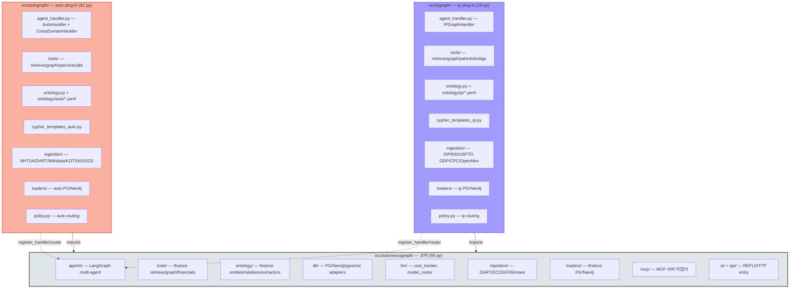
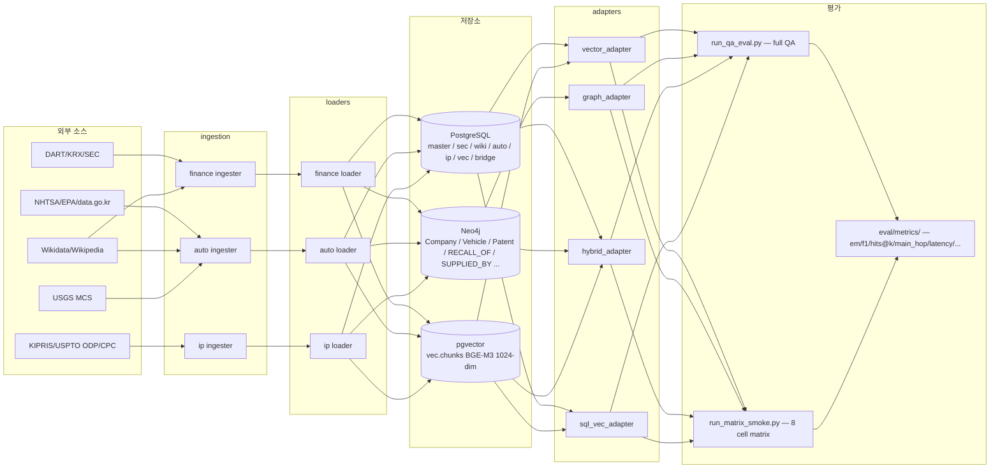
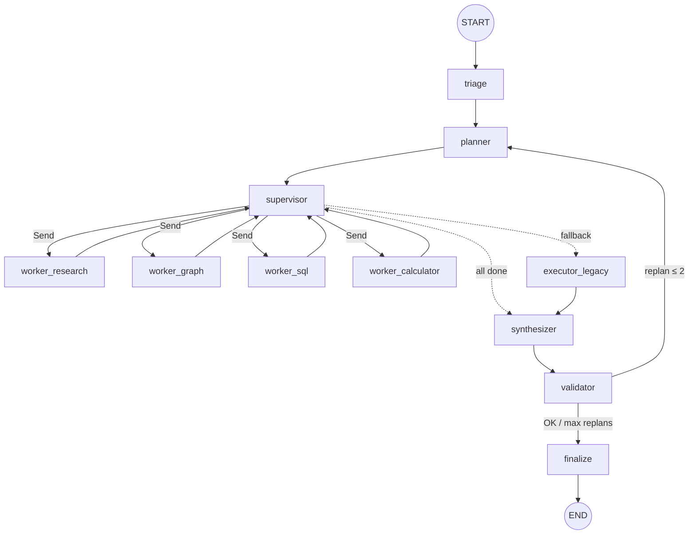

# AutoNexusGraph 시스템 아키텍처

> **본 문서의 위치**: 시스템 **구조 SSOT**. 패키지 토폴로지 / 도메인 모듈 / 데이터 흐름 /
> LangGraph 노드 / plug-in 등록 메커니즘 / SSOT 위치 색인을 한 자리에 모은다.
> 수치는 [README.md §1](../README.md) 이 SSOT, 요구사항은 [PRD.md](../PRD.md), 결정·열린 질문은
> [docs/mental_model.md](mental_model.md), 도메인 상세는 [docs/autograph.md](autograph.md) /
> [docs/ipgraph.md](ipgraph.md) 가 분담.
>
> **v2.2 — 2026-06-01**. 3 도메인 (finance / auto / ip) + plug-in 확장 모델.

---

## 1. 한 줄 정의

AutoNexusGraph 는 **N-domain GraphRAG umbrella** — 단일 코어 (LangGraph multi-agent + 3-store
PG/Neo4j/pgvector + cost/cypher guard) 위에 **도메인 plug-in** 을 import-side-effect 로
자동 등록하는 구조. 현재 1 코어 + 3 plug-in:

| 패키지 | py 파일 | 역할 | 상태 |
|---|---:|---|---|
| `src/autonexusgraph/` | 95 | 코어 (finance 도메인 + LangGraph + 공통 인프라) | ✅ 완료 |
| `src/autograph/` | 81 | auto plug-in (자동차 OEM/부품/리콜) | ⭐ MVP 안정 |
| `src/ipgraph/` | 18 | ip plug-in (특허·기술혁신, 도메인3) | 🔧 skeleton + outline |

핵심 정책: **코어는 plug-in 을 직접 import 하지 않는다** (역의존 0건). plug-in 이 import 되는
순간 부작용으로 `register_handler` / `register_router` 가 호출되어 코어 라우터에 합류.
ENV `AUTONEXUSGRAPH_DOMAIN_PLUGINS` (csv, 기본 `autograph`) 가 import 대상 모듈을 지정.

---

## 2. 패키지 토폴로지



**의존 방향 (검증)**: `grep -rn '^from autograph\|^import autograph' src/autonexusgraph/` → 0 건.
`grep -rn '^from ipgraph\|^import ipgraph' src/autonexusgraph/ src/autograph/` → 0 건.
**코어는 plug-in 을 모른다.** 코어 변경 없이 새 도메인 추가 가능 (PRD §10.15 baseline reset).

---

## 3. 도메인별 모듈 매트릭스

| 모듈 카테고리 | autonexusgraph (코어/finance) | autograph (auto) | ipgraph (ip) |
|---|---|---|---|
| **agent_handler** | (코어 자체) | `agent_handler.py` `AutoHandler` + `CrossDomainHandler` | `agent_handler.py` `IPGraphHandler` |
| **policy / router** | `agents/_domain_handler.py` registry | `policy.py` `route_domain_auto` | `policy.py` `route_domain_ip` |
| **tools (LLM 호출)** | `tools/` finance retrieve/graph/financials | `tools/` retrieve/graph/specs/recalls | `tools/` retrieve/graph/patents/bridge |
| **cypher 템플릿** | (코어 SafeCypher) | `cypher_templates_auto.py` `auto_*` | `cypher_templates_ip.py` `ip_*` |
| **ontology** | `ontology/` + `ontology/entities.yaml` / `relations.yaml` | `ontology.py` + `ontology/auto/*.yaml` | `ontology.py` + `ontology/ip/*.yaml` |
| **ingestion (raw 수집)** | `ingestion/` DART/ECOS/FSS/news | `ingestion/` NHTSA/Wikidata/KOTSA/USGS/Wikipedia/DART 부록 | `ingestion/` KIPRIS/USPTO ODP/CPC/OpenAlex |
| **loaders (PG/Neo4j 적재)** | `loaders/` finance | `loaders/` (+ `_neo4j_helpers.py` 공통) | `loaders/` |
| **gold QA** | `eval/qa_gold/gold_qa_v0.jsonl` (30) | `eval/qa_gold/gold_qa_auto_v0.jsonl` (49) | `eval/qa_gold/gold_qa_ip_v0.jsonl` (30, 적재 대기) |
| **cross_domain QA** | `eval/qa_gold/gold_qa_cross_v0.jsonl` (38, CD-L1~L4) — 공통 영역 |||

**onlogy SSOT**: `ontology/<domain>/relations.yaml` 헤더 1곳에 `schema_version` 정의. 로더는
`default_schema_version()` 로 동적 회수 — 코드에 박지 않는다 (PRD §6.7).

**의무 메타 강제** (PRD §6.7): 모든 Neo4j 엣지 적재 시 `source_type` / `source_id` /
`confidence_score` / `snapshot_year` / `schema_version` 필수. `_neo4j_helpers.py:edge_meta_cypher()`
가 통합 진입점. `scripts/audit/edge_meta_invariants.py` 가 사후 검증.

---

## 4. 데이터 흐름 (end-to-end)



### 4.1 SQL 마이그레이션 24개 (`infra/postgres/init/`)

| Prefix | 파일 | 도메인 | 역할 |
|---|---|---|---|
| 01 | `01_schema.sql` | core | 기본 메타·스키마 정의 |
| 02 | `02_entity_resolution.sql` | core | corp_code/QID/LEI 다형 마스터 |
| 03 | `03_news_articles.sql` | finance | 뉴스·보도자료 |
| 04 | `04_external_data.sql` | finance | ESG/KOSIS/특허 슬롯·운영 메트릭 |
| 05 | `05_vec_chunks_meta.sql` | vec | RAG 필터 메타 |
| 06 | `06_llm_usage.sql` | ops | LLM 사용량·비용 |
| 07 | `07_autograph.sql` | auto | 자동차 도메인 스키마 |
| 08 | `08_bridge.sql` | bridge | finance ↔ auto 매칭 |
| 09 | `09_vec_chunks_auto_meta.sql` | vec | auto 메타 추가 |
| 10 | `10_autograph_bom.sql` | auto | BOM 계층 L0~L5 |
| 11 | `11_autograph_staging.sql` | auto | suppliers 마스터 + P3 staging |
| 12a | `12a_autograph_inspections.sql` | auto | KOTSA 수리검사 (data.go.kr 15155857) |
| 12b | `12b_autograph_investigations.sql` | auto | NHTSA ODI 조사 |
| 13 | `13_autograph_oem_sec.sql` | auto | 글로벌 OEM SEC EDGAR |
| 14 | `14_master_entities.sql` | core | master.entities 다형 ER |
| 15 | `15_autograph_production.sql` | auto | DART 사업보고서 생산·설비 |
| 16 | `16_autograph_kama_macro.sql` | auto | KAMA 매크로 통계 |
| 17 | `17_autograph_oem_news.sql` | auto | OEM IR/뉴스룸 본문 |
| 18 | `18_ipgraph.sql` | ip | IPGraph 핵심 스키마 |
| 19 | `19_ipgraph_bridge.sql` | ip-bridge | `ip.assignee_corp_map` |
| 20 | `20_auto_minerals.sql` | auto-L6 | USGS MCS 결정적 SSOT |
| 21 | `21_auto_ev_chargers.sql` | auto | EV 충전 인프라 |
| 22 | `22_ip_works.sql` | ip | OpenAlex Work/Institution 슬롯 |
| 23 | `23_ip_cpc.sql` | ip | CPC 분류 bulk |
| 24 | `24_auto_factoryon.sql` | auto | 팩토리온 공장등록 |

**적용 메커니즘**: postgres `docker-entrypoint-initdb.d` 가 알파벳 순으로 1회 실행
(빈 볼륨 첫 부팅 시). 데이터 보존된 환경에는 `make migrate-schema-pg
MIGRATE_FILE=<파일>` 으로 hot-apply ([docs/operations/migrations.md](operations/migrations.md)).

### 4.2 어댑터 4종 (`eval/adapters/`)

모든 어댑터는 `base.AgentResponse` (evidence / cypher / tokens_used / cost_usd) 통일 인터페이스.

| 어댑터 | 사용 store | 용도 |
|---|---|---|
| `vector_adapter` | pgvector | 단순 RAG 베이스라인 (BGE-M3 1024dim cosine + HNSW ef_search=400) |
| `graph_adapter` | Neo4j | Cypher 템플릿 multi-hop (vector 무시) |
| `hybrid_adapter` | pgvector + Neo4j | vector + cypher 병렬 후 머지 |
| `sql_vec_adapter` | PG 정형 + pgvector | 정량 SQL 조회 + 보조 RAG |

### 4.3 평가 runner

- `eval/runners/run_qa_eval.py` — full QA 평가 (LLM 실호출, predictions.jsonl, manifest.json,
  cost 누적, em/f1/hits@k/cypher_execution_accuracy 산정)
- `eval/runners/run_matrix_smoke.py` — PRD §10.17(d) 축소 매트릭스 (4 어댑터 × rerank{on/off} = 8 셀,
  simulation/full 모드, thesis headline 자동 계산)

---

## 5. LangGraph 노드 토폴로지

`src/autonexusgraph/agents/graph.py` 가 진입점. langgraph 설치 시 StateGraph, 미설치 시 함수 체인 폴백.



**노드 책임**:
- `triage` — 사용자 발화 → 도메인 분류 (route_domain 호출) + 의도 추출
- `planner` — task DAG 생성 (multi-hop 분해)
- `supervisor` — 의존성 없는 task 병렬 Send (langgraph 활성 시)
- `workers` — research (LLM Q&A) / graph (Cypher) / sql (PG 정형) / calculator (산술)
- `synthesizer` — worker 결과 통합·답안 생성
- `validator` — 사실성 검증 + replan 트리거 (max 2회)
- `finalize` — 실패 응답 패키징

**도메인 라우팅**: `triage` 노드가 `_domain_handler.route_question(q)` 호출 → 등록된 라우터
(autograph: `route_domain_auto`, ipgraph: `route_domain_ip`, finance: 코어 기본) 가 순차 평가 →
최초 match 되는 도메인의 `DomainHandler` 가 worker 호출 시 사용됨.

**Tracing**: `agents/tracing.py` `start_turn_context(thread_id, domain)` 가 ContextVar 로
turn 단위 격리. cost_tracker 통합 (PRD §10.17(b)).

**PG checkpoint**: `chat` 스키마에 langgraph state 저장 (PRD §7.5.8).

---

## 6. Plug-in 등록 메커니즘

### 6.1 흐름

```
1. 코어 import 시 (`autonexusgraph.agents._domain_handler` 로드)
   └ discover_plugins() 가 ENV `AUTONEXUSGRAPH_DOMAIN_PLUGINS` (기본 "autograph") 파싱
2. 각 모듈명을 `importlib.import_module(name)` 으로 import
3. 도메인 패키지의 `__init__.py` 가 `from . import agent_handler` 부작용 실행
4. agent_handler 모듈 import 시 모듈 최상단에서
   `register_handler(AutoHandler())` + `register_handler(CrossDomainHandler())` 호출
5. 코어 _HANDLERS dict 에 domain 키로 등록 — idempotent (덮어쓰기)
```

### 6.2 새 도메인 4번째 추가 시 체크리스트

> **본 단계 비목표** (PRD §2.3, v2.2) — 의약품/전자제품/에너지/식품 영구 비목표.
> 아래 체크리스트는 ip 도메인이 <5% 정량 증명 (PRD §10.15) 한 후 미래 확장 시 참조.

| 항목 | 위치 |
|---|---|
| 패키지 골격 | `src/<domain>graph/` (autograph/ipgraph 와 동일 layout) |
| `agent_handler.py` | `<Domain>Handler` 클래스 + `register_handler(...)` 부작용 |
| `policy.py` | `route_domain_<domain>` 함수 + `register_router(...)` |
| `ontology.py` + `ontology/<domain>/*.yaml` | entities/relations/extractors |
| `cypher_templates_<domain>.py` | `<domain>_*` 템플릿 |
| `tools/` | retrieve/graph 도메인별 메타 필터 |
| `ingestion/` + `loaders/` | 외부 소스 → PG/Neo4j |
| `infra/postgres/init/<NN>_<domain>.sql` | 새 스키마 prefix 부여 |
| `eval/qa_gold/gold_qa_<domain>_v0.jsonl` | 30+ 문항 seed |
| ENV `AUTONEXUSGRAPH_DOMAIN_PLUGINS` | csv 에 추가 |
| **코어 변경** | **0건이 목표** — PRD §10.15 baseline reset 후 측정 |

---

## 7. SSOT 위치 색인

| 무엇이 | 어디서 SSOT | 갱신 방법 |
|---|---|---|
| 데이터 카운트·수치 | [README.md §1](../README.md) | ingestion 재실행 후 PG/Neo4j 직접 쿼리 |
| 요구사항 / DoD 17항 | [PRD.md](../PRD.md) §10 | 버전 bump (v2.x) |
| 도메인1 (finance) 상세 | core 코드 (별도 가이드 없음) — README §1 finance 절 | — |
| 도메인2 (auto) 상세 | [docs/autograph.md](autograph.md) | PR 와 동기 |
| 도메인3 (ip) 상세 | [docs/ipgraph.md](ipgraph.md) | PR 와 동기 |
| 결정·트레이드오프·열린 질문 | [docs/mental_model.md](mental_model.md) | 결정 시 confirmed/잠정/미정 라벨 |
| 이론·알고리즘 (BGE-M3, HNSW, LangGraph 등) | [docs/learning_guide.md](learning_guide.md) | 변경 적음 |
| 외부 데이터 소스 카탈로그 | [docs/data_sources.md](data_sources.md) | 신규 채널 도입 시 |
| 운영 절차 (마이그레이션·docker·MCP) | [docs/operations/](operations/) | 절차 변경 시 |
| 온톨로지 schema_version | `ontology/<domain>/relations.yaml` 헤더 | yaml 한 곳 |
| Neo4j 의무 메타 키 5종 | `src/autograph/loaders/_neo4j_helpers.py:edge_meta_cypher()` | 헬퍼 한 곳 |
| Cypher 템플릿 | `cypher_templates_<domain>.py` `<DOMAIN>_TEMPLATES` 레지스트리 | 도메인별 |
| gold QA 행 수 | `eval/qa_gold/*.jsonl` (자체) | jsonl 수정 |
| 어댑터 인터페이스 | `eval/adapters/base.py` `AgentResponse` / `Evidence` | base 한 곳 |
| LangGraph 노드 정의 | `src/autonexusgraph/agents/graph.py` `_build_langgraph_app()` | 코드 한 곳 |
| Plug-in 등록 정책 | `src/autonexusgraph/agents/_domain_handler.py` | ENV + 한 곳 |

---

## 8. 문서 간 분담 (중복 회피)

| 문서 | 라인 수 | 분담 |
|---|---:|---|
| README.md | 888 | 정량 수치 SSOT + 빠른 시작 |
| PRD.md | 738 | 요구사항 SSOT (§ 단위 절번호) + DoD 17항 |
| **docs/architecture.md (본 문서)** | ~300 | **구조 SSOT** — 패키지/노드/SSOT 색인 |
| docs/autograph.md | 559 | 도메인2 (auto) 단독 SSOT |
| docs/ipgraph.md | 254 | 도메인3 (ip) 단독 SSOT |
| docs/mental_model.md | 1091 | 결정·트레이드오프·열린 질문 |
| docs/learning_guide.md | 1260 | 이론 (BGE/HNSW/LangGraph/리랭커) |
| docs/data_sources.md | 495 | 외부 데이터 소스 카탈로그 |
| docs/operations/* | — | 운영 절차 (migrations / docker / agents / rag_tools) |

**중복 검출 정책**: 본 architecture.md 와 다른 문서가 같은 사실을 다룰 때 architecture.md
가 우선. 다른 문서는 본 문서로 cross-link. 예:
- mental_model.md 의 "구조 요약" 절은 본 문서 §2 (토폴로지) 로 cross-link
- autograph.md / ipgraph.md 의 "전체 시스템 개요" 절은 본 문서 §3 (모듈 매트릭스) 로 cross-link
- README.md §15 "확장성 (Domain plug-in)" 짧은 설명은 본 문서 §6 으로 cross-link

---

## 9. 빠른 검증 명령

```bash
# 패키지 의존 방향 (역의존 0건 검증)
grep -rn '^from autograph\|^import autograph' src/autonexusgraph/ src/ipgraph/  # 0 expected
grep -rn '^from ipgraph\|^import ipgraph' src/autonexusgraph/ src/autograph/    # 0 expected

# SQL 마이그레이션 순서 깨끗
ls infra/postgres/init/ | sort  # prefix 충돌 없음 (12a/12b 분리 후)

# 의무 메타 강제 (Neo4j 모든 엣지)
python3 scripts/audit/edge_meta_invariants.py

# 온톨로지 schema_version 일관성
python3 scripts/audit/ontology_validate.py

# 데이터 채널 트래픽 라이트
python3 scripts/audit/data_channels.py

# gold QA lint
python3 scripts/audit/validate_gold_qa.py --no-db eval/qa_gold/*.jsonl
```
