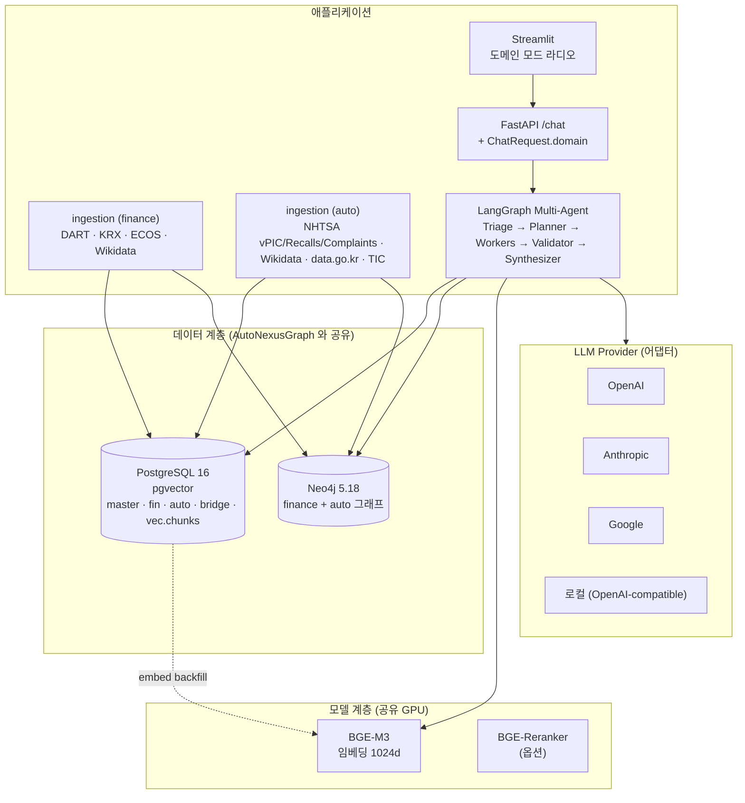
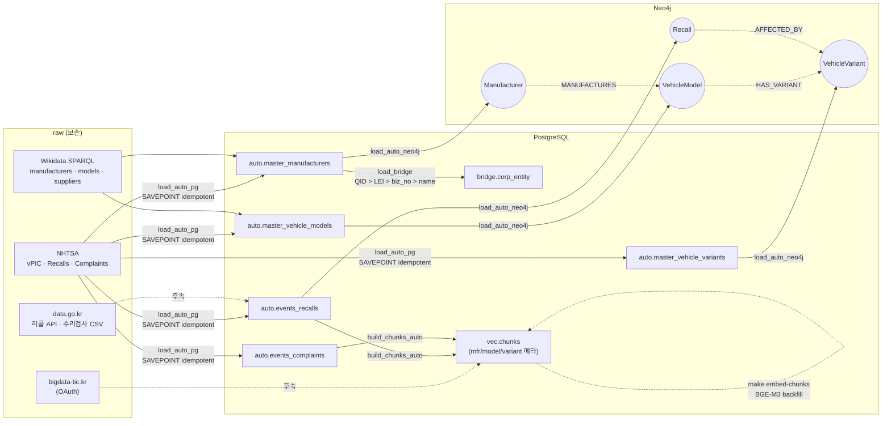
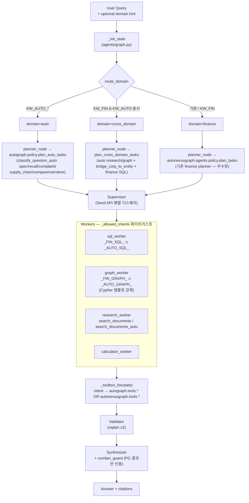
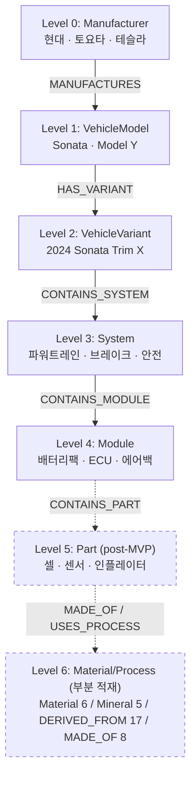

# AutoGraph — 자동차 도메인 GraphRAG (README v3.0 auto 도메인 단독 가이드)

AutoNexusGraph(금융) 코어 위에 **자동차 제품·부품·리콜·공급망 GraphRAG**를 얹은 도메인 plug-in.
LangGraph multi-agent, PG/Neo4j/pgvector, cost/number/cypher guard 등 핵심 인프라는 그대로
재사용한다. 새 코드는 `src/autograph/` 별도 패키지로 격리.

> 전체 시스템 구조 (3 패키지 토폴로지 · LangGraph 노드 · SSOT 색인) 는
> [docs/architecture.md](./architecture.md) 가 SSOT. 본 문서는 **auto 도메인 단독 가이드**.

> **v2.1 핵심 변경 요약 — §7 참조**
> ① `ontology/auto/*.yaml` SSOT 도입 → Neo4j 제약·LLM 프롬프트·검증기 동시 구동.
> ② BOM 라벨 정상화: `:Component` → `:Module` (level=4) / `:Part` (level=5) 분리, `:System` 코드 SCREAMING_SNAKE 통일, `:Supplier.entity_id` 식별 일관성 복구.
> ③ deterministic 엣지: `RECALL_OF` (component_text 정규화 매칭) + `SUPPLIED_BY` (manual seed).
> ④ LLM P3 + P4 cross-validate — `auto.staging_relations` 경유, confidence-gate 적재.
> ⑤ §0 12 개 버그 (`:Supplier` 식별 / ghost MERGE / `snapshot_year` NULL / 라벨 컨벤션 충돌 …) 해소.

> **데이터 적재 현재 상태 (정확성 명시):**
> - **NHTSA / EPA / Wikidata 마스터** — ✅ 적재 완료
> - **NHTSA Recalls / Complaints / Investigations** — ✅ 적재 완료 (493 / 16,005 / 154)
> - **Wikidata P176 (manufactured by)** — ⚠️ **rate-limit (1 req/min, 429)** 로 `auto.staging_relations` **0 row**. P3 LLM 추출 + manual `supplier_seed.yaml` 19 공급사 46 매핑 (Neo4j `SUPPLIED_BY` **30 distinct edges** — customer 다중은 `:CONTAINS_COMPONENT` 로 분리) 으로 우회. 자세한 사유는 `docs/data_inventory.md §2.1` B-issue 참조
> - **BOM Level 5 (`:Part`) / Level 6 (`:Material` / `:Process`)** — ⚠️ Level 5 `:Part` 노드 **0** (리콜·LLM 추출에서만 자연 발생). Level 6 은 **부분 진입** — `:Material` 6 (cathode chem: NCM811/622/523/NCA/LFP/GRAPHITE_ANODE) / `:Mineral` 5 (Li/Ni/Co/Mn/Graphite, USGS MCS 2024) / `DERIVED_FROM` 17 / `MADE_OF` 8. §2.5.4 다이어그램 참조
> - **`:Supplier` Neo4j 9,642 vs PG `auto.master_suppliers` 4,812** — ⚠️ 약 2배 차이는 `supplier_seed.yaml` + `auto.suppliers_edges` loader 의 중복 적재 의심. `data_inventory.md §3 B10` 추적 중

## 1. 구조

```
src/autograph/
  config.py                       # AutoGraph 전용 .env 키 (NHTSA·Wikidata·KATRI 등)
  policy.py                       # 도메인 라우터 + auto 분류/플래너
  cypher_templates_auto.py        # AUTO_TEMPLATES — finance TEMPLATES 에 자동 병합
  ingestion/
    nhtsa_vpic.py                 # 제조사·모델·연식·제원
    nhtsa_recalls.py              # 리콜 이벤트
    nhtsa_complaints.py           # 결함 신고/컴플레인
    wikidata_auto.py              # 제조사/모델/공급사 QID + LEI/사업자번호
    car_go_kr_recalls.py          # TODO — 한국 자동차리콜센터 (수동 CSV → normalize)
  loaders/
    neo4j_init.py                 # CONSTRAINT/INDEX 멱등 생성
    load_auto_pg.py               # raw → auto.* PG UPSERT
    load_auto_neo4j.py            # PG → Neo4j MERGE (SSOT=PG)
    load_bridge.py                # bridge.corp_entity 매칭 (QID > LEI > 사업자번호 > name)
    build_chunks_auto.py          # 리콜/컴플레인 텍스트 → vec.chunks
  tools/
    spec.py                       # PG SQL — lookup_vehicle / get_spec / compare_vehicles
    graph.py                      # Neo4j — list_recalls_affecting / list_components / ...
    retrieve.py                   # pgvector — search_documents_auto (manufacturer_id 필터)
    bridge.py                     # cross-domain — bridge_corp_to_entity / bridge_entity_to_corp

infra/postgres/init/
  07_autograph.sql                # auto.* 스키마
  08_bridge.sql                   # bridge.corp_entity
  09_vec_chunks_auto_meta.sql     # vec.chunks 에 manufacturer_id/model_id/variant_id 추가

eval/qa_gold/gold_qa_auto_v0.jsonl  # MVP QA seed (SQL/Vector/Graph/Cross-Domain 혼합)
```

## 2. 데이터 흐름 (한 줄 요약)

```
NHTSA / Wikidata raw
       │
       ▼  data/raw/auto/<source>/
  ingestion (멱등, RateLimiter + CheckpointStore)
       │
       ▼
  loader → auto.* (PG) ──→ load_auto_neo4j ──→ Neo4j 노드/관계
       │                                                 │
       ▼                                                 ▼
  bridge.corp_entity ←── load_bridge ←── master.entity_map (finance)
       │
       ▼
  자동차 청크 → vec.chunks (manufacturer_id/model_id/variant_id 메타)
       │
       ▼
  Agent (domain='auto' | 'cross_domain')
    ├ planner_node → autograph.policy.plan_auto_tasks / plan_cross_domain_tasks
    ├ workers      → autograph.tools.* (자유 SQL/Cypher 금지)
    └ synthesizer  → number_guard 통과 후 LLM 합성
```

## 2.5. 시스템 아키텍처 다이어그램

### 2.5.1 컨테이너 토폴로지 — AutoNexusGraph 인프라 공유



### 2.5.2 데이터 흐름 (멱등 파이프라인)



### 2.5.3 도메인 라우팅 (한 turn 의 흐름)



### 2.5.4 BOM 계층 (README §11.2 가용성 매트릭스)



#### 부록 — 배터리·소재 L5/L6 확장 (곁가지 — 부분 적재, auto 도메인 BOM 하향)

> ip 도메인(특허) 아님. auto 의 BOM 을 셀·화학조성·핵심광물까지 내림. **현 적재 상태 (2026-06-01)**: `:Material` 6 (cathode chem: NCM811/622/523/NCA/LFP/GRAPHITE_ANODE) / `:Mineral` 5 (Li/Ni/Co/Mn/Graphite, USGS MCS 2024) / `DERIVED_FROM` 17 (7-key 100%) / `MADE_OF` 8 (기존 :Module name 매칭). 회사단위 셀↔OEM 소싱은 grade C candidate (sparse). 상세 데이터 소스는 README §4 "배터리·소재 보완" 표 참조.

```
(:Module {name:'배터리팩'})
   -[:CONTAINS_MODULE]-> (:Cell {chemistry:'NCM811', form_factor:'pouch'})
      -[:MADE_OF]->        (:Material {code:'NCM811', cathode_ratio:'8:1:1'})
         -[:DERIVED_FROM]-> (:Mineral {code:'Ni', usgs_id:'…'})
```

- `:Cell` 노드 — 배터리 셀 단위. props: `chemistry`, `form_factor`, `capacity_wh`, `manufacturer_id` (LG엔솔/삼성SDI/SK온/CATL …)
- `:Material` 노드 — 화학조성 (NCM/NCA/LFP/LMFP …). 출처 = Wikidata + 셀 제조사 IR PDF (CC0 / 공공)
- `:Mineral` 노드 — 핵심광물 (Li/Ni/Co/Mn/Graphite). 출처 = USGS Mineral Commodity Summaries (공공, US Gov)
- `:Cell -[SUPPLIES]-> :OEM` (회사단위 소싱) — grade C candidate (공개 데이터 sparse). 자동 만료 후보 — `reviewed_status='auto'` 6개월 미검토 시 `rejected`.
- 무역통계 (`macro.trade_minerals`) = 관세청 / K-stat — Li/Ni/Co 한국 수입 통계 (월 단위).

**구현 우선순위:** Wikidata cell chemistry → USGS minerals → SUPPLIES candidate → 무역통계. 모두 정형 (LLM 0%). 회사단위 셀↔OEM 소싱은 한계 명시 후 candidate 로만.

#### USGS MCS — L6 광물 결정적 SSOT

- CSV 테이블 배포 (PDF 아님), 90+ 비연료 광물의 세계·미국 5년 통계 (생산/수입/수출/가격/재고/소비).
- 적재: `auto.master_minerals` (commodity, year, world_production, us_import_reliance, price, …).
- 엣지: `(:Material {NCM811})-[:DERIVED_FROM {confidence_score:0.95, source_type:'usgs_mcs'}]->(:Mineral {Ni})`.
- grade A (US Gov 공식 통계). 무인증.

#### EVO 온톨로지 정렬 (설계 참조)

- arXiv 2304.04893 (EVKG) 의 EVO — 20 클래스·17 객체속성·54 데이터타입 속성 (EV 분류·부품·충전·커넥터·에너지원·규제·추진계·환경영향).
- `ontology/auto/*.yaml` 의 EV/배터리 확장 시 EVO 클래스명·속성을 정렬 베이스로 인용 → "임의 설계" 아닌 "학계 온톨로지 정렬". SHACL/pydantic 검증 (§11.1) 과 시너지.

#### EV 충전 인프라 (신규 노드)

```
(:ChargingStation {station_id, operator, charger_type, capacity_kw, install_year, sido, gungu})
(:Operator)-[:OPERATES {snapshot_year}]->(:ChargingStation)
(:Operator)-[:IS_ENTITY]->(bridge.corp_entity)   # 운영사 ↔ 재무 cross
```

- 출처: data.go.kr B552584 (환경공단) + B553530 (에너지공단). `DATA_GO_KR_API_KEY` 재사용.
- grade A (공공). operator 정규화 후 corp_entity 매칭 → CD 질의 "충전 인프라 1위 운영사의 영업이익".

## 3. PRD 핵심 원칙 적용

| 원칙 | 어디서 강제하는지 |
|---|---|
| 정량 수치는 PG 조회 결과만 | `autograph.tools.spec.get_spec` / `compare_vehicles` 결과 → `number_guard` 화이트리스트 |
| 자유 SQL/Cypher 금지 | 모든 Cypher 는 `cypher_templates_auto.AUTO_TEMPLATES` 레지스트리 경유. SQL 은 사전 정의 함수만 |
| 관계 source/confidence/validated_status/snapshot_year 필수 | `load_auto_neo4j` 의 MERGE 모두 동봉. candidate 는 0.5~0.8 confidence + `validated_status='candidate'` |
| LLM 이 부품/공급사 관계 생성 금지 | loader 는 PG SSOT 데이터만 사용. Wikidata 후보도 명시적으로 candidate. synthesizer 프롬프트에 강제 (README §5 도구 화이트리스트 + §3.6 Deterministic-first 추출) |
| Cross-Domain bridge | `bridge.corp_entity` — Wikidata QID > LEI > 사업자번호 > name 매칭. 자동 매칭은 `candidate`, 검토 후 `reviewed` |

## 4. 실행 순서

### 4.1 사전 준비

```bash
# 1) 코어 인프라 가동 (Neo4j + PG + pgvector)
make up

# 2) 자동차 마이그레이션 적용 — docker compose 초기화 시 자동 실행되지만, 기존 DB 에는 수동 적용.
docker compose exec postgres psql -U autonexusgraph -d autonexusgraph \
    -f /docker-entrypoint-initdb.d/07_autograph.sql
docker compose exec postgres psql -U autonexusgraph -d autonexusgraph \
    -f /docker-entrypoint-initdb.d/08_bridge.sql
docker compose exec postgres psql -U autonexusgraph -d autonexusgraph \
    -f /docker-entrypoint-initdb.d/09_vec_chunks_auto_meta.sql

# 3) Neo4j 제약/인덱스
make neo4j-init-auto
```

### 4.2 Ingestion (raw 다운로드)

```bash
# 단발 — 현대 2024 한 차종/연식
make ingest-auto-vpic        MAKES=HYUNDAI YEARS=2024
make ingest-auto-recalls     MAKE=HYUNDAI  YEAR=2024
make ingest-auto-complaints  MAKE=HYUNDAI  YEAR=2024
make ingest-auto-wikidata

# 일괄 — .env 의 AUTO_INGEST_MAKES / AUTO_INGEST_YEAR_*
make ingest-auto-all
```

raw 경로: `data/raw/auto/{nhtsa_vpic,nhtsa_recalls,nhtsa_complaints,wikidata}/`

### 4.3 Loader (PG → Neo4j → bridge → seed/supplier/recall→comp → 청크)

```bash
make load-auto-all
# 의존 순서:
#   neo4j-init-auto                  (CONSTRAINT/INDEX — ontology SSOT)
#   load-auto-pg                     (raw → auto.* PG)
#   load-auto-specs                  (canspec → spec_measurements + body/drive 보강)
#   load-auto-neo4j                  (PG → Manufacturer/Model/Variant/Recall/System/Module/Part/Supplier 노드 + 핵심 엣지)
#   load-auto-bridge                 (bridge.corp_entity — QID/LEI/biz/name 매칭)
#   load-auto-seed-standards-plants  (:Standard + :Plant + OWNS_PLANT — load-auto-safety 의 선행 조건)
#   load-auto-safety                 (NHTSA SafetyRatings → spec_measurements.safety.* + SAFETY_RATED_BY)
#   load-auto-aihub                  (AI Hub → :Module + CONTAINS_COMPONENT)
#   load-auto-supplier-edges         (supplier_seed.yaml → :SUPPLIED_BY)
#   load-auto-complaints-neo4j       (:Complaint + REPORTED_IN)
#   load-auto-recall-components      (events_recalls.component_text → :RECALL_OF)
#   derive-auto-contains-system      ((VehicleModel)-[:CONTAINS_SYSTEM]->(System) 1-hop 유도)
#   build-chunks-auto                (recall/complaint → vec.chunks)
```

상세 절차는 §7.5 검증 가이드 참조. P3 LLM + P4 cross-validate 는 본 타겟에 포함되지 않으며
별도 명시 호출 (`make extract-validate-auto`) — LLM 비용 발생.

### 4.4 Tool 단위 확인

```bash
$(PYTHON) -c "from autograph.tools.spec import lookup_vehicle; \
              print(lookup_vehicle('Grandeur', year=2024))"
$(PYTHON) -c "from autograph.tools.graph import list_recalls_affecting; \
              print(list_recalls_affecting(model_id=1))"
$(PYTHON) -c "from autograph.tools.bridge import bridge_corp_to_entity; \
              print(bridge_corp_to_entity('00164742'))"
```

### 4.5 Agent end-to-end

```bash
# 자동차 도메인 (명시)
curl -X POST localhost:8000/chat -H 'content-type: application/json' \
  -d '{"message":"현대 그랜저 2024 변속기는?","domain":"auto"}'

# auto-detect (router 가 키워드로 판정)
curl -X POST localhost:8000/chat -H 'content-type: application/json' \
  -d '{"message":"Tesla Model Y 2023 리콜 사례 알려줘"}'

# cross-domain
curl -X POST localhost:8000/chat -H 'content-type: application/json' \
  -d '{"message":"현대자동차의 2024년 매출과 그랜저 리콜 건수 관계는?",
       "domain":"cross_domain"}'
```

UI 사이드바에 도메인 라디오(`auto-detect | finance | auto | cross_domain`) 추가됨.

### 4.6 평가

```bash
make eval-auto
# eval/reports/auto_<timestamp>/summary.md 확인
```

## 5. 알려진 제약 / TODO  (2026-05-28 본 패치 기준 갱신)

본 패치로 **해결된** 항목 (§7 상세):

- ~~`auto.components` loader 없음~~ → AI Hub 71347/578 + manual supplier_seed 가 채움. `list_modules_by_*` / `get_suppliers_of_component` / `get_vehicles_using_supplier` 결과 반환.
- ~~supplier 관계 자동 적재 부재~~ → `ontology/auto/supplier_seed.yaml` (19 공급사 × 46 매핑) 이 `(Module|Part)-[:SUPPLIED_BY]->(Supplier)` 결정적 엣지를 생성. confidence 0.90~0.95.
- ~~Wikidata supplier 의 entity_id 식별 불일관~~ → `auto.master_suppliers.supplier_id` SSOT 도입, `bridge.corp_entity.entity_id` 도 stringified supplier_id 로 정렬.
- ~~`load_recalls / load_complaints` N+1~~ → single LEFT JOIN 으로 통합 완료 (Phase 5 커밋).
- ~~`nhtsa_*` 3종 `_http_get` 중복~~ → `_common_nhtsa.py` 추출 완료.

2026-05-28 (Phase B) 패치로 **인터페이스까지 깔린 외부 의존** (키만 채우면 즉시 활성):

- **data.go.kr 3048950 한국 리콜 (KOTSA CSV)** — `loaders.load_datagokr_recalls --csv`.
  구 오픈API `15089863` **폐기** → 파일데이터 CSV 로 전환. **941 row 적재 완료** (CSV 부재 시 graceful skip).
- **data.go.kr 15155857 수리검사** — `ingestion.datagokr_inspections` + `loaders.load_datagokr_inspections`.
  CSV 수동 다운 후 normalize → `auto.events_inspections` (`infra/postgres/init/12a_autograph_inspections.sql`).
- **car.go.kr** — `ingestion.car_go_kr_recalls` 가 CSV 파서 제공. 공식 API 미정.
- **KATRI / bigdata-tic.kr** — `ingestion.katri_tic` OAuth client_credentials.
  `BIGDATA_TIC_CLIENT_ID/SECRET` 미설정 시 skip.
- **KNCAP** — `ingestion.kncap` + `loaders.load_kncap`. raw 자료 부재 시 skip.
  적재 시 `spec_measurements.safety.kncap.*` + `(:VehicleVariant)-[:SAFETY_RATED_BY]->(:Standard {code:'KNCAP'})`.

여전히 외부 채널 의존 (수집 약관/지정 채널):

- **NCAP / IIHS / Euro NCAP** — 별도 수집 미구현. NHTSA NCAP 만 구현됨.
- **Level 5(Part)는 부분 커버** — Module 은 AI Hub / supplier_seed 기반으로 다수 등록되지만,
  Part 은 ontology 및 MERGE 경로만 준비. 실데이터는 LLM P3 의 RECALL_OF 추출에서 자연 발생.
- **Level 6 (Material/Process)** — 부분 적재 (곁가지): `:Material` 6 (manual seed: NCM811/622/523/NCA/LFP/GRAPHITE_ANODE) + `:Mineral` 5 (USGS MCS 2024: Li/Ni/Co/Mn/Graphite) + `DERIVED_FROM` 17 + `MADE_OF` 8. 회사단위 셀↔OEM 소싱은 grade C candidate. **Wikidata 자동 보강은 비활성** — `wikidata_cell_chem.py::CATHODE_QIDS` 빈 dict (BACKLOG L6-1).
- **MANUFACTURED_AT (모델↔공장 구체)** — `ontology/auto/manufactured_at_seed.yaml` 46 매핑
  + `loaders.load_manufactured_at`. 한국 OEM 12 모델 + Tesla/BMW/VW/Toyota 등 글로벌 대표.
- **임베딩** — 자동차 청크의 embedding 백필은 동일하게 별도 `embed-chunks` 필요.

### 5.1 SUPPLIED_BY 의 manual seed 의존도 — 정직 표시 (P1-6)

> 본 절은 시스템의 "공급망 추론" 자랑이 실제로 어디까지 자동인지를 솔직히 정리. cold review ([docs/system_review.md](system_review.md)) 의 P1-(6) 항목.

**현재 사실**:
- Neo4j `SUPPLIED_BY` 30 distinct edges — **거의 100% manual `supplier_seed.yaml` 출처**
- `auto.staging_relations` (Wikidata P176 자동 추출 후보 staging) — **0 row**
- 이유: Wikidata SPARQL endpoint 의 1 req/min rate-limit (429) — `docs/data_inventory.md §3 B7`

**즉**:
- 시스템의 "공급망 추론" 가치는 **manual yaml 한 줄 한 줄 의 품질** 에 종속
- 새 공급사 추가 = `supplier_seed.yaml` 수동 수정 (`(supplier, customer, component)` tuple) + PR
- LLM P3 추출 + P4 cross-validate 경로는 **wired-but-disabled** — 비용·환각 위험 vs 가치 검증 미실시
- 확장성: 19 공급사 → 50+ 늘리려면 yaml 50+ 줄 수기 작성 — 자동화 routine 부재

**왜 이 의존을 감수하나 (의도된 트레이드오프)**:
- (a) 자동 채널 (Wikidata P176 / OpenAlex assignee / LLM 추출) 모두 **정확도 불충분** — manual seed 의 90~95% confidence 보다 낮음
- (b) bridge.corp_entity 의 supplier candidate 4,790 row 와 일관성 — strong_match (≥0.9) 만 인용하는 정책
- (c) 본 PR 의 README §10.11 측정 (SUPPLIED_BY 100% 7키 메타) 은 이 manual 30 edges 로 달성 — 정량 증명 자체는 정합

**우회 옵션 (P1 백로그)**:
1. **Wikidata bulk dump** — 90 GB+ 다운, P176 관계만 추출. 운영 비용 큼.
2. **OpenAlex assignee → supplier inference** — 특허 assignee 가 부품사인 경우 자동 supplier 후보 (정확도 낮음, candidate 등급)
3. **수동 SPARQL batch** — Wikidata Query Service 의 웹 UI 에서 직접 실행 + CSV 다운로드 (rate-limit 회피)
4. **DART 사업보고서 본문 LLM P3 확장** — 현대모비스/한온/만도/현대위아 사업보고서 narrative 에서 SUPPLIED_BY 관계 추출 (현재 IRRelationExtractor wired)

**결론**: 현재 SUPPLIED_BY 30 edges 는 **"공급망 추론" 시연용 seed 로는 정합** 하나, **시스템 차원 자랑 ("자동 공급망 추출") 은 정직히 보강 필요**. 본 한계는 README §1 / §10.11 자랑 표기에 cross-link 권장.

## 6. 회귀 안전

- finance 도메인 tool / 라우팅 / SQL 은 무수정. `state['domain']` 미지정 시 router 가
  키워드로 자동 판정 (자동차 키워드 없으면 `finance` 기본).
- `vec.chunks` 의 `corp_code` NOT NULL 제약은 nullable 로 완화됨 — 기존 finance 청크는
  영향 없음 (이미 NOT NULL 로 채워져 있음).
- `cypher_templates_auto.AUTO_TEMPLATES` 키는 `auto_` 접두사로 finance 키와 충돌 안 함.
  병합은 `src/autograph/tools/__init__.py` import 시 1회 실행.
- `autonexusgraph/extractors/base.py` / `engine.py` 의 finance P3 파이프라인 — 본 패치는 어떤 코드도
  옮기지 않고 *import* 만 한다. finance 측 P3 / P4 동작은 그대로.
- 기존 testsuite 310 개 모두 그린 — `pytest -q` (unit). 본 패치가 추가한 `tests/autograph/*` 52 개도 통과.
- 통합 테스트(`pytest -m integration`)는 마커가 부여된 케이스가 코드베이스에 없어 0개 실행 — 본 패치도 마커 작성 안 함 (실제 Neo4j/PG 인프라가 필요한 검증은 §7.5 verification 절차로 수동 수행).

---

## 7. 본 패치 변경 사항 상세 (2026-05-28)

### 7.1 Ontology SSOT — `ontology/auto/*.yaml`

```
ontology/
├── entities.yaml         # (변경 없음) finance — autonexusgraph 가 SSOT 로 사용
├── relations.yaml        # (변경 없음) finance
├── extractors.yaml       # (변경 없음) finance
└── auto/                 # ⭐ 신규 — autograph SSOT
    ├── entities.yaml         # Manufacturer/VehicleModel/Variant/System/Module/Part/Supplier/Recall/Complaint/Standard/Plant (11)
    ├── relations.yaml        # MANUFACTURES/HAS_VARIANT/CONTAINS_SYSTEM/CONTAINS_COMPONENT/CONTAINED_IN/SUPPLIED_BY/AFFECTED_BY/RECALL_OF/REPORTED_IN/COMPLIES_WITH/SAFETY_RATED_BY/MANUFACTURED_AT/OWNS_PLANT/COMPETES_WITH (14)
    ├── extractors.yaml       # 13 추출기 카탈로그 (P2/P3/P4)
    ├── system_taxonomy.yaml  # 19 시스템 코드 + alias_codes (AI Hub 'powertrain' → 'POWERTRAIN')
    ├── standards.yaml        # 22 표준 (FMVSS/ECE/KMVSS/NCAP/UN R155/ISO 26262/…)
    ├── plants.yaml           # 18 공장 (한국 OEM + 글로벌)
    └── supplier_seed.yaml    # 19 공급사 × 46 매핑 (manual A-grade)
```

`src/autograph/ontology.py` 가 단일 로더. **변경 충격 점:**
- `neo4j_init.py` 의 라벨/key 리스트가 더 이상 하드코딩이 아님 (ontology 가 SSOT).
- LLM 프롬프트의 entity/relation 표는 `render_*_for_prompt()` 로 런타임 주입.
- finance `ontology/*.yaml` 은 손대지 않음 — autonexusgraph 코드가 그대로 사용.

### 7.2 BOM 라벨 정상화

| Before | After |
|---|---|
| `:Component {id}` (모든 부품, level 미분리) | `:System {code}` (L3) + `:Module {id}` (L4) + `:Part {id}` (L5) |
| `:Component {component_id}` (AI Hub) ↔ `:Component {id}` (neo4j_init) — 키 불일치 → 중복 노드 | `:Module {id}` 단일 키 — 제약과 일치 |
| `auto.components` 단일 level (= 분리 없음) | `level SMALLINT NOT NULL DEFAULT 4` + `parent_component_id` |

`auto.components` 의 row 별 level 에 따라 `MERGE_MODULE` 또는 `MERGE_PART` 로 분기.
`(:Part)-[:CONTAINED_IN]->(:Module)-[:CONTAINED_IN]->(:System)` 체인.

### 7.3 새 deterministic 엣지

- **RECALL_OF** — `load_recall_components.py` :
  - `auto.events_recalls.component_text` 정규화 (영문 stem `bags→bag`/`hoses→hos`) 후
    `auto.components.{name_norm, aliases}` 매칭. exact 0.85 / alias 0.80 / token 0.65.
  - 매칭된 row 는 `auto.events_recalls.component_id` 백필 + Neo4j `(:Recall)-[:RECALL_OF]->(:Module|:Part)` 적재.
  - 미매칭 row 는 그대로 두고 P3 LLM 이 자유 텍스트 → Part 추론으로 재시도.

- **SUPPLIED_BY** — `load_supplier_edges.py` + `supplier_seed.yaml` :
  - 매뉴얼 시드의 (supplier, component_canonical_name, system_code) 트리플 → Neo4j 엣지.
  - 누락 component 는 `_ensure_component_module` 로 새 `:Module {level:4}` 자동 등록.
  - source_type='manual_supplier_seed', validated_status='validated', confidence=0.95.

- **Plant / Standard / Complaint** — `load_seed_standards_plants.py` + `load_complaints_neo4j.py`.
  `(:Manufacturer)-[:OWNS_PLANT]->(:Plant)`, `:Standard` 노드 (엣지는 KNCAP/KATRI 후속),
  `(:VehicleVariant)-[:REPORTED_IN]->(:Complaint)`.

### 7.4 P3 LLM + P4 Cross-Validate

```
vec.chunks (manufacturer_id IS NOT NULL,
            source IN ('nhtsa_recall','nhtsa_complaint','wikipedia_auto'))
        │
        ▼  chunk_selector.select_auto_chunks  (per-manufacturer cap)
        │
   AutoRelationExtractor.extract(chunk, ctx)   ← prompt SSOT: schema-aware
        │      target_relations: [SUPPLIED_BY, RECALL_OF]   ← 1차 활성
        │      deferred (enabled=false): COMPETES_WITH, MANUFACTURED_AT,
        │                                CONTAINS_MODULE, CONTAINS_PART
        ▼
   ExtractorEngine.merge   ← (rel_type, head_norm, tail_norm, snapshot_year) dedupe
        │
        ▼
   staging_writer.upsert_staging → auto.staging_relations
        │      gate: ≥0.80 auto_accept / 0.65 needs_review / <0.65 rejected
        ▼
   cross_validate.run_p4
        │      ① P2 SSOT 일치 → validated (confidence boost ≥ 0.95)
        │      ② P2 충돌 → rejected (deterministic 우선)
        │      ③ 결정 없음 + 0.80↑ → candidate (graph load with flag)
        │      ④ 결정 없음 + 0.65↑ → needs_review (graph load + flag)
        ▼
   Neo4j MERGE (relations 별 cypher)  + auto.staging_relations.{p4_decision, neo4j_loaded_at}
```

비용 가드: `autonexusgraph.llm.budget_aware.budget_aware_client` 그대로 재사용 — `--hard-limit-usd`.

### 7.5 검증 절차 (Neo4j/PG 가 떠 있는 환경에서)

```bash
# 0) 마이그레이션 적용 (10_autograph_bom.sql / 11_autograph_staging.sql 자동 실행).
make up

# 1) PG 데이터 채우기 (변경 없음, 멱등).
make ingest-auto-all
make load-auto-all      # 새 타겟 — 의존 순서: neo4j-init → pg → specs → neo4j → bridge → aihub
                        #          → supplier-edges → seed-standards-plants → complaints-neo4j
                        #          → recall-components → build-chunks-auto

# 2) §6.7 메타 무결성 — 모든 auto 엣지가 confidence/snapshot/source 필수.
echo "MATCH ()-[r]->() WHERE
        (r.confidence_score IS NULL OR r.source_type IS NULL OR r.snapshot_year IS NULL)
        AND any(l IN labels(startNode(r)) WHERE l IN
            ['Manufacturer','VehicleModel','VehicleVariant','Module','Part','Supplier','Recall','Complaint','Plant','Standard','System'])
      RETURN count(*) AS missing" | cypher-shell
# 기대: missing = 0

# 3) 핵심 invariant 회귀 체크 — Supplier 식별 / Component 중복키 / ghost Variant / System 이름.
cypher-shell <<'EOF'
// 0.1 Supplier 식별
MATCH (s:Supplier) WHERE s.entity_id IS NULL RETURN count(*) AS supplier_no_id;
// 0.2 Component 중복키 잔재 — :Module 노드에 component_id 가 있으면 안 됨.
MATCH (m:Module) WHERE m.component_id IS NOT NULL RETURN count(*) AS module_with_legacy_key;
// 0.3 Ghost variant — name·year 둘 다 비어있는 VehicleVariant.
MATCH (v:VehicleVariant) WHERE v.model_year IS NULL AND v.trim IS NULL
                          AND v.body_class IS NULL RETURN count(*) AS ghost_variant;
// 0.8 System 이름.
MATCH (s:System) WHERE s.name IS NULL RETURN count(*) AS system_no_name;
EOF
# 기대: 모두 0 (또는 0 에 근접 — ghost_variant 는 데이터 의존).

# 4) Cross-Domain 진입 — 본 PR 의 결정적 SUPPLIED_BY + manual seed 가 살아있는지.
echo "MATCH (s:Supplier {name:'LG에너지솔루션'})<-[:SUPPLIED_BY]-(m:Module)
      RETURN s.name, m.name, m.system_code LIMIT 5" | cypher-shell

# 5) P3 비용 dry-run.
make extract-auto-p3-cost MFR_IDS=498 P3_LIMIT=20

# 6) P3 실행 + P4 검증 (실제 LLM 호출).
make extract-auto-p3 MFR_IDS=498 P3_LIMIT=20 P3_HARD_LIMIT=0.5
make validate-auto-p4

# 7) P3 산출이 staging 에 들어갔는지 + P4 결정.
psql -c "SELECT relation_type, gate_status, p4_decision, count(*)
           FROM auto.staging_relations
          GROUP BY 1,2,3 ORDER BY 1,2,3;"
```

### 7.6 본 PR 이 다루지 않은 (deferred) 항목 — 2026-05-28 Phase B 후 갱신

| 영역 | 상태 | 위치 |
|---|---|---|
| Wikidata P176 자동 SUPPLIED_BY (SPARQL) | ✅ wired | `loaders.load_wikidata_part_supplies` 가 staging→P4→Neo4j |
| LLM 관계 활성화 (COMPETES_WITH) | wired but disabled | `ontology/auto/relations.yaml` 의 `enabled:false` (비용/환각 위험) |
| `MANUFACTURED_AT` 구체 모델-공장 매핑 | ✅ seed 적용 | `ontology/auto/manufactured_at_seed.yaml` (46 매핑) + `loaders.load_manufactured_at` |
| `COMPLIES_WITH` (차량↔표준) | 미연결 | 표준 노드만 존재. KNCAP/KATRI/IR 수집 후 P3 LLM 으로 보강 예정 |
| KNCAP / Euro NCAP / IIHS | KNCAP 인터페이스만 (`ingestion.kncap` + `loaders.load_kncap`). Euro NCAP/IIHS 는 미구현 | 외부 채널 약관 검토 후 |
| `:Part` 대량 적재 | LLM P3 RECALL_OF 결과에서 자연 발생 | manual seed 는 Module 위주 |
| integration test (`pytest -m integration`) | 마커 없음 (0 케이스) | 실제 Neo4j/PG 가 필요 — 별도 CI PR |
| eval/qa_gold 확장 (도내 100/100 + CD 30 완전) | seed: finance 30 / auto 42 / cross 30 | `make validate-gold-qa` lint 통과. 100 row 확장은 별도 |

위 deferred 들은 본 도큐먼트가 다루는 골격 (Module/Part 분리 / P3·P4 / Standard·Plant seed) 범위 밖이다. ontology · 비용 가드 · 적재 helper · 테스트 인프라는 그대로 재사용 가능.
