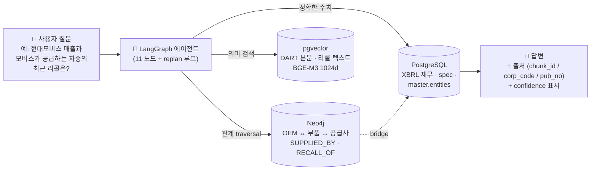
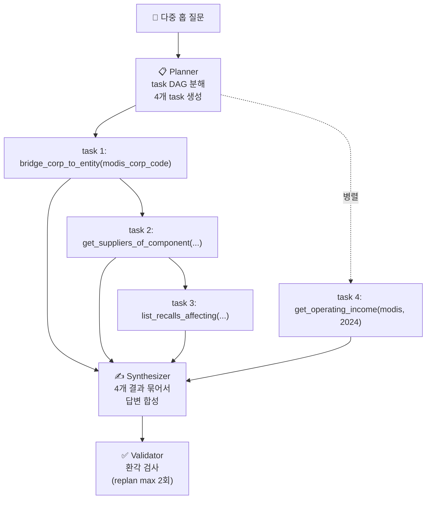
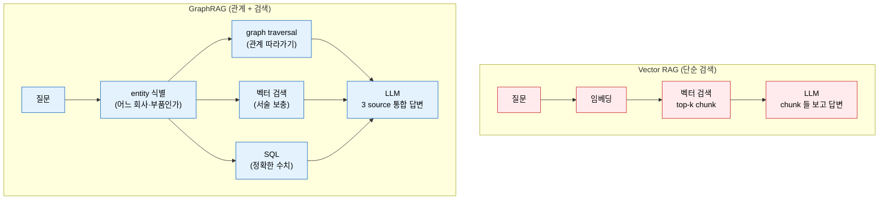
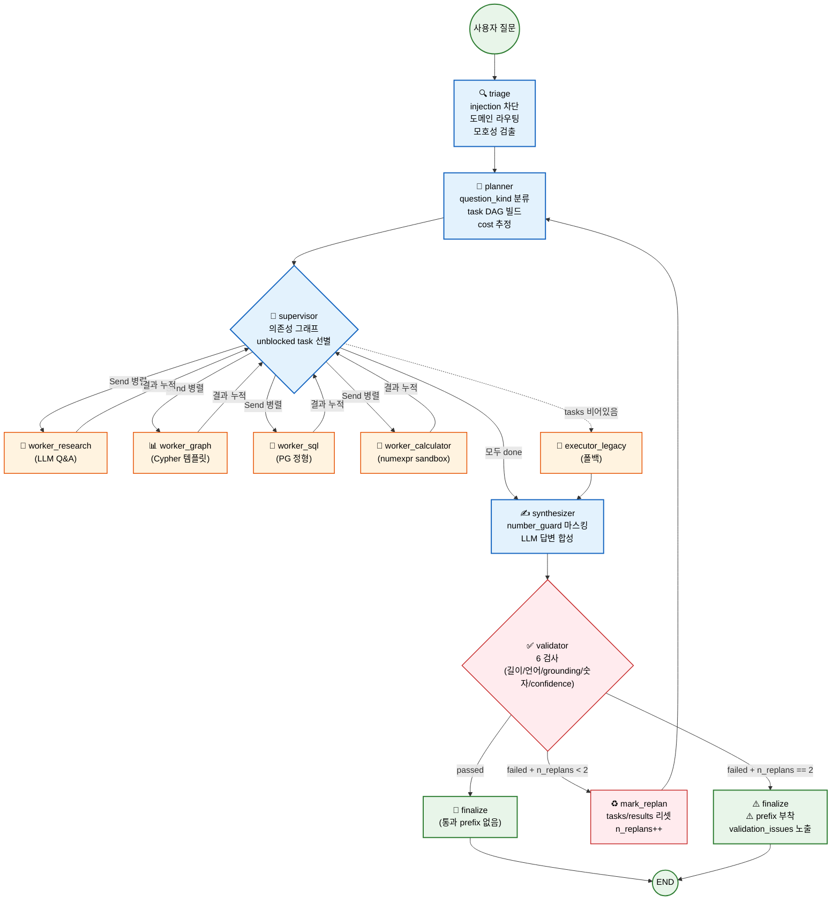
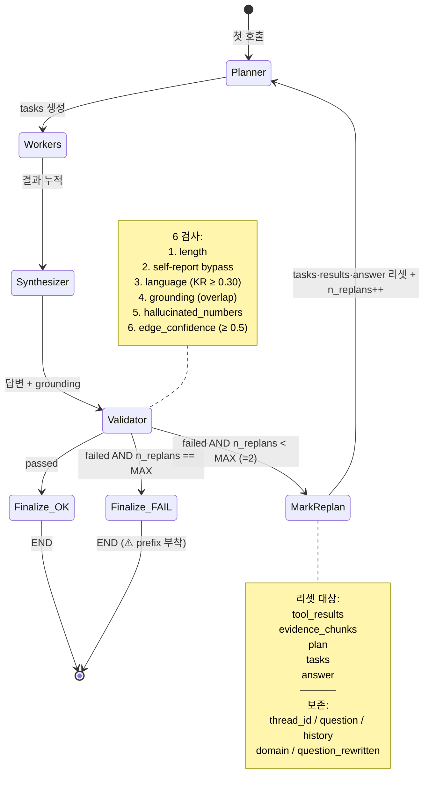

# AutoNexusGraph — 시스템 심화 가이드 (Seminar-Level)

> 본 문서는 **시스템을 이론적으로 설명할 수 있는 수준** 까지 끌어올리기 위한 교재다. 청중은 GraphRAG / Multi-Agent 시스템에 익숙한 시니어 엔지니어·연구자이고, 발표자는 청중이 "왜 이렇게 했는가" 를 물을 때 코드를 짚어가며 답할 수 있어야 한다.
>
> 작성 기준일: **2026-05-29**. 본 문서가 인용하는 코드 줄 번호와 시그니처는 그 시점의 main 브랜치(HEAD `5635e65`) 를 기준으로 한다. 코드가 바뀌면 본 문서도 갱신되어야 한다 — 갱신 트리거·주체는 `[설계 의도 확인 필요]`.
>
> 본 문서는 **이론 교재**다. mental_model.md 의 **결정 카탈로그** 와 명시적으로 분담돼 있다 (§0.1).
>
> **추측·창작 금지** 원칙에 따라 작성됐다. "왜" 가 코드만으로 안 드러나는 자리는 본문 안에 `[설계 의도 확인 필요]` 로 표시했다. 본 문서는 그 자리를 비워두는 것이지 채우는 것이 아니다.

---

## 0. 이 가이드의 위치

### 0.1 다른 문서와의 분담

| 문서 | 역할 | 본 가이드와의 관계 |
|---|---|---|
| **이 문서 (`learning_guide.md`)** | **이론 교재** — 왜 GraphRAG / 3-Store / LangGraph 인가, 각 알고리즘·정규식·휴리스틱의 이론적 근거, 예상 질문 | 발표용 통독 |
| `docs/mental_model.md` | **결정 카탈로그** — 모든 결정의 [확정]/[잠정]/[미정] 라벨, 트레이드오프 박스, 열린 질문 리스트 | 본 가이드에서 결정 사실을 인용. 라벨 시스템 SSOT |
| `docs/architecture.md` | **구조 SSOT** — 패키지 토폴로지 / 도메인 모듈 매트릭스 / LangGraph 노드 / plug-in 등록 / SSOT 색인 | 본 가이드의 "어디에 무엇이 있는가" 빠른 참조처 |
| `README.md` | **통합 SSOT v3.0** — 데이터 수치, 도구 목록, 요구사항, DoD 20항, 로드맵, 의사결정 로그, Quickstart 일체 | 본 가이드에서 수치·명령어·DoD 항목 인용 |
| `docs/autograph.md` | **auto 도메인 단독 가이드** | §2.3 BOM 계층 / §7.2 P3·P4 절에서 인용 |
| `docs/process_graph.md` | **process(BoP) 단독 가이드** (auto 수직 심화, 주요 축) | BoP 모델 / 회사 귀속 정책 / 내부 데이터 수용 규격 |
| `docs/ipgraph.md` | **ip 도메인 단독 가이드** (보조축, README §11.1) | M-점수 설계 SSOT — 특허·CPC·OpenAlex |
| `docs/operations/*.md` | **운영 절차** — Docker / 데이터 파이프라인 / agents / RAG 도구 / migrations / KCGS | 절차 막힘 시 참조처 |
| `docs/data_sources.md`, `docs/data_inventory.md` | **데이터 소스 + 적재 현황** | 가설의 정량 근거 |

### 0.2 라벨 컨벤션 (mental_model.md §0.2 와 동일)

본문 결정·서술에 동행하는 라벨:

- **[확정]** — 코드·PRD·커밋 메시지에 근거 있음. 바꾸려면 명시적 트레이드오프 논의 필요.
- **[잠정]** — 일단 이렇게 해뒀지만 바뀔 수 있음. 왜 임시인지 한 줄 동행.
- **[미정]** — 아직 안 정함. 무엇이 정해져야 결정 가능한지 한 줄 동행.
- **[설계 의도 확인 필요]** — 코드/문서로 "왜" 가 안 드러남. 본 문서는 추측하지 않고 사용자가 채울 자리만 남긴다.
- **[가정]** — 시스템이 작동하기 위해 참이어야 하는 명제 (검증 안 됨).
- **[위험]** — 현재 설계가 깨질 수 있는 시나리오.

### 0.3 코드 인용 규약

- `path/file.py:LINE` — 절대 경로 기준. Read 도구 / `code .` / IDE 점프로 즉시 확인.
- 코드 줄 번호는 작성 시점 (2026-05-29 / `5635e65`) 기준이며 stale 가능성이 있다.
- 함수·상수·정규식을 인용할 때는 **이름** 을 우선하고 줄 번호는 보조로만 사용한다 (이름은 grep 으로 찾을 수 있지만 줄 번호는 stale 되기 쉽다).

### 0.4 본 가이드의 적용 한계

- 본 가이드는 **finance + auto(+process) + ip 세 도메인 + 보조축** 기준이다 (v3.0 — ip = 보조축 / process = 주요 축 신설). 4번째 도메인 추가는 본 단계 비목표 (§3.6 / §9.4 갱신 대상).
- 평가 지표 (§8) 는 축소 매트릭스 (4 어댑터 × FAST tier 1종) 실측이 아직 완료되지 않은 시점이다. **숫자가 들어가야 할 자리는 README §10 의 목표값 (DoD 20항)** 으로 기술하고, 실측은 `eval/reports/*` 가 SSOT.

> **인용 규약**: 본 문서의 `PRD §X.Y` 인용 다수는 **구 PRD 표기** — README v3.0 (2026-06-02) 통합 후 [README §10 DoD 20항](../README.md#10-dod-definition-of-done--20-항) + [§3.X 아키텍처](../README.md#3-아키텍처) + [§11 비전 / §12 백로그](../README.md#11-최종-비전--장기-로드맵) 가 새 SSOT. 본 학습 가이드의 인용은 점진적 갱신 중.
- LLM 가격 (§6.3) 은 `src/autonexusgraph/llm/cost.py` 의 PRICING dict 가 SSOT. provider 가 가격을 변경하면 본 가이드 인용도 stale 된다 — 갱신 정책 `[설계 의도 확인 필요]`.

---

## 0.5 처음 읽는 분께 — 5분 직관 가이드

### 0.5.1 한 그림으로 본 시스템



**3가지 저장소에 역할을 분리**한 것이 핵심. 각자가 가장 잘하는 일만 함:
- **Neo4j** — "현대차 자회사 중 …" 같은 **관계 traversal**
- **PostgreSQL** — "삼성전자 2023년 매출은?" 같은 **정확한 수치**
- **pgvector** — "이 회사의 주요 사업 위험은?" 같은 **의미 검색**

### 0.5.2 왜 단순 RAG 가 아니라 이 구조인가? — 3 분 이해

흔히 말하는 **"Vector RAG"** 는 다음 흐름이다:


이 방식의 본질적 한계: **다중 홉** 질문을 못 푼다.

예) "**현대모비스가 공급하는 차종의 리콜 건수와 현대모비스의 영업이익**" — 이 질문은:
1. 현대모비스 → 공급하는 부품 (**홉 1**)
2. 그 부품을 쓰는 차종 (**홉 2**)
3. 그 차종의 리콜 건수 (**홉 3**)
4. + 별도로 현대모비스의 영업이익 (다른 store)

벡터 검색은 의미 유사 청크만 찾을 뿐, **명시적 관계 그래프 traversal** 을 못 한다. 이 시스템은:



→ **Planner 가 명시적으로 DAG 로 쪼개고, 각 단계가 적절한 store 로 라우팅된다**.

### 0.5.3 핵심 용어 4개 — 이것만 알면 50% 이해

| 용어 | 한 줄 설명 | 비유 |
|---|---|---|
| **GraphRAG** | Vector RAG + 그래프 traversal — 의미 검색 + 관계 추론 결합 | "구글 검색 (vector)" + "위키 링크 따라가기 (graph)" |
| **bridge.corp_entity** | 한국 corp_code (finance) ↔ 글로벌 entity (auto/ip) 양방향 매칭 테이블 | "여권 (다국 ID 통합)" |
| **도메인 plug-in** | core 코드 변경 없이 새 도메인 (auto / ip / pharma …) 추가 가능 | "USB 처럼 꽂는 모듈" |
| **4 가드** | prompt_safety / cypher_guard / number_guard / language_guard — 답변 안전성 4 단계 검사 | "공항 보안검색대 (가방·금속·액체·음료)" |

### 0.5.4 진입 한 줄 명령

```bash
python3 -c "
from autonexusgraph.agents import run_agent
result = run_agent('삼성전자 2023년 매출은?', domain='finance')
print(result['answer'])
"
```

→ 이 한 줄이 위 그림의 11 노드 전체를 한 번 돌린다. 더 자세한 환경 구성은 [docs/quickstart.md](quickstart.md).

---

## 1. 문제 정의 — 무엇을 왜 푸는가

### 1.1 단일 도메인 Vector RAG 의 4 가지 한계

finance 단독으로 검증된 시스템의 4 가지 한계 (구 PRD.md §1.1 → README v3.0 흡수) 를 코드 사실로 환원하면 다음과 같다.

| 한계 | 의미 | 본 시스템의 응답 |
|---|---|---|
| **도메인 단일성** | 금융 한 영역. 일반성 미입증 | finance + auto 두 도메인 동시 운영 + cross_domain. `auto_detect_domain` (`src/autonexusgraph/agents/_domain_handler.py:196`) 가 ENV 기반 plugin 으로 라우팅 |
| **관계 평면성** | 자회사·임원·주주가 동일 평면 — "메인 홉" 과 "사이드 홉" 구분 없음 | auto 도메인의 BOM 계층 (L0~L5, §2.3) 이 자연스러운 메인 홉 도입 |
| **이벤트 빈도 낮음** | 공시·뉴스는 분기/월 단위 | NHTSA 리콜·결함은 일·주 단위 (`auto.events_recalls` / `auto.events_complaints`) |
| **물리적 계층 부재** | 모든 엔티티가 법인 | Manufacturer → Model → Variant → System → Module → Part 의 물리적 계층 |

[확정] 자동차 도메인 추가는 이 4 가지 한계를 풀기 위한 것이다 (`PRD §1.1`, `PRD §2.1`).

### 1.2 시스템의 가치 제안

`README.md:3` 의 한 줄 정의 (**v3.0 — README + PRD + PRD_process_graph 통합 SSOT**):

> 자동차·제조 (auto) + 한국 상장사 공시·재무 (finance) + **특허·기술혁신 (ipgraph, 예정)** 3 도메인을 그래프·정형·벡터 하이브리드로 추론하고, `bridge.corp_entity` 로 Cross-Domain 까지 한 turn 안에 묶는 산업·기업 인텔리전스 그래프. **서비스 등급 (MCP·관측가능성·평가 실측) agent + ontology 를 정량 증명하는 것이 1차 목표.**

[확정] 사용자 시나리오 (`PRD §2.1` + `PRD §12.5`):

1. **도메인 내 멀티홉** — "현대 쏘나타의 에어백 리콜과 관련된 공급사는?"
2. **Cross-Domain** — "현대모비스 매출과 모비스가 공급하는 차종의 최근 리콜은?"
3. **Cross-Domain + 시점** — "2023년 LG에너지솔루션 배터리를 쓰는 OEM 의 KCGS ESG 등급은?"
4. **3 도메인 동시 (v2.2 신규 — CD-L4 시연 핵심)** — "**삼성SDI 배터리 특허(CPC H01M) 집중 분야 (ip) + 영업이익 (finance) + 그 셀을 쓰는 OEM 리콜 (auto)**" → 호출 경로 `bridge_assignee_to_corp → list_patents_in_cpc → get_revenue → list_recalls_affecting`

Vector 단독 RAG 로는 #1 일부, #2/#3/#4 사실상 불가능. 그래프(관계) + 정형(수치) + 벡터(서술) 의 하이브리드가 정당화되는 지점이다.

### 1.3 Vector-only 가 풀 수 있는 것 / 풀 수 없는 것

| 질문 유형 | Vector-only 가능 여부 | 본 시스템이 푸는 방법 |
|---|---|---|
| 단일 문서 단일 사실 | 가능 | `search_documents` 단독 |
| 단일 회사 다년치 시계열 | 어려움 (chunk 가 분기마다 다름) | `get_revenue` SQL 직접 |
| 회사 간 관계 (자회사·임원) | 거의 불가능 — chunk 가 회사명을 동시에 가져야 | `list_subsidiaries`, `find_paths` Cypher |
| 2 -hop 이상 멀티홉 | 합성 ground truth 가 chunk 안에 없으면 불가능 | DAG planner + Send API 병렬 worker |
| Cross-Domain | 거의 불가능 — bridge 매핑이 chunk 안에 없음 | `bridge.corp_entity` 의 corp_code ↔ entity_id 매핑 |
| 정확한 재무 수치 인용 | 위험 — LLM 환각 | `number_guard` (§4.5) + validator (§4.6) 이중 방어 |

### 1.4 명시적 비목표 (Non-Goals)

`README §9` (v3.0) 에서 명시:

- 실시간 주가 예측 / 매매 신호 생성 / 투자 자문
- 비상장사 데이터 (DART 미제공)
- 영문 글로벌 기업 (1차 범위 외)
- 차량 가격 예측 / 중고차 시세
- 비공개 OEM 내부 BOM / 자율주행 안전성 인증 대체 / 실시간 텔레매틱스
- **N-domain 4번째~ (의약품 `pharmagraph` / 전자제품 `elecgraph` / 에너지 `energygraph` / 식품 `foodgraph`) — v3.0 영구 비목표 (README §9).** ip 도메인이 §10.12 < 5% 를 실측 증명한 뒤 의사결정 갱신 (README §11.1 Phase D/E 비전).

**v3.0 에서 부분 진입 (이전 비목표였지만 흡수):**

- **공정·라인·설비·원가·생산량** — DART 사업보고서 가동률 + 산단공 합성 공정 + KAMA 매크로 + 팩토리온 (DATA_GO_KR) 으로 부분 진입 (정형, LLM 0%).
- **BOM Level 6 (소재·공법)** — 배터리 셀 chem + USGS 핵심광물 + 관세청 무역통계로 부분 진입 (`docs/autograph.md §2.5.4`). 회사단위 셀↔OEM 소싱은 grade C candidate.

---

## 2. 이론적 기초 — 청중이 "왜 이 부품인가" 물을 때

### 2.1 GraphRAG 의 자리매김

#### 2.1.1 Knowledge Graph + LLM 결합의 기본 아이디어

Vector RAG: 질문 → 임베딩 → top-k chunk → LLM 답변. 한계는 명확하다 — chunk 안에 정답의 모든 구성요소가 동시에 있어야 한다.

GraphRAG: 질문 → entity 식별 → graph traversal → 관련 chunk·수치·관계 모음 → LLM. **관계는 chunk 안에 없어도 그래프에 있다**. 이것이 본 시스템이 Neo4j 를 도입한 1차 동기.

본 시스템의 차별점: **Graph + SQL + Vector** 3-Store. 관계(그래프), 수치·메타(정형), 서술(벡터) 의 책임을 명시적으로 나눈다 (§3.1).

**한 그림으로 본 차이** (주니어용 비유):



**비유**:
- Vector RAG = **"구글 검색"** — 키워드 비슷한 페이지 top 10 가져와서 읽기
- GraphRAG = **"위키 링크 따라가기 + 구글 검색 + 위키데이터 표"** — 페이지 안의 링크를 명시적으로 따라가면서 동시에 키워드 검색, 그리고 정량 표는 표에서 직접 조회

→ 사용자가 "현대모비스 매출과 모비스가 공급하는 차종의 리콜" 같이 **여러 source 의 정보 묶기** 가 필요한 질문은 GraphRAG 가 유리.

#### 2.1.2 "메인 홉" 의 의미

청중 질문 자주 받음: "그래프 정보가 chunk 에 풍부하게 들어 있으면 vector 도 잘 풀지 않나?"

[확정] 본 시스템의 입장: 한 chunk 의 임베딩 공간은 **그 chunk 의 topical similarity 만 보존한다**. "삼성디스플레이가 삼성전자의 자회사" 라는 사실이 한 chunk 안에 있어도, "삼성전자 자회사 중 매출 1조 이상" 같은 질문은 **여러 chunk 의 사실을 cross-product** 해야 푼다. Cross-product 는 vector 가 못 한다.

BOM 계층 (L0~L5, §2.3) 은 이 cross-product 를 그래프 traversal 로 환원 가능하게 만든다. Manufacturer-Model-Variant-…-Part 의 단방향 트리는 "메인 홉" — 즉 의미 있는 traversal 방향이 명확한 엣지 — 의 자연스러운 사례다.

#### 2.1.3 Vector-only 대비 정량적 이득의 가설

[가정] Multi-hop 정답률에서 본 시스템이 Vector-only 보다 우위라는 가설은 `eval/metrics/main_hop_efficiency.py` 의 측정 대상이다. **[위험] [설계 의도 확인 필요]**: 이 메트릭이 "vector 단독 대비 노드 탐색 수 -30%" 를 측정하는데, "노드 탐색 수" 의 정의 자체가 hybrid 가 그래프에서 노드를 미리 골라 들어가는 구조이므로 **자기충족적** 일 수 있다. §8.2 에서 재논의.

### 2.2 Entity Resolution — 다중 외부 식별자 → 단일 ID 공간

#### 2.2.1 문제

같은 회사가 데이터 소스마다 다른 식별자를 갖는다.

| 소스 | 식별자 |
|---|---|
| DART | `corp_code` (8자리) |
| Wikidata | `QID` (Q...) |
| GLEIF | `LEI` (20자리) |
| SEC EDGAR | `CIK` |
| NHTSA | `manufacturer_id` |
| ISIN/사업자번호 | 국제·국내 표준 |
| 위키 문서명 | string title |

도메인 간 join 을 위해 **단일 ID 공간** 이 필요하다.

#### 2.2.2 본 시스템의 답: `master.entities` + `master.entity_map`

- `master.entities` — 단일 ID 공간. v2.1 에서 `corp_code` 중심키 → `entity_id + entity_type` 다형 키로 일반화 (README §3.4 ER 마스터 + §3.4.1 마이그레이션 1:1 매핑). 스키마는 `infra/postgres/init/*.sql`.
- `master.entity_map` — 확장 인덱스: ticker / QID / LEI / CIK / ISIN / 사업자번호 / 법인등록번호 / NHTSA mfr_id / wikipedia_title 등 (`README §1.1`).

[확정] v2.1 에서 entity_id 다형 키 도입.

[잠정] 현재 finance 엔티티(Company) 와 auto 엔티티(Manufacturer/Supplier) 의 entity_type 분리 — 인물(Person) 통합 여부는 미정 (auto 측 인물 엔티티가 없음). `docs/mental_model.md §2.1.1` 참조.

#### 2.2.3 동명이인 분리

`master.persons` 는 (name, birth_year) 쌍을 SSOT 키로 사용한다. README §1 의 "동명이인 2,171 분리" 가 이것.

[가정] birth_year 가 충분한 분리 키라는 가정. 동명·동년생은 분리 못 함 — 그 경우 어느 회사 임원이 누구인지가 모호해진다. [위험] 동명·동년생 충돌 발생률은 `master.persons` 의 (name, birth_year) 충돌 빈도로 측정 가능하나 `[설계 의도 확인 필요]` — 현재 측정 routine 의 존재 여부 미확인.

### 2.3 BOM 계층 (Level 0 ~ 5)

| Level | 엔티티 | 데이터 출처 | Cypher 노드 라벨 |
|---|---|---|---|
| L0 | Manufacturer | NHTSA vPIC + Wikidata mfr | `:Manufacturer` |
| L1 | VehicleModel | vPIC + Wikidata model | `:VehicleModel` |
| L2 | VehicleVariant | vPIC × 연식 | `:VehicleVariant` |
| L3 | System | `ontology/auto/system_taxonomy.yaml` 19 시스템 | `:System` |
| L4 | Module | `supplier_seed.yaml` + AI Hub | `:Module` |
| L5 | Part | 리콜 텍스트 + AI Hub | `:Part` |
| L6 | Material / Process | **비목표** (`README §11.2`) | — |

[확정] L0 ~ L2 는 vPIC + Wikidata 로 100% deterministic (0% LLM). L3 는 yaml SSOT. L4 ~ L5 는 deterministic seed + 리콜 텍스트의 component 정규화 매칭. 일부 관계 (SUPPLIED_BY / RECALL_OF) 는 P3 selective LLM 으로 보강 (§7.2).

### 2.4 Bridge — `bridge.corp_entity`

#### 2.4.1 목적

finance 의 `master.companies.corp_code` 와 auto 의 `master.entities.entity_id` 를 매핑해 **Cross-Domain join 키** 를 제공한다.

매핑 우선순위 (Cross-Domain 정확도의 핵심):

1. `wikidata_qid` — 가장 신뢰도 높음
2. `LEI` — 글로벌 표준 식별자
3. `business_no` — 한국 사업자번호
4. `name match` — 마지막 폴백 (fuzzy, 신뢰도 낮음)

`reviewed_status='rejected'` 가 명시된 행은 `cross_query` 호출에서 자동 배제 (`docs/autograph.md §3.4`).

#### 2.4.2 현재 적재량 (README §1 기준)

- 전체 행: 4,833 [측정 시점 2026-05-29]
- corp_code 매핑된 한국 OEM/부품사: 4 (현대자동차·현대모비스·현대위아·한국타이어)

[잠정] 매핑 4 건은 v1 seed. 부품사 4,830 중 corp_code 매핑 가능한 한국 OEM/부품사 추가는 P3 확장 시 처리 예정. `docs/mental_model.md §2.1.2` 참조.

### 2.5 Deterministic-first 추출 (`README §3.6`)

| Pass | 입력 | LLM 호출 | 출력 |
|---|---|---|---|
| P1 | KRX, DART corp 마스터 | 0% | `master.companies` |
| P2 | XBRL, 지배구조 공시, Wikidata SPARQL | 0% | `fin.financials`, Neo4j SUBSIDIARY_OF/EXECUTIVE_OF/MAJOR_SHAREHOLDER_OF, `auto.master_*` |
| P3 | DART 공시 + AI Hub 텍스트 + NHTSA recall component | 선택적 (P3 enabled relations) | `auto.staging_relations` |
| P4 | P3 산출물 + 다른 출처 cross-check | 0% (rule + lookup) | `p4_decision` 분기: candidate / validated / needs_review / rejected |

[확정] **"재무 수치는 절대 LLM 이 생성하지 않는다"** (`PRD §7.3`). XBRL 재무·지배구조는 LLM 우회. `agents/number_guard.py` + `agents/validator.py` 가 답변 단계의 환각 방어.

[잠정] P3 활성 관계 — SUPPLIED_BY, RECALL_OF (2종). wired-but-disabled 4종은 `docs/autograph.md` 참조.

---

## 3. 아키텍처 — 3-Store + Multi-Agent

### 3.1 3-Store 책임 분담

| 저장소 | 책임 | 예시 질의 | 코드 진입점 |
|---|---|---|---|
| **Neo4j** | 관계·구조 | "현대차 자회사 중 매출 1조 이상은?" | `src/autonexusgraph/tools/graph.py` |
| **PostgreSQL** | 정확한 수치 + 메타 | "삼성전자 2023년 매출은?" | `src/autonexusgraph/tools/financials.py` |
| **pgvector / Qdrant** | 의미·서술 | "삼성전자의 주요 사업 위험 요인은?" | `src/autonexusgraph/tools/retrieve.py` |

**원칙 (`README §3`):** "재무 수치는 절대 LLM 이 생성하지 않는다 — 반드시 PostgreSQL 조회 결과만 사용." 이 원칙은 다음 두 가드로 강제된다:

1. `agents/number_guard.py` — Synthesizer 입력에서 미승인 수치 마스킹 (§4.5)
2. `agents/validator.py:87-92` — 답변에 등장한 큰 숫자가 tool_results / evidence 에 존재하는지 cross-check (§4.6)

[확정] Qdrant 분리 임계는 청크 100만 (`README §3`). 현재 `vec.chunks` 는 finance 748K + auto 16K — pgvector 단독 운영 범위.

[설계 의도 확인 필요] 100만 청크 임계의 정량 근거 (pgvector 성능 측정 / Qdrant 운영 비용) 는 코드/문서에서 안 잡힘. PRD §6.3 가 출처일 가능성.

### 3.2 LangGraph StateGraph 구조

#### 3.2.1 노드 등록

`src/autonexusgraph/agents/graph.py:108-122` 가 등록하는 노드 11 개 (실제 코드 인용):

```
workflow = StateGraph(AgentState)
workflow.add_node("triage", triage_node)
workflow.add_node("planner", planner_node)
workflow.add_node("supervisor", lambda s: s)          # identity — Send fan-out 의 hub
workflow.add_node("worker_research", _worker_wrap(research_worker))
workflow.add_node("worker_graph",    _worker_wrap(graph_worker))
workflow.add_node("worker_sql",      _worker_wrap(sql_worker))
workflow.add_node("worker_calculator", _worker_wrap(calculator_worker))
workflow.add_node("executor_legacy", _executor_legacy_fallback)   # tasks 비어 있을 때 폴백
workflow.add_node("synthesizer", synthesizer_node)
workflow.add_node("validator", _validator_with_replan_prep)
workflow.add_node("finalize", _finalize_failed)
```

#### 3.2.2 엣지 와이어링

`graph.py:124-162`:

- `triage` → `planner` (정적 엣지)
- `planner` → `supervisor` (정적 엣지)
- `supervisor` → `[Send(worker_*) | executor_legacy | synthesizer]` (조건부 — `_supervisor_route`)
- 각 worker → `supervisor` (정적 엣지, fan-in)
- `executor_legacy` → `synthesizer`
- `synthesizer` → `validator`
- `validator` → `[planner (replan) | finalize | END]` (조건부 — `_validator_route`)
- `finalize` → `END`

**한 그림으로 본 11 노드 흐름** (mermaid):



**노드별 한 줄 설명** (주니어용):

| # | 노드 | "이게 무슨 일을 하나" — 한 줄 |
|---:|---|---|
| 1 | `triage` | "이 질문 안전한가? 어느 도메인인가? 모호한 회사명은?" — 입구 검문소 |
| 2 | `planner` | "이 질문을 어떻게 쪼개서 풀까?" — 작전 계획 |
| 3 | `supervisor` | "어떤 task 가 지금 시작 가능하지?" — 작업 분배자 |
| 4-7 | 4 worker | 각자 "research / graph / sql / calculator" 단일 책임 — 실무자 |
| 8 | `executor_legacy` | "task 가 비었네 — 옛날 방식으로 한 번 가자" — 폴백 |
| 9 | `synthesizer` | "결과들 묶어서 답변 만들어, 단 큰 숫자는 검증된 것만" — 작가 |
| 10 | `validator` | "답변에 환각 없나? 한국어 비율 30% 넘나? grounding 있나?" — 검수자 |
| 11 | `finalize` | "통과/실패 결과 패키징" — 출구 |

#### 3.2.3 LangGraph 미설치 fallback

[확정] langgraph 미설치 환경에서는 `graph.py` 가 **동일 AgentState 를 받아 순차 함수 체인** 으로 동작. PG checkpointer 없음, Send 병렬 없음, interrupt 사용 불가 (→ `InterruptUnavailable` 예외 → 호출부 fallback 다운그레이드, §4.7).

이 fallback 의 의미: 본 시스템은 **LangGraph 의존성을 강하게 두지 않는다**. 테스트는 두 모드 모두 통과해야 함 (`tests/test_graph_smoke.py`).

### 3.3 AgentState (TypedDict)

[확정] **33 필드** — `src/autonexusgraph/agents/state.py:22-72`. 카테고리별 분류:

| 카테고리 | 필드 | 채우는 노드 |
|---|---|---|
| **Input** (7) | thread_id, question, history, domain, target_vehicles, target_models, target_makes | 외부 호출자 / `run_agent` |
| **Triage 산출** (4) | question_rewritten, temporal_audit, rewrite_audit, safety_signals | triage |
| **Planning 산출** (5) | question_kind, target_companies, session_carryover, plan, tasks | triage(부분) + planner |
| **Task 결과** (1) | task_results | supervisor (append-only) |
| **Execution** (4) | tool_results, evidence_chunks, graph_subgraph, fallback_used | workers + executor_legacy |
| **Synthesis** (3) | answer, citations, visualizations | synthesizer |
| **Validation** (3) | validation_status, validation_issues, grounding | validator |
| **HITL** (3) | pending_interrupt, interrupt_response, interrupt_handled | triage / planner / synthesizer (depends on kind) |
| **Meta** (3) | llm_usage_usd, n_replans, aborted_reason | 모든 노드 (누적) |

이 표는 "어느 노드가 어느 키를 쓰는가" 를 한눈에 보여준다. 새 노드를 추가하면 이 표를 갱신해야 한다.

### 3.4 Send API 병렬 디스패치

[확정] LangGraph 의 `Send` 객체는 supervisor 가 `add_conditional_edges` 의 반환값으로 `[Send("worker_graph", task1), Send("worker_sql", task2), ...]` 를 yield 하면, LangGraph runtime 이 각 worker 를 **병렬로** 실행하고 결과를 supervisor 노드에 자동 fan-in 한다.

**한 그림으로 본 fan-out / fan-in** (multi-hop 4 task 예시):

```mermaid
flowchart TD
    SUP1["supervisor<br/>round 1<br/>tasks=[t1,t2,t3,t4]<br/>의존성 분석"]
    SUP1 -- "t1 unblocked" -.->|Send| W1["worker_graph<br/>(t1: bridge_corp_to_entity)"]
    SUP1 -- "t4 unblocked (병렬)" -.->|Send| W4["worker_sql<br/>(t4: get_operating_income)"]
    W1 -- "결과 → state.task_results['t1']" --> SUP2["supervisor<br/>round 2<br/>t1, t4 done<br/>t2 unblocked (t1 의존)"]
    W4 -- "결과 → state.task_results['t4']" --> SUP2
    SUP2 -.->|Send| W2["worker_graph<br/>(t2: get_suppliers_of_component<br/>← t1 결과 활용)"]
    W2 --> SUP3["supervisor<br/>round 3<br/>t3 unblocked (t2 의존)"]
    SUP3 -.->|Send| W3["worker_graph<br/>(t3: list_recalls_affecting)"]
    W3 --> SUP4["supervisor<br/>round 4<br/>모두 done"]
    SUP4 --> SYN["synthesizer<br/>4 결과 통합 → 답변"]

    classDef sup fill:#e3f2fd,stroke:#1565c0,stroke-width:2px,color:#000
    classDef worker fill:#fff3e0,stroke:#e65100,stroke-width:1.5px,color:#000
    classDef final fill:#e8f5e9,stroke:#2e7d32,stroke-width:2px,color:#000
    class SUP1,SUP2,SUP3,SUP4 sup
    class W1,W2,W3,W4 worker
    class SYN final
```

**핵심 포인트** — supervisor 가 매 round 마다 다시 호출되어 의존성 상태를 재평가:

1. **t1** (bridge_corp_to_entity), **t4** (영업이익) 은 의존성 없음 → 동시 발사 (1 round)
2. **t2** 는 t1 결과 (`entity_id`) 가 필요 → t1 완료 후 발사 (2 round)
3. **t3** 는 t2 결과 (`component_list`) 필요 → t2 완료 후 발사 (3 round)
4. 모두 완료 → synthesizer 가 4 결과 통합

→ **wall-clock 4 round** 인데 worker 호출은 4 회 (병렬 round 1 에서 2 worker 동시). 순차 였다면 4 round + sequential 4 호출.

DAG 의존성 그래프는 `agents/dag.py` 가 관리:

- `unblocked_tasks(tasks)` — 의존성이 모두 완료된 다음-실행 가능 task
- `topologically_valid(tasks)` — 순환 의존성 검사 (DAG 가 아니면 reject)
- `task_summary(tasks)` — 디버그용 요약

**비용 측면**: 병렬 worker 가 N개면 **tool 호출** 은 N배. 하지만 worker 가 LLM 호출하는 경우 LLM 비용도 N배. 현재 코드는 worker 가 tool 만 호출 + LLM 은 synthesizer 단계로 모음 — 그래서 cost_estimator (§4.2) 는 Synthesizer 단일 호출 비용 + replan 곱하기로 추정.

> **이 시스템이 왜 supervisor + Send 패턴인가?** (대안과 기각 사유는 [docs/architecture.md §5.1 (b)](architecture.md) 참조 — Plan-and-Execute / 직접 라우팅 / 순차 worker 모두 기각된 사유 명시.)

### 3.5 Replan 루프

[확정] `agents/validator.py:31` — `MAX_REPLANS = 2` (PRD §7.5.5 무한 루프 방지).

**한 그림으로 본 replan 사이클**:



`should_replan(state)` (`validator.py:165`):

### 3.5 Replan 루프

[확정] `agents/validator.py:31` — `MAX_REPLANS = 2` (PRD §7.5.5 무한 루프 방지).

`should_replan(state)` (`validator.py:165`):

```python
def should_replan(state):
    if state.get("validation_status") != "failed":
        return False
    n = int(state.get("n_replans") or 0)
    if n >= MAX_REPLANS:
        log.warning("[validator] replan limit (%d) 도달 — 부분 답변 그대로 반환", n)
        return False
    return True
```

`mark_replan(state)` (`validator.py:176`) 는 다음 키를 **리셋** 해서 planner 가 새로 채우게 한다:
- `tool_results = []`
- `evidence_chunks = []`
- `plan = []`, `tasks = []`, `task_results = {}`
- `answer = ""`, `citations = []`
- `validation_status = "pending"`
- `n_replans += 1`

[가정] replan 이 의미를 가지려면 두 번째 시도가 첫 번째와 **달라야** 한다. 현재 코드는 planner 가 동일 question 으로 다시 호출되므로, 차이는 (a) LLM stochasticity 와 (b) validator 가 남긴 `validation_issues` 신호를 planner 가 읽는지에 달려 있다. [설계 의도 확인 필요]: planner 가 `validation_issues` 를 실제로 다음 plan 에 반영하는지의 코드 path 확인.

### 3.6 도메인 확장의 메커니즘

[확정] `_domain_handler.py` 의 핵심 아이디어:

- core (autonexusgraph) 는 외부 도메인 패키지 (autograph) 를 **직접 import 하지 않는다**. `_domain_handler.py:22-23` 의 주석: "이로써 의존 방향이 정상화 (autograph → core, 반대 아님)."
- 도메인 패키지가 **자기 자신을 등록** 한다 (`src/autograph/agent_handler.py`).
- core 는 ENV `AUTONEXUSGRAPH_DOMAIN_PLUGINS` (default: `"autograph"`) 의 모듈명을 `importlib.util.find_spec` 으로 soft-import (`_domain_handler.py:108-148`).
- 미설치 환경에서도 core 는 finance 만으로 동작 — `auto_detect_domain` 이 라우터 없으면 `"finance"` 폴백 (`_domain_handler.py:213`).

#### 3.6.1 DomainHandler Protocol (6 메서드)

`_domain_handler.py:44-80`:

| 메서드 | 호출처 | 책임 |
|---|---|---|
| `identify_targets(state, *, question)` | `triage_node` | state 에 `target_vehicles` 등 도메인 entity 채움 |
| `plan_tasks(state, *, question)` | `planner_node` | task DAG 반환 |
| `toolbox_modules()` | `workers._toolbox_for` | 도메인 tool 함수 모듈 list |
| `allowed_intents(kind)` | `workers._allowed_intents` | `'graph' / 'sql' / 'research'` 별 화이트리스트 |
| `fallback_search(state, *, query)` | executor fallback | `(tool_name, callable, kwargs)` 또는 `None` |
| `retrieve_module()` | `workers.research_worker` | 도메인의 retrieve 모듈 |

[확정] 모든 메서드는 **선택적** — `hasattr()` 또는 `NotImplementedError` 로 skip 가능. autograph 가 부분 구현이어도 core 는 finance 기본 동작 유지.

[확정 — v3.0] README §10.12 코어 변경량 < 5% 메트릭은 `eval/metrics/core_diff.py:38-178` 가 측정 (`collect_core_diff()`). baseline = ENV `CORE_DIFF_BASELINE` 또는 `src/autograph` 첫 등장 직전 commit (현재 `4049caf856`). **DoD #15** (v2.2 신설, v3.0 유지) — ip 도메인 추가 후 baseline reset → 재측정 < 5% 가 N-domain 확장성 정량 증거. 누적 reset 이력은 `make audit-dod` 출력에 별도 기록 (README §12.1 baseline reset 정책).

#### 3.6.2 IPGraph (보조축) 적용 사례 — v3.0 시연

[확정 — PRD §12.5] 도메인3 = IPGraph 가 본 메커니즘의 첫 plug-in 확장 정량 증명 사례.

- 핸들러: `src/ipgraph/agent_handler.py` (autograph 1:1 미러) — `domain = "ip"` + Protocol 6 메서드.
- 라우터: `route_domain_ip(question, hint)` 를 `register_router` 로 별도 등록 (autograph 의 `route_domain` 과 동일 패턴).
- 온톨로지: `ontology/ip/{entities,relations}.yaml` — Patent / Assignee / Inventor / CPCCode / TechField + 5 엣지.
- Bridge: `bridge.corp_entity` 직접 변경 없이 신규 join 테이블 `ip.assignee_corp_map` (assignee→corp) — supplier candidate 4,792 row 운영 SOP 와 동일 흐름 재사용 → core/bridge 스키마 변경 0.
- 데이터: KIPRIS (한국) + USPTO ODP bulk (미국, PatentsView 후속) + CPC scheme bulk + OpenAlex — 거의 전부 정형, LLM 비용 거의 0.
- 가치 데모: CD-L4 "삼성SDI 배터리 특허(CPC H01M) 집중 분야 + 영업이익 + 그 셀을 쓰는 OEM 리콜" — 3 도메인 동시 추론.

상세 설계 SSOT 는 [docs/ipgraph.md](./ipgraph.md). PRD §12.5 (어댑터 슬롯 + 작업 순서 + 측정 게이트) 가 후속 PR 작업 항목 SSOT.

---

## 4. 추론 흐름의 깊이 — 청중 질문이 가장 많이 나오는 절

이 절은 한 turn 의 코드 path 를 노드 단위로 추적한다. 각 노드의 책임·코드 인용·이론적 근거·실패 모드를 함께 둔다.

### 4.1 Triage 노드 — 5 단계 전처리

`src/autonexusgraph/agents/nodes.py` 의 `triage_node` (대략 32~199 줄, 5 단계).

#### 4.1.1 Prompt injection 단발 차단

`safety/prompt_safety.py` 의 **SSOT 단일 rule 테이블** 이 핵심.

```python
# prompt_safety.py:36-58
_INJECTION_RULES: tuple[tuple[str, bool], ...] = (
    (r"이전\s*지시.*?무시",                              True),
    (r"앞의\s*지시.*?무시",                              True),
    (r"ignore\s+previous\s+(?:instructions|prompt)",   True),
    (r"disregard\s+(?:all|previous)",                  True),
    (r"<\s*\|\s*im_start\s*\|\s*>",                    True),
    (r"<\s*\|\s*im_end\s*\|\s*>",                      True),
    (r"\bjailbreak\b",                                 True),
    (r"###\s*system",                                  False),
    (r"##\s*instructions?\s*##",                       False),
    (r"너는\s*이제",                                    False),
    (r"you\s+are\s+now",                               False),
    (r"system\s*prompt",                               False),
    (r"reveal\s+your\s+prompt",                        False),
)
```

[확정] `high_risk=True` 만 매칭되면 triage 가 `aborted_reason` 을 설정해 즉시 종료. `False` 는 텔레메트리 (`safety_signals` 필드) 로만 기록.

**드리프트 방어:** 60-62 줄의 `assert set(_HIGH_RISK_PATTERNS) <= set(_INJECTION_PATTERNS)` 가 두 파생 정규식이 SSOT 테이블에서 일관성 있게 만들어졌음을 모듈 import 시점에 강제한다.

[가정] "이전 지시 무시" 같은 한국어 패턴이 정상 질문 (예: "이전 지시는 무시해도 되나요?" 라는 메타질문) 에서도 잡힐 수 있다. 보수적 선별 의도는 docstring 에 적혀 있고, 청중 질문 대비 "false positive 비율은?" 에 대한 답은 [측정 미수행].

#### 4.1.2 XML 경계 escape

`escape_for_xml_tag(text)` (`prompt_safety.py:63`) — `<user_question>...</user_question>` 태그로 LLM 에 데이터 영역 표시. 본문 안에 `</user_question>` 가 들어오면 태그 위조 가능 → `</tag>` 패턴을 안전한 대체 문자로 치환.

#### 4.1.3 Coreference rewriter

[확정] `agents/rewriter.py` — 멀티 turn coreference 해소. 이전 turn 의 entity 를 carry-over 해서 "그 회사", "그 모델" 을 명시 entity 로 교체.

[설계 의도 확인 필요] rewriter 가 LLM 호출인지 rule-based 인지, history 가 비어 있을 때의 동작은 — `cost_estimator.py:86-89` 에서 "history 있고 rewrite_audit.called 일 때만" LLM 비용 추정에 들어가는 것으로 보아 **선택적 LLM 호출**. 정확한 트리거 조건은 `rewriter.py` 본문 확인 필요.

#### 4.1.4 질문 유형 분류 (`classify_question`)

[확정] **Rule-based, LLM 호출 없음** — `agents/policy.py:30-52`.

```python
KW_FINANCIAL   = ("매출", "영업이익", "순이익", "자산", "부채", "ROE", "ROA", "PER", "PBR")
KW_STRUCTURAL  = ("자회사", "임원", "대표", "주주", "지분", "계열사", "기업집단", "모회사")
KW_NARRATIVE   = ("위험", "전략", "전망", "사업 개요", "비즈니스 모델", "주요사항", "ESG")
KW_MULTIHOP    = ("중에", "들의", "함께", "동시에", "vs", "비교", "합산", "총합")
```

분류 우선순위 (`policy.py:39-52`): `multi_hop > structural > factual > narrative > unknown`.

[잠정] 키워드 사전은 finance 도메인 hard-code. auto 도메인 키워드는 `src/autograph/policy.py` 가 별도 분류 + 도메인 라우팅 담당.

#### 4.1.5 회사명 fuzzy lookup + 모호성 검출

[확정] `is_ambiguous_company(candidates, max_margin=0.10, min_n=2)` (`interrupts.py:67`):

```python
if scores[0] == 0.0 and scores[1] == 0.0:
    return True   # score 없음 + 후보 여럿 = 모호
margin = scores[0] - scores[1]
return margin < max_margin * max(scores[0], 1.0)
```

1·2 위 score 차이 < 10% 면 모호 → clarification interrupt 발동 (§4.7.1).

#### 4.1.6 Temporal normalization

`agents/temporal.py` 가 "작년", "최근 3년" 같은 상대 시간 표현을 절대 연도로 변환. `temporal_audit` state 필드에 변환 audit 기록.

[잠정] "작년" 같은 상대 시간의 reference_date 가 무엇인지 — 코드 호출 시점의 today 인지, 명시적 입력인지. `temporal.py` 본문 확인 필요.

### 4.2 Planner 노드 — DAG 빌드 + 비용 추정

#### 4.2.1 도구 선택 (`select_tools`)

`policy.py:69-82`:

```python
if kind == "factual":
    return ["lookup_company", "get_revenue", "get_operating_income"]
if kind == "structural":
    return ["lookup_company", "list_subsidiaries", "get_executives",
            "get_major_shareholders", "get_subgraph"]
if kind == "narrative":
    return ["lookup_company", "search_documents"]
if kind == "multi_hop":
    return ["lookup_company", "list_subsidiaries", "get_companies_of_person",
            "find_paths", "get_revenue", "search_documents"]
# unknown → ["lookup_company", "search_documents"]
```

#### 4.2.2 DAG 모델 — `depends_on`

planner 가 만드는 task 객체:

```python
{
    "id": "t1",
    "intent": "lookup_company",
    "args": {...},
    "depends_on": [],          # 의존 task id 들
}
```

`agents/dag.py::unblocked_tasks(tasks, done_ids)` 가 의존성이 모두 끝난 task 만 반환. supervisor 가 매 step 이 함수를 호출해 다음 fan-out 결정.

[잠정] task 가 다른 task 의 **결과** 를 args 로 받는 경로 — `task_results[dep_id]["result"]` 를 args 에 binding 하는 방식. `agents/supervisor.py` 의 `dispatch_one` 또는 `sup_send_directives` 코드에서 확인 필요.

#### 4.2.3 Cost estimator (`cost_estimator.py`)

[확정] **토큰 추정 휴리스틱:** `_approx_tokens(text) = max(1, len(text) // 2)` (`cost_estimator.py:24-27`).

- 한국어 1글자 ≈ 1.5 token (BPE 평균), 영어 4글자 ≈ 1 token. 보수적: 글자 수 // 2 (over-estimate).

**Synthesizer 비용 식 (`cost_estimator.py:58-83`):**

```
expected_input  = system_tokens(200) + q_tokens + tool_str_tokens + task_tokens + ev_tokens
expected_output = 1200
synth_cost = (expected_input  × in_per_1m  / 1_000_000)
           + (expected_output × out_per_1m / 1_000_000)
```

- evidence: 최대 6 chunk × 400 chars (`cost_estimator.py:74`) — Synthesizer 가 실제로 컨텍스트에 쓰는 cap 과 일치.
- task: 50 tokens/task × n_tasks (보수적).

**Replan 곱하기:** `replan_factor = MAX_REPLANS + 1 = 3` (`cost_estimator.py:100-102`).

이 모델의 의미: **planner 가 산출 직후 부르면 Synthesizer 가 한 번도 안 돌았는데도 최악 3 회 비용을 미리 청구한다**. 이것이 cost approval (§4.7.2) 의 보수성 기반.

[설계 의도 확인 필요] tool_str_tokens 가 `_approx_tokens(str(t.get("result"))[:1000])` 로 1000 char 까지만 보는데, planner 산출 시점에는 tool_results 가 아직 비어 있다. 즉 cost approval 시점의 추정은 tool_results 기여가 0 인 채로 한다. [위험] tool_results 가 큰 경우 (예: 그래프 결과 500 row × 평균 200 char) 실제 비용이 추정의 2~3 배일 수 있다.

### 4.3 Supervisor 노드 — 순차 vs 병렬

#### 4.3.1 두 모드

- **순차 모드** (`agents/supervisor.py::supervisor_node`): 함수 chain. `unblocked_tasks` 가 비어 있을 때까지 한 task 씩 `dispatch_one` 으로 실행. LangGraph 미설치 환경 + 단순 graph 의 경우.
- **병렬 모드** (`sup_send_directives`): `unblocked_tasks` 를 `[Send("worker_X", task), ...]` 로 yield. LangGraph runtime 이 병렬 실행 + supervisor 노드 자동 fan-in.

#### 4.3.2 Circuit breaker — turn budget

매 dispatch 전 `policy.turn_budget_exceeded(state)` 검사. True 면 잔여 task skip + `state["aborted_reason"] = "turn_budget_exceeded"`. policy.py:55-66:

```python
def turn_budget_remaining(state):
    used = float(state.get("llm_usage_usd") or 0.0)
    return turn_budget_for_domain(state.get("domain")) - used
```

[확정] **도메인별 turn budget override** — `config.py::turn_budget_for_domain(domain) → float` 가 ENV `AGENT_TURN_BUDGET_<DOMAIN>_USD` (예: `AGENT_TURN_BUDGET_AUTO_USD`) 를 우선, 없으면 `AGENT_TURN_BUDGET_USD` (기본 $0.20). recent commit `5635e65` 가 이 동적 lookup 을 도입.

### 4.4 Worker 화이트리스트 — 두 단계 가드

#### 4.4.1 1차: `_allowed_intents` (워커별)

`agents/workers.py`:

- `research_worker` 의 allowed: search_documents, get_chunk, search_by_metadata 등 (정확한 set 은 `workers.py` 참조)
- `graph_worker` 의 allowed: graph tool 들
- `sql_worker` 의 allowed: financials tool 들
- `calculator_worker` 의 allowed: numexpr 표현식 평가 (sandbox)

화이트리스트 밖 intent 가 task 로 들어오면 worker 가 "intent not allowed" 로 거부.

#### 4.4.2 2차: `_resolve_tool` (도메인 알고리즘)

도메인 hint 또는 자동 라우팅 결과로 toolbox 가 결정됨 (`workers._toolbox_for`). cross_domain 의 경우 `CrossDomainHandler.toolbox_modules()` 가 **auto 먼저, finance 나중에** 반환 — 이유는 [설계 의도 확인 필요].

### 4.5 Synthesizer 노드 — Number Guard 의 작동 원리

이것이 본 시스템에서 가장 정교한 가드. 이론적 깊이가 있어 발표에서 자주 묻는다.

#### 4.5.1 4 단계 처리

`agents/number_guard.py:48-101`:

1. **`collect_approved_numbers(state)`** — tool_results + evidence_chunks 에 등장한 큰 숫자를 정규형으로 수집 (콤마 제거, 부호 정규화). SSOT 는 `_number_patterns.BIG_NUMBER_RE`.

2. **`sanitize_evidence_for_synth(evidence, approved, cap=6, text_max=400)`** — evidence 본문에서:
   - 승인된 숫자 → `[수치:1,234,567]` 로 마킹 (LLM 이 인지 쉽게)
   - 미승인 숫자 → `[검증불가:1,234,567]` 로 치환 (LLM 사용 억제)

3. **`format_approved_for_prompt(approved, limit=10)`** — 시스템 프롬프트에 박는 화이트리스트 한 줄:

```
"다음 정량 수치만 인용 가능: 1,234,567, 89,000,000, ... 외 N개"
```

승인된 숫자가 0개면 — `"(이번 답변에서 인용 가능한 정량 수치 없음 — 수치 인용 금지)"` 명시 (`number_guard.py:94`).

4. **Post-hoc validator** (§4.6) 가 final answer 의 `BIG_NUMBER_RE` 매칭을 `approved` 집합과 cross-check.

#### 4.5.2 SSOT 일관성 보장

[확정] number_guard (pre-synth) 와 validator (post-synth) 가 **같은** `_number_patterns` 모듈을 import. 즉:
- 화이트리스트 추출 정규식 = 검증 정규식
- 정규형 함수 = 비교 함수

번호 패턴이 바뀌면 두 가드가 자동으로 같이 바뀐다. drift 차단.

#### 4.5.3 "사전 차단 + 사후 검증" 이중 방어의 이론적 의미

[확정] 단순 사후 validator 만으로는:
- LLM 이 잘못된 숫자를 답변에 옮기는 **유인** 을 줄이지 못함.
- Validator 실패 → replan 비용 발생 (synth 한 번 더). cost 가 max_replans = 2 만큼 곱해진다.

사전 차단의 효과:
- evidence 안에서 미승인 숫자가 마스킹되면 LLM 이 그 숫자를 답변에 옮길 입력이 없어진다.
- system prompt 의 화이트리스트가 LLM 의 attention 을 명시적으로 좁힌다.

[가정] LLM 이 system prompt 의 "다음 숫자만 인용 가능" 지시를 실제로 따른다는 가정. 실측 검증은 [측정 미수행]. 그래서 사후 validator 가 안전망으로 동시 운영된다.

#### 4.5.4 `cap=6`, `text_max=400`, `limit=10` 의 근거

[설계 의도 확인 필요] 이 cap 값들 (`number_guard.py:57-101`) 의 정량 근거 — context window 비용 균형인지, recall 측정 결과인지 코드만으로 안 보임.

### 4.6 Validator 노드 — 6 가지 검증

[확정] `agents/validator.py:46-122` 의 `validator_node` 가 답변에 6 가지 검증:

| # | 검사 | 임계 | 실패 시 |
|---|---|---|---|
| 1 | `len(answer.strip()) < 15` | `_MIN_ANSWER_LENGTH = 15` | issues += `answer_too_short` (hard) |
| 2 | self-report bypass — "정보 부족" / "데이터 없음" 포함 | — | 즉시 `passed` 반환 (replan 무의미) |
| 3 | 한국어 비율 (`check_korean`) | `FINGRAPH_MIN_KOREAN_RATIO` 기본 0.30 | issues += `language_non_korean_*` (hard) |
| 4 | grounding (`verify_answer_grounding`) — token overlap | `HARD_FAIL` 임계 | narrative/multi_hop 만 warning, 그 외 hard |
| 5 | hallucinated numbers — answer 의 `BIG_NUMBER_RE` ∉ `collect_numbers_from_state` | — | issues += `hallucinated_numbers:[...]` (hard) |
| 6 | edge confidence (`_check_edge_confidence`) — `confidence < 0.5` (`LOW_CONFIDENCE_THRESHOLD`) | 0.5 | `all_low` → hard, `some_low` → soft warn |

#### 4.6.1 Hard vs Soft 분리

`validator.py:108-114`:

```python
hard = [i for i in issues if (
    i.startswith("hallucinated_numbers")
    or i.startswith("language_non_korean")
    or i == "answer_too_short"
    or i.startswith("low_confidence_edges_only")
)]
state["validation_status"] = "failed" if hard else "passed"
```

[확정] grounding warning, `low_confidence_edges_mixed`, 그 외는 **soft** → passed 로 통과 + 로그만 남김.

#### 4.6.2 Edge confidence (PRD §6.7 / §7.0)

[확정] "confidence < 0.5 엣지는 단독 근거 금지" 정책 (`validator.py:35-38`).

- 모든 엣지 confidence 미달 → hard fail (replan)
- 일부만 미달 → soft warning (다른 A/B 출처와 결합 가정)
- confidence 컬럼 없는 SQL 결과 → 검사 대상 아님

[가정] confidence 가 의미 있게 calibrated 됐다는 가정. 즉 `0.50` 과 `0.95` 의 차이가 실제 정답률 차이와 단조 관계라는 가정. [위험] mental_model.md §5 의 열린 질문 중 하나. 미검증.

### 4.7 HITL — LangGraph interrupt() 메커니즘

#### 4.7.1 Clarification interrupt

[확정] `interrupts.py:84-105`:

```python
def make_clarification_payload(query, candidates, *, thread_id, limit=5):
    return {
        "kind": "company_clarification",
        "prompt": f'"{query}" 와 일치하는 회사가 여러 곳입니다. 어떤 곳을 의미하시나요?',
        "candidates": short,
        "thread_id": thread_id,
    }
```

`is_ambiguous_company` (§4.1.5) 가 True 면 triage 가 payload 생성 → `request_interrupt(payload)` → LangGraph `interrupt()` 호출 → graph pause.

`coerce_clarification_response(response, candidates)` 는 resume 값을 corp_code 로 정규화 — dict / int (index) / str (corp_code 8자리 or 이름) 모두 수용.

#### 4.7.2 Cost approval interrupt

[확정] `interrupts.py:139-152`:

```python
def make_cost_approval_payload(*, estimated_cost_usd, plan_summary, thread_id):
    return {
        "kind": "cost_approval",
        "prompt": f"이 질문 처리에 예상 ${estimated_cost_usd:.4f} 소요됩니다. 진행할까요?",
        "estimated_cost_usd": float(estimated_cost_usd),
        "plan_summary": plan_summary,
        "thread_id": thread_id,
    }
```

발동 조건 (`cost_estimator.py:119-124`):

```python
def needs_cost_approval(state):
    est = estimate_turn_cost(state)
    threshold = float(getattr(s, "llm_cost_auto_approve_usd", 0.50))
    return (est.estimated_cost_usd > threshold, est)
```

`LLM_COST_AUTO_APPROVE_USD` (기본 $0.50) 초과 시 사용자 승인 요청.

`coerce_cost_response` 는 보수적 — 인식 불가 응답은 `False` (비용 발생 거부).

#### 4.7.3 Sensitive decision interrupt — wired-but-disabled

[잠정 / 미구현] `interrupts.py:27-31` 의 `InterruptKind` Literal 은:

```python
InterruptKind = Literal[
    "company_clarification",
    "cost_approval",
    "sensitive_decision",
]
```

`sensitive_decision` 의 payload builder (`make_sensitive_decision_payload`) 는 **현재 코드에 없음**. `InterruptPayload` TypedDict 에 `answer_preview: str` 필드만 미리 정의되어 있다. PRD §7.5.6 에 명시됐으나 구현 후속 PR 대기.

#### 4.7.4 Fallback 환경 동작

[확정] `InterruptUnavailable` 예외 (`interrupts.py:45-46`) — langgraph 의 interrupt API 가 없을 때 raise. 호출부가 받아서:

1. **Clarification** → 1순위 후보 자동 선택 + `state.fallback_used = True` 경고
2. **Cost approval** → 자동 통과 + 경고 (PRD §7.5.6)

이 다운그레이드 정책의 이론적 의미: **HITL 의 부재 = 사용자 동의의 묵시적 부여** 가 아니라 **로그·메트릭으로 추적 가능한 사고** 로 본다. fallback_used 플래그가 그 추적 핸들.

### 4.8 PG Checkpointer — Thread별 영속화

[확정] `agents/checkpointer.py` 가 `LANGGRAPH_CHECKPOINT_BACKEND` ENV (`auto` / `memory` / `none`) 에 따라:

- `auto` — PostgreSQL 우선 (psycopg + `langgraph-checkpoint-postgres`), 실패 시 memory
- `memory` — in-process dict
- `none` — checkpointer 미사용 (multi-turn 불가)

`LANGGRAPH_CHECKPOINT_SCHEMA` (기본 `chat`) + `search_path` 주입으로 langgraph 의 default schema 와 분리.

[잠정] thread별 entity TTL (carry-over) — `agents/session.py` 가 thread_id 별 entity 캐시 유지. TTL 기본값 / LRU 정책의 정확한 숫자는 `session.py` 본문 확인 필요.

---

## 5. 안전·비용 가드 — 4 layer defense

본 시스템에는 **4 개의 독립적 가드** 가 있고, 비용 가드가 **3 tier** 로 깊어진다.

### 5.1 prompt_safety (§4.1.1 에서 다룸)

다층: high-risk 단발 차단 + low-risk telemetry. SSOT 단일 rule table (`_INJECTION_RULES`) → 두 정규식 파생.

### 5.2 cypher_guard — Cypher 정적 READ-ONLY 강제

[확정] `safety/cypher_guard.py:38-58` 의 두 정규식:

```python
_WRITE_KEYWORDS_RE = re.compile(
    r"\b(?:CREATE|MERGE|DELETE|DETACH|SET|REMOVE|LOAD\s+CSV|DROP)\b",
    re.IGNORECASE,
)

_DANGEROUS_CALL_RE = re.compile(
    r"\bCALL\s+("
    r"apoc\.(?:periodic|trigger|export|import|load|refactor|merge|create|do"
    r"|atomic|cypher|lock|schema)\."
    r"|apoc\.nodes\.(?:link|connect|delete|collapse)\b"
    r"|dbms\.security\."
    r"|gds\.graph\."
    r"|db\.index\.fulltext\.(?:createNodeIndex|createRelationshipIndex"
        r"|createRelationshipTypeIndex|drop)"
    r"|db\.create(?:Label|Index|Property|RelationshipType)\b"
    r")",
    re.IGNORECASE,
)
```

#### 5.2.1 camelCase procedure 와 word boundary 문제

[확정] cypher_guard 의 문서주석 (`cypher_guard.py:24-25`):

> "camelCase procedure (mergeNodes 등) 는 word boundary 가 쓰기 키워드 정규식을 비활성화하므로 procedure 패턴 매칭이 마지막 방어선이다."

즉 `apoc.refactor.mergeNodes` 같은 호출은 `_WRITE_KEYWORDS_RE` 가 `Merge` 를 word boundary 안에서 잡지 못한다. 그래서 `_DANGEROUS_CALL_RE` 가 namespace 별 차단으로 보강.

#### 5.2.2 주석 우회 방지

`_LINE_COMMENT_RE` (`//[^\n]*`) + `_BLOCK_COMMENT_RE` (`/\*.*?\*/`) — 주석을 먼저 제거하고 검사 (`cypher_guard.py:60-61`).

#### 5.2.3 진입점

[확정] **함수명: `assert_read_only(query)`** (`cypher_guard.py:68`) — 실패 시 `CypherGuardError` raise. (일부 docs 가 `enforce_read_only` 라고 적었다면 그것은 stale — 실제 이름은 `assert_read_only`.)

`assert_templates_params_match(scenario, cypher, required_params, provided_params)` (`cypher_guard.py:92`) — 템플릿 `$param` 바인딩 강제.

### 5.3 number_guard (§4.5 에서 상세)

[확정] **위치는 `safety/` 가 아니라 `agents/`** — `src/autonexusgraph/agents/number_guard.py`. 이는 synthesizer 노드 직전 적용 + state 의존 (validator 와 SSOT 공유 — `_number_patterns`) 이기 때문으로 추정되나, 명시적 [설계 의도 확인 필요].

### 5.4 language_guard — 한국어 비율 강제

[확정] `safety/language_guard.py`:

- `korean_char_ratio(text) → (ratio, denom)` — `hangul / (hangul + latin)` 비율. 한자·기호·숫자는 분모에 안 들어감.
- `check_korean(text) → (ok, ratio)` — `ratio >= FINGRAPH_MIN_KOREAN_RATIO` (기본 0.30) 면 ok.
- 짧은 텍스트 (`< FINGRAPH_MIN_LANG_CHARS`, 기본 20 chars) 는 auto-pass.

[설계 의도 확인 필요] 30% 임계의 근거 — 영어 인용 + 한국어 본문이 섞일 때 false positive 비율 측정인지, 다른 근거인지 코드만으로 안 보임.

[가정] 한자·숫자·기호를 분모에서 빼는 정책은 "재무제표 같은 정량 답변" 의 정량부가 한국어 비율을 떨어뜨리지 않도록 한 설계로 보임. 그러나 명시적 출처 [설계 의도 확인 필요].

### 5.5 Cost 가드 — 3 tier

#### 5.5.1 Tier 1: 세션 hard limit

`llm/cost_tracker.py` — `LLM_SESSION_HARD_LIMIT_USD` (기본 $5.00) 가 한 세션의 누적 비용 한도. 도달 시 `BudgetExceeded` 예외 → `state["aborted_reason"] = "session_budget_exceeded"`.

`LLM_SESSION_WARN_AT_USD` (기본 $2.50) 는 경고 로그만.

#### 5.5.2 Tier 2: 도메인별 turn budget

`config.py::turn_budget_for_domain(domain) → float` — 가장 최근 변경 (`5635e65` commit):

1. `AGENT_TURN_BUDGET_<DOMAIN>_USD` ENV 가 있으면 그것
2. 없으면 `settings.agent_turn_budget_usd` (기본 $0.20)

도메인 분리의 의미: **auto / cross_domain** 이 finance 보다 도구 호출 다양성이 높아 token 소비가 클 가능성. 사용자가 도메인별로 다른 한도 설정 가능.

#### 5.5.3 Tier 3: 사전 비용 추정 + auto-approve

`cost_estimator.estimate_turn_cost(state)` (§4.2.3) → `needs_cost_approval(state)` (§4.7.2) → 초과 시 HITL.

#### 5.5.4 Persistent log

[확정] `LLM_COST_LOG_PATH` (기본 `data/cost_log.jsonl`) — 매 LLM 호출이 1 JSONL line append. 필드: model, tokens, cost_usd, timestamp 등 (정확 필드는 `llm/cost_log.py` 참조).

CLI: `python -m autonexusgraph.llm.cost_history --from YYYY-MM-DD --to YYYY-MM-DD` — 기간 별 집계.

### 5.6 가드 간 false positive / false negative trade-off

[가정] 본 시스템의 일관된 정책: **false positive 가 false negative 보다 비용이 싸다**. 이유:

- prompt_safety: 정상 질문 일부 차단 (FP) 은 사용자가 다시 묻는 비용. 인젝션 통과 (FN) 는 시스템 안전성 손상.
- cypher_guard: 정상 read 쿼리 차단 (FP) 은 답변 실패. write 쿼리 통과 (FN) 는 데이터 손상.
- number_guard: 정상 숫자 마스킹 (FP) 은 답변 누락. 환각 숫자 통과 (FN) 는 사용자 신뢰 손상.
- language_guard: 영어 답변 차단 (FP) 은 replan 비용. 영어 답변 통과 (FN) 는 사용자 체감 품질 손상.

[설계 의도 확인 필요] 이 trade-off 가 명시적으로 어디에 적혀 있는지 — PRD §7.5.11 (prompt) 가 일부 다루지만 통합 정책 문서 없음.

---

## 6. LLM Provider 추상화

### 6.1 자동 dispatch — 모델 prefix 매핑

[확정] `llm/base.py:114-130` `detect_provider(model)`:

- `gpt-*` → `openai`
- `claude-*` → `anthropic`
- `gemini-*` → `google`
- `local-*` 또는 `LOCAL_LLM_BASE_URL` 환경 → `local` (OpenAI-compatible self-host: vLLM / Ollama)

`llm_provider="auto"` (기본) 면 모델 이름으로 추적. 명시적 `llm_provider="openai"` 등으로 override 가능.

### 6.2 Role × Tier 매핑

[확정] 최근 commit `4644317` 이 11 role 을 2 tier (FAST/SMART) 로 단축:

- **FAST tier** (`LLM_MODEL_FAST`) — triage, research, sql, calculator, validator, titler 등 경량 역할
- **SMART tier** (`LLM_MODEL_SMART`) — planner, graph, synthesizer, judge 등 추론 역할

각 role 의 기본 tier 매핑은 `llm/base.py::_resolve_model` (`base.py:210`) 에 정의. role-specific override (`LLM_MODEL_<ROLE>`) 가 tier 보다 우선.

[잠정] FAST/SMART 구분 자체가 의도이고, 어느 role 이 어느 tier 인지는 default mapping 이 코드 안에 있다. **default mapping 의 모든 entry 가 합리적인지 검증된 상태는 아닐 수 있다** — 예: validator 가 FAST 인 것의 정량 근거는 [설계 의도 확인 필요].

### 6.3 cost.py 의 PRICING SSOT

[확정] `llm/cost.py:18-44`:

```python
PRICING: dict[str, tuple[float, float]] = {
    "gpt-4o":              (2.50, 10.00),
    "gpt-4o-mini":         (0.15,  0.60),
    "gpt-4-turbo":         (10.00, 30.00),
    "gpt-4":               (30.00, 60.00),

    "claude-opus-4-7":     (15.00, 75.00),
    "claude-opus-4-5":     (15.00, 75.00),
    "claude-sonnet-4-6":   (3.00,  15.00),
    "claude-sonnet-4-5":   (3.00,  15.00),
    "claude-haiku-4-5":    (1.00,   5.00),

    "gemini-2.5-pro":       (1.25,  5.00),
    "gemini-2.5-flash":     (0.30,  2.50),
    "gemini-2.5-flash-lite":(0.10,  0.40),
    "gemini-1.5-pro":       (1.25,  5.00),
    "gemini-1.5-flash":     (0.075, 0.30),
    "gemini-1.5-flash-8b":  (0.0375, 0.15),
    # local 모델은 별도 — (0.00, 0.00)
}
```

단위: USD per 1M tokens. `(input, output)`.

[가정] 본 가격표가 stale 되지 않는다는 가정. 가격은 provider 가 변경 가능. [설계 의도 확인 필요] 가격 갱신 트리거·주체. CI 가 provider API 의 published pricing 을 비교하는 코드 path 는 보이지 않는다.

### 6.4 BudgetAwareLLMClient — Wrapper 패턴

[확정] `llm/budget_aware.py` 의 `BudgetAwareLLMClient` 가 base `LLMClient` 를 wrap.

호출 흐름:
1. 호출 전 cost_estimator 로 비용 추정
2. session hard limit + turn budget 비교
3. 초과 시 raise `BudgetExceeded`
4. 실제 호출
5. 실측 비용 + token usage 로깅 (data/cost_log.jsonl)

[잠정] wrapper 가 자동 적용되는지, 명시적 적용인지 — `synthesizer_node` 가 `BudgetAwareLLMClient` 를 직접 instantiate 하는지 factory 가 wrap 하는지 코드에서 확인 필요.

---

## 7. 데이터 파이프라인 — 멱등 SSOT

### 7.1 5 단계 책임

```
raw → processed → PG → Neo4j → vec.chunks
```

- **raw** (`data/raw/<source>/`) — 외부 API/페이지 원본 보존. "raw 만 있으면 DB 재생성 가능" 의 핵심.
- **processed** (`data/processed/`) — 정제된 중간 산출 (XBRL parsed, entity matches, bridge CSV).
- **PG** (`master.*`, `fin.*`, `auto.*`, `bridge.*`, `news.*`, `wiki.*`, `sec.*`, `esg.*`) — 정형 SSOT.
- **Neo4j** — 관계 그래프 (Company, Person, Manufacturer, VehicleModel, …).
- **vec.chunks** — 임베딩된 서술형 본문 (DART + Wikipedia + AI Hub 등).

### 7.2 P1 ~ P4 정의 (`README §3.6`)

| Pass | 입력 | LLM 호출 | 출력 SSOT | Makefile 타겟 |
|---|---|---|---|---|
| **P1** | KRX 마스터, DART corp 코드, NHTSA vPIC | 0% | `master.companies`, `auto.master_manufacturers` | `ingest-corp`, `ingest-krx`, `ingest-auto-vpic` |
| **P2** | XBRL, 지배구조 공시, Wikidata SPARQL | 0% | `fin.financials`, Neo4j SUBSIDIARY_OF / EXECUTIVE_OF, `auto.master_vehicle_models` | `load-financials`, `load-graph-structural`, `load-auto-neo4j` |
| **P3** | DART 공시 + NHTSA recall component + AI Hub | **선택적** (활성 2종, wired-but-disabled 4종) | `auto.staging_relations` (SUPPLIED_BY / RECALL_OF) | `make extract-auto-p3` |
| **P4** | P3 산출물 + 다른 출처 | 0% (rule + lookup) | `p4_decision` ∈ {candidate, validated, needs_review, rejected} | `make validate-auto-p4` |

[확정] P3 비용 dry-run: `make extract-auto-p3-cost MFR_IDS=… P3_LIMIT=…` — LLM 호출 0, 비용 추정만.

#### 7.2.1 활성 관계 (P3)

[잠정] 2 종 활성:
- `SUPPLIED_BY` (Supplier → VehicleVariant/Module)
- `RECALL_OF` (Recall → Component)

`docs/autograph.md` 참조. wired-but-disabled 4종은 ontology/auto/relations.yaml 의 `enabled: false` 필드.

### 7.3 ON CONFLICT / MERGE — SSOT 키

[확정] 멱등성 강제는 ON CONFLICT (PG) / MERGE (Neo4j) 기반:

| 테이블 | SSOT 키 |
|---|---|
| `master.companies` | `corp_code` |
| `master.persons` | `(name, birth_year)` |
| `master.entity_map` | `(entity_id, external_id_type, external_id_value)` |
| `auto.master_manufacturers` | `manufacturer_id` (NHTSA mfr id 또는 Wikidata QID 매핑) |
| `auto.master_vehicle_models` | `(manufacturer_id, model_name_normalized)` |
| `auto.master_vehicle_variants` | `(model_id, year)` |
| `bridge.corp_entity` | `(corp_code, entity_id)` |

[설계 의도 확인 필요] `auto.master_manufacturers.manufacturer_id` 가 NHTSA mfr id 와 Wikidata QID 중 어느 것 우선인지, 충돌 시 정책은 — 코드만으로 안 보임.

### 7.4 RateLimiter + Checkpoint

[확정] `ingestion/_common.py` 가 공통 HTTP retry + rate limit 헬퍼 제공.

각 client (예: `dart_client.py`) 는:
- RateLimiter — `INGEST_RATE_LIMIT_PER_SEC` (기본 ENV) 기반
- CheckpointStore — `data/state/<source>.json` 같은 형태로 진행 상황 영속화 → Ctrl+C 안전 종료 → 다음 실행에서 이어받기

### 7.5 edge_required_meta 무결성

[확정] PRD §10 DoD #11 — Neo4j 의 모든 도메인 엣지가 `(confidence_score, source_type, snapshot_year)` 3 키 NOT NULL.

검증 Cypher (mental_model.md §3.5 인용):

```cypher
MATCH ()-[r]->() WHERE
    (r.confidence_score IS NULL OR r.source_type IS NULL OR r.snapshot_year IS NULL)
    AND any(l IN labels(startNode(r)) WHERE l IN
        ['Manufacturer','VehicleModel','VehicleVariant','Module','Part',
         'Supplier','Recall','Complaint','Plant','Standard','System'])
RETURN count(*) AS missing
```

기대: 0. `make audit-edge-meta` 가 동일 검증.

이 무결성이 깨지면: confidence 게이트 (§4.6.2) 가 동작 못함 → validator 의 hard fail 판정 의미 없어짐.

---

## 8. 평가 전략

### 8.1 12 조합 매트릭스

`README §6` / `PRD §8`:

- **4 어댑터**: Vector only / Graph only / **Hybrid Agent (본 시스템)** / SQL+Vector
- **3 LLM**: provider 별 또는 tier 별 — 정확한 조합은 [잠정], gold QA 실측 단계에서 정해짐
- = 12 조합

Cross-Domain 은 Hybrid+Bridge 어댑터 단독 (다른 어댑터는 Bridge 미사용).

#### 8.1.1 어댑터 비교의 공정성

[가정] 각 어댑터가 **같은** 질문 set + **같은** judge 로 평가받아야 공정. 코드의 `eval/adapters/` 가 그 인터페이스를 추상화.

[위험] **자기충족 위험 (main_hop_efficiency)** — 다음 절.

### 8.2 메트릭의 이론적 한계

| 메트릭 | 측정 | 자기충족 위험 / 한계 |
|---|---|---|
| Answer Accuracy (LLM-as-judge) | judge LLM 의 판정 | judge LLM 이 hybrid 와 같은 family 면 편향 가능 |
| Multi-hop 정답률 | 2-hop+ subset | gold 작성자가 시스템에 익숙하면 시스템에 유리한 멀티홉을 만듬 |
| Hybrid vs Vector-only 격차 | runner 자동 측정 | 분류 자체가 hybrid 입력 / vector 입력 다름 → 동일 question 가정 깨질 수 있음 |
| 재무 수치 Exact Match | EM | LLM 환각 방어 (number_guard) 의 직접 측정 |
| Faithfulness (Ragas) | citation 일치 | grounding overlap 기준이라 number-only 답변에 약함 |
| 평균 latency | wall clock | warmup / cache 정책에 민감 |
| Bridge confidence ≥ 0.9 비율 | bridge_quality | mental_model.md §5 의 confidence calibration 미검증 시 신뢰성 [위험] |
| Main-Hop Efficiency | vector 단독 대비 노드 수 −30% | **자기충족적** [위험] — §1.3 / §8.2.1 |
| Confidence-Weighted Accuracy | confidence × correct | confidence calibration 미검증 시 의미 약함 |

#### 8.2.1 main_hop_efficiency 의 자기충족 위험

[설계 의도 확인 필요] `eval/metrics/main_hop_efficiency.py` 의 정의가 "hybrid agent 가 graph 에서 노드를 미리 골라 들어가는 구조" 자체를 측정에 유리하게 만든다. Vector 단독은 traversal 개념이 없으므로 비교 기준이 동등하지 않을 수 있다.

청중 질문 대비 답변: **이 메트릭은 본 시스템의 우월성을 "측정" 하기보다는 "정의" 한다**. 더 정직한 평가는 (a) 동일 질문에 대한 정답률, (b) 동일 정답에 대한 latency 와 비용. mental_model.md §5 의 "[열린 질문 §5.7] 자기충족적이지 않은가" 와 같은 입장.

### 8.3 gold QA 단계 정의

[확정] `eval/qa_gold/*.jsonl`:

- `gold_qa_v0.jsonl` (finance) — L1/L2/L3 단계 — seed 30, 목표 100
- `gold_qa_auto_v0.jsonl` (auto) — L1/L2/L3 — seed 42, 목표 100
- `gold_qa_cross_v0.jsonl` (cross) — CD-L1 10 / CD-L2 8 / CD-L3 8 / CD-L4 4

[잠정] 단계 정의 (PRD §8.1):
- **L1**: 1-hop 단일 사실
- **L2**: 2-hop / 단일 도메인 cross-source
- **L3**: 3+ hop / 멀티 sub-task
- **CD-L1~L4**: bridge 1회 → 시간 윈도 → 다중 entity → 정성·정량 통합 [정확한 정의는 PRD §8.1 SSOT]

#### 8.3.1 LLM-as-judge vs EM/F1 vs 부분 매칭

- **EM/F1** — `eval/metrics/em_f1.py` — 재무 수치 정확성에 강함, 자연어 답변에 약함
- **LLM-as-judge** — `eval/metrics/llm_judge.py` — 자연어 답변 의미 평가, judge 비용 발생
- **부분 매칭** (`expected_answer_contains` 필드) — gold QA 가 명시한 토큰 포함 여부

[가정] LLM judge 의 일관성은 prompt + temperature 고정으로 어느 정도 보장. 실측 inter-judge agreement 는 [측정 미수행].

---

## 9. 현재 상태 — 코드로 확인된 사실 vs 잠정 vs 미구현

이 절은 본 가이드의 가장 정직한 절이다. "곧 추가될 예정" 같은 표현 금지. 코드에 있는 것만 있다고 한다.

### 9.1 [확정 / 테스트됨]

- LangGraph StateGraph 11 노드 + fallback 함수 체인 (`agents/graph.py`)
- 4 worker (`research`, `graph`, `sql`, `calculator`) (`agents/workers.py`)
- DAG planner + Send API 병렬 디스패치 (`agents/dag.py`, `agents/supervisor.py`)
- Replan loop (max 2) (`agents/validator.py:31`)
- HITL `company_clarification` (`agents/interrupts.py:84-105`)
- HITL `cost_approval` (`agents/interrupts.py:139-152`)
- prompt_safety high-risk 단발 차단 + low-risk telemetry (`safety/prompt_safety.py`)
- cypher_guard READ-ONLY + APOC write/dynamic-cypher procedure 블록 (`safety/cypher_guard.py`)
- number_guard pre-synth 마스킹 + post-synth validator cross-check (`agents/number_guard.py` + `agents/validator.py`)
- language_guard 한국어 비율 (`safety/language_guard.py`)
- 22 Cypher 템플릿 — 14 정적 + 5 `find_paths_{1..5}hops` + 3 `get_subgraph_d{1..3}` (`tools/cypher_templates.py`)
- 19 auto Cypher 템플릿 (`src/autograph/cypher_templates_auto.py`)
- LLM provider 자동 dispatch (OpenAI / Anthropic / Google / local) (`llm/base.py`)
- PRICING SSOT — 16 모델 등재 (`llm/cost.py`)
- 세션 hard limit + 도메인별 turn budget + auto-approve + persistent log (`llm/cost_tracker.py`, `llm/cost_log.py`, `config.py::turn_budget_for_domain`)
- BGE-M3 1024 dim 임베딩 (self-hosted TEI) + BGE-Reranker (`embeddings.py`)
- PG checkpointer + chat 스키마 (`agents/checkpointer.py`)
- Streaming — `run_agent_stream` + FastAPI `/chat/stream` (SSE)
- Tracing — Langfuse / LangSmith integration (`agents/tracing.py`)
- DomainHandler Protocol + plugin auto-discovery (`agents/_domain_handler.py`)
- corp 마스터, KRX 매칭, XBRL 184K, filings 4.6K, wiki/wikidata, SEC, GLEIF 적재 (Makefile `ingest-step1` ~ `ingest-step8`)
- auto vPIC / Recalls / Complaints / Wikidata / AI Hub 적재 (`make ingest-auto-*`, `load-auto-all`)
- P3 SUPPLIED_BY / RECALL_OF 활성 + P4 cross-validate (`make extract-auto-p3`, `make validate-auto-p4`)
- bridge.corp_entity 4,833 행 [측정 시점 2026-05-29]
- audit: bom-coverage / edge-meta / dod 14항 / gold QA lint
- 4 신규 메트릭: main_hop_efficiency, confidence_weighted, latency, bridge_quality (`eval/metrics/`)
- gold QA seed: finance 30, auto 42, cross 30

### 9.2 [잠정] — 변경 가능

- entity_type 분리 정책 — Person 통합 여부 미정 (§2.2.2)
- 한국어 비율 30% threshold (`FINGRAPH_MIN_KOREAN_RATIO`) (§5.4)
- number_guard 위치가 `agents/` (vs `safety/`) (§5.3)
- LLM tier 매핑 default (어느 role 이 FAST 인지 SMART 인지) (§6.2)
- DART filings 본문 chunk 임베딩 backfill 진행 중 (`README §1`, vec.chunks 748K 중 일부)
- bridge corp_code 매핑 4 건 — 부품사 추가는 P3 확장 시
- LangGraph 의존성 default 여부 — `[agent]` extra 로 분리

### 9.3 [미정 / 미구현 / wired-but-disabled]

- **HITL `sensitive_decision`** — `InterruptKind` Literal 에 선언됐으나 payload builder 없음 (§4.7.3)
- **P3 wired-but-disabled 4 종** (`ontology/auto/relations.yaml` 의 `enabled: false`) — `docs/autograph.md` 참조
- **car.go.kr / KATRI / KNCAP / data.go.kr 외부 API** — Makefile 타겟·loader 있으나 graceful skip (인증 키 필요)
- **공정위 기업집단 / KOSIS / KIPRIS / LAW.go.kr** — 키 확보 후 활성 (`README §4`)
- **5.2 평가 실측** — 12 조합 매트릭스 실측 대기 (`make eval-full / eval-auto / eval-cross`)
- **planner 가 `validation_issues` 를 다음 plan 에 반영하는지** — 코드 path 확인 필요 (§3.5)
- **DAG task 가 다른 task 결과를 args 로 받는 binding** — `supervisor.py` 확인 필요 (§4.2.2)

### 9.4 [설계 의도 확인 필요] — 코드만으론 안 잡히는 결정

본 가이드 작성 중 발견된 자리. 사용자가 채워주면 가이드가 더 정확해진다.

| 자리 | 위치 |
|---|---|
| 100만 청크 / pgvector vs Qdrant 분리 임계의 정량 근거 | §3.1 |
| Person 통합 entity_type 정책 | §2.2.2 |
| birth_year 충돌 빈도 측정 routine | §2.2.3 |
| classify_question 의 KW_NARRATIVE 가 "ESG" 를 포함하는 이유 (구조적 정보일 수도) | §4.1.4 |
| rewriter 의 정확한 trigger 조건 | §4.1.3 |
| temporal.py 의 reference_date 정책 | §4.1.6 |
| DAG task argument binding 방식 | §4.2.2 |
| Number Guard cap=6 / text_max=400 / limit=10 의 근거 | §4.5.4 |
| Number Guard 가 `agents/` 에 있는 이유 | §5.3 |
| 한국어 30% 임계의 근거 | §5.4 |
| language_guard 의 한자·숫자 분모 제외 정책 근거 | §5.4 |
| CrossDomainHandler.toolbox_modules 가 auto 먼저 반환하는 이유 | §4.4.2 |
| 가드 false positive / false negative trade-off 통합 정책 문서 | §5.6 |
| confidence calibration 검증 routine | §4.6.2 |
| LLM tier default mapping 의 정량 근거 (validator=FAST?) | §6.2 |
| PRICING 갱신 트리거 / 주체 | §6.3 |
| BudgetAwareLLMClient 자동 적용 여부 | §6.4 |
| auto.master_manufacturers manufacturer_id 우선순위 (NHTSA vs Wikidata) | §7.3 |
| main_hop_efficiency 자기충족 위험 회피 정책 | §8.2.1 |
| LLM judge inter-agreement 측정 routine | §8.3.1 |
| README §10.12 "코어 변경량 < 5%" 메트릭 정의 | §3.6 |
| AutoNexusGraph 우산 이름의 영구성 / 다음 리브랜딩 가능성 | mental_model §1.4 |

---

## 10. 예상 청중 질문 — Anticipated Q&A

각 질문은 발표 중 실제로 나올 가능성이 높은 것들. 답변은 본 가이드 안의 절 / 코드 참조를 인용. 청중이 더 깊이 파면 [설계 의도 확인 필요] 자리로 안내.

### Q1. Vector-only 로 같은 것을 못 하는가?

**A.** §1.3 표 참조. 단일 사실은 가능, 멀티홉 / Cross-Domain / 정확한 수치 인용은 어렵다.

vector RAG 의 본질적 한계: chunk 안에 정답의 모든 구성요소가 있어야 한다. "현대모비스 매출과 모비스가 공급하는 차종의 최근 리콜" — 매출은 DART 공시 chunk, 공급 관계는 Wikidata, 리콜은 NHTSA. 세 source 가 한 chunk 에 동시에 있을 가능성이 사실상 0.

본 시스템: bridge.corp_entity 로 모비스 corp_code ↔ entity_id 매핑 → PG 에서 매출 → Neo4j 에서 SUPPLIED_BY traversal → NHTSA recalls join. 한 turn 안에 완료.

### Q2. GraphRAG 가 일반적으로 안 쓰이는 이유는?

**A.** [확정 — 이론적 근거] 3 가지 비용:

1. **Schema decision** — 그래프 스키마 (어떤 엔티티·관계 라벨) 를 사전 결정해야 한다. 본 시스템은 `ontology/entities.yaml`, `ontology/relations.yaml` 이 SSOT.
2. **Entity Resolution 부담** — 다중 외부 ID → 단일 ID 공간 매핑이 큰 작업. §2.2 의 master.entities + master.entity_map.
3. **Build cost** — 추출 파이프라인 (P1~P4) + 멱등성 + 출처 메타 (snapshot_year, confidence_score, source_type) 가 vector RAG 의 단순 chunk + embed 보다 훨씬 무겁다.

본 시스템이 이걸 감수하는 이유: §1.1 의 4 가지 한계 해소. 그 가치가 build cost 보다 크다는 명시적 베팅.

### Q3. LLM provider 종속성은?

**A.** §6.1 의 `detect_provider` + 11 role × FAST/SMART tier. 4 provider 동등 (OpenAI / Anthropic / Google / local).

[가정] 새 provider 추가는 `llm/<provider>_adapter.py` + PRICING entry + `detect_provider` 분기 한 줄. 큰 코어 변경 없음. [잠정] 실제 새 provider 추가 사례는 (Gemini 외) 미발생 — 새 provider 가 OpenAI-compatible API 가 아닐 경우의 추가 비용 [측정 미수행].

### Q4. 데이터 신선도는 어떻게 관리되나?

**A.** [부분 답변]

- 멱등 파이프라인 + `snapshot_year` — 모든 그래프 엣지에 시점 메타.
- raw 보존 + ON CONFLICT — 같은 source 재실행 시 새 데이터로 갱신.
- NHTSA / DART / Wikidata 등 외부 API 의 갱신 주기와 본 시스템의 재실행 주기 매칭은 [설계 의도 확인 필요] — 자동 cron 또는 manual trigger.

답변 추가 정보: `data/cost_log.jsonl` 로 LLM 호출 빈도는 측정 가능하나 ingestion 호출 빈도 측정 routine 은 코드만으로 안 보임.

### Q5. 평가의 자기충족 위험은?

**A.** §8.2.1 참조. `main_hop_efficiency` 메트릭은 본 시스템의 구조에 유리한 정의일 수 있다. 더 정직한 평가는 동일 질문 정답률 + 동일 정답 latency + 비용.

[열린 질문] mental_model.md §5 의 다른 메트릭 (confidence_weighted, bridge_quality) 도 비슷한 위험.

### Q6. 도메인 추가의 코어 변경량은?

**A.** §3.6 의 DomainHandler Protocol + ENV 기반 plugin auto-discovery.

[확정] core 의 `from autograph` import = 0 건. 의존 방향이 단방향 (autograph → core). 새 도메인 패키지는 `register_handler(handler)` 만 호출하면 core 가 ENV 로 import.

[설계 의도 확인 필요] README §10.12 의 "코어 변경량 < 5%" 가 어떻게 측정되는지 — LOC 비율인지, 호출 site 수인지. 정확한 메트릭 정의 필요.

### Q7. 환각 방어가 number_guard 외에 어떤 것이 있나?

**A.** 4 단계:
1. **사전 차단** — number_guard 의 evidence 마스킹 + system prompt 화이트리스트 (§4.5)
2. **사후 검증** — validator 의 `hallucinated_numbers` 검사 (§4.6)
3. **Citation 강제** — synthesizer 시스템 프롬프트가 "출처(chunk_id / corp_code / 노드ID) + 회계연도 명시" 요구 (`README §5`)
4. **Confidence 게이트** — `confidence < 0.5` 엣지 단독 근거 금지 (§4.6.2, `README §3.7`)

[잠정] LLM 의 자체 환각률을 직접 측정한 routine 은 `eval/metrics/llm_judge.py` 의 faithfulness 메트릭 (Ragas 기반). 실측은 12 조합 매트릭스 수행 후.

### Q8. LangGraph 가 필수인가?

**A.** [확정] **선택적**. `graph.py` 는 langgraph 미설치 환경에서 동일 AgentState 를 받는 순차 함수 체인으로 동작 (§3.2.3). 단:

- HITL 사용 불가 → fallback 자동 다운그레이드 (§4.7.4)
- Send 병렬 불가 → 순차 worker dispatch
- PG checkpointer 없음 → multi-turn 컨텍스트 손실 가능 (memory checkpointer 폴백)

LangGraph 의 비용·가치: PRD §7.5 가 명시적 베팅. `[agent]` extra 로 의존성 격리.

### Q9. cost approval 의 임계 $0.50 의 근거는?

**A.** [확정] `LLM_COST_AUTO_APPROVE_USD` 기본값. ENV 로 사용자가 조정 가능.

[설계 의도 확인 필요] $0.50 의 정량 근거 — 평균 turn 비용의 N 배수인지, 절대 액수인지 코드만으로 안 보임. cost_log.jsonl 의 분포 분석이 SSOT 자료 후보.

### Q10. 시스템이 가장 깨지기 쉬운 지점은?

**A.** [위험] 명시적으로 표시된 것들:

1. **confidence calibration** — §4.6.2 가정. 깨지면 validator hard fail 판정이 무의미.
2. **자기충족 평가** — §8.2.1. 깨지면 비교 매트릭스의 정당성 손상.
3. **birth_year 동명·동년생 충돌** — §2.2.3. 깨지면 인물 → 회사 매트릭스가 망가짐.
4. **prompt_safety false positive** — §4.1.1. 정상 질문 차단 시 사용자 체감 품질 손상.
5. **Number Guard 의 system prompt 지시 무시** — §4.5.3. LLM 이 지시를 따른다는 가정 의존.

이 외에 mental_model.md §5 의 11 개 열린 질문이 위험 후보 카탈로그.

---

### 주니어 Q&A — 더 기본적인 질문 (트랙 A 청중용)

> Q1~Q10 은 시니어 청중 대비. 처음 합류한 주니어가 자주 묻는 더 기본적인 질문을 별도로 정리.

#### Q11. RAG 가 뭔가요?

**A.** Retrieval-Augmented Generation. **검색 + 생성**. LLM 이 답하기 전에 (1) 질문 관련 문서 chunk 를 검색하고 (2) 그 chunk 를 LLM 에게 프롬프트로 주입한 뒤 (3) 답변 생성. LLM 의 지식 cutoff 이후의 데이터, 회사 내부 데이터, 정확한 인용이 필요한 답변에 필수.

본 시스템은 "검색" 부분을 **3 가지 방법** (Neo4j Cypher / PG SQL / pgvector ANN) 으로 확장한 것 — "Hybrid RAG" 또는 "GraphRAG".

#### Q12. LangGraph 가 뭔가요?

**A.** LangChain 진영의 **에이전트 워크플로우 프레임워크**. 코어는 **StateGraph**:

- **State** = TypedDict (본 시스템은 `AgentState` 33 필드)
- **Node** = state 받아서 새 state 반환하는 함수 (본 시스템 11 개)
- **Edge** = 노드 간 흐름 (정적 / 조건부)

장점:
- 노드 시퀀스를 그래프로 명시 → 디버깅·시각화 쉬움
- **PG checkpointer** 가 state 영속화 → multi-turn / interrupt-resume 자동
- **Send API** 가 의존성 없는 task 병렬 디스패치

본 시스템이 LangGraph 를 쓰는 이유는 ① supervisor + 4 worker 병렬 패턴이 LangGraph 의 Send API 와 잘 맞고, ② HITL clarification / cost approval 의 interrupt-resume 사이클이 PG checkpointer 와 잘 맞기 때문.

#### Q13. 벡터 임베딩이 뭔가요? 왜 BGE-M3 인가요?

**A.** **임베딩 = 텍스트를 고정 길이 벡터로 변환**. 본 시스템은 BGE-M3 (1024 차원). 두 텍스트의 코사인 유사도 = 의미 유사도. pgvector `<=>` 연산자가 cosine distance.

BGE-M3 선택 이유 ([확정]):
- **한국어 성능 우수** — multilingual + 한국어 fine-tune 다수
- **1024d** — 비교적 작은 차원 (저장·검색 빠름)
- **MIT 라이선스** — 상용 사용 가능
- **dense + sparse + multi-vector 지원** — 향후 확장 여지

대안 (미적용, 참고): Qwen3-Embedding (8B, 더 강력하지만 무거움), e5-mistral, Cohere embed-v4 — §11.2 참조.

#### Q14. Neo4j 의 Cypher 가 뭔가요?

**A.** Neo4j 의 **그래프 쿼리 언어**. SQL 이 테이블이라면, Cypher 는 그래프. 핵심 구문:

```cypher
MATCH (m:Manufacturer {name: "Hyundai"})-[:MANUFACTURES]->(v:VehicleModel)
WHERE v.year >= 2024
RETURN v.name, count(*) AS variant_count
```

→ `(노드)-[관계]->(노드)` 패턴 매칭. 본 시스템은 **자유 Cypher 금지** — `cypher_templates_*.py` 의 사전 정의 템플릿만 (param schema 검증 + cypher_guard READ-ONLY 강제).

왜 자유 Cypher 금지? Q7 참조 — 환각 + 쓰기 작업 + 무한 hop traversal 위험.

#### Q15. "도메인 plug-in" 이 정확히 어떻게 동작하나요?

**A.** 3 단계:

1. **ENV 설정** — `.env` 에 `AUTONEXUSGRAPH_DOMAIN_PLUGINS=autograph,ipgraph` (CSV)
2. **첫 호출 시 lazy import** — core 의 `discover_plugins()` 가 모듈 import 호출 (`importlib.import_module`)
3. **import 부작용** — 도메인 패키지의 `__init__.py` 가 `from . import agent_handler` → agent_handler 모듈 import 시점에 `register_handler(AutoHandler())` 가 모듈 최상단에서 실행 → core 의 `_HANDLERS` dict 에 등록

→ **core 가 도메인을 import 하지 않는다** (역의존 0). 도메인이 core 를 import 한다. ENV 1줄로 활성/비활성. 새 도메인 추가도 동일 패턴 — `src/<domain>graph/` 디렉터리 + ENV 에 추가만.

자세히는 [docs/architecture.md §6](architecture.md) (4 단계 순환 import 회피 메커니즘 포함).

#### Q16. "MAX_REPLANS=2" 가 무슨 뜻인가요?

**A.** Validator 가 답변에 환각 / 한국어 비율 / grounding / confidence 등 검사를 하고, **failed** 면 자동으로 planner 로 되돌아가서 다시 답변 생성을 시도. 이걸 **replan** 이라 함. 무한 루프 방지로 **최대 2회** 까지만.

3번째 replan 시점 (`n_replans == 2`) 에는 `finalize` 노드가 `⚠️ 검증 실패 (replan 2/2 후): ...` 프리픽스를 답변에 부착해 사용자에게 솔직히 알림. "더 이상 못 풀었다" 를 숨기지 않는 정책.

#### Q17. 4 가드 (prompt_safety / cypher_guard / number_guard / language_guard) 가 각각 무엇을 막나요?

**A.** 비유:

| 가드 | 막는 것 | 비유 | 코드 |
|---|---|---|---|
| `prompt_safety` | injection 공격 ("이전 지시 무시하고 ...") | 신분증 확인 | `safety/prompt_safety.py:36-58` |
| `cypher_guard` | Neo4j 쓰기 작업 (`CREATE/DELETE/...`) + 위험 procedure | 가방 검색 (날카로운 것 차단) | `safety/cypher_guard.py:assert_read_only` |
| `number_guard` | LLM 이 환각 큰 숫자 (조 단위 매출 등) 답변에 삽입 | 액체 반입 제한 | `agents/number_guard.py` |
| `language_guard` | 답변 한국어 비율 30% 미만 (영어 도배) | 음료 시음 (이상한 맛 차단) | `safety/language_guard.py` (`FINGRAPH_MIN_KOREAN_RATIO=0.30`) |

#### Q18. validator 가 fail 했는데 답변에는 표시 안 되는 이유는?

**A.** **`some_low`** 분류 — 답변 근거 그래프 엣지 중 일부만 confidence < 0.5. 이 경우 hard fail (replan 트리거) 이 아니라 **soft warning** — 답변에 "후보 정보" 만 명시하고 그대로 진행. 사용자가 confidence 표시 (`citations[*].confidence`) 로 판단.

**`all_low`** 면 hard fail → replan → 그래도 안 풀리면 `⚠️` 프리픽스.

#### Q19. "도메인 라우팅" 이 자동으로 잘 안 되면 어떻게 하나요?

**A.** 3 가지 우회:

1. **명시 hint** — `run_agent(question, domain='auto')` 로 도메인 강제
2. **API 호출 시** — `POST /chat {"message": "...", "domain": "ip"}` 의 `domain` 필드
3. **Streamlit UI** — 사이드바 라디오 (auto-detect / finance / auto / ip / cross_domain)

자동 라우팅은 `auto_detect_domain(question, hint=None)` (`_domain_handler.py:196`) 이 등록 라우터 (`route_domain_auto` / `route_domain_ip`) 를 순차 평가 → 첫 match → 그래도 None 이면 **default = `finance`**.

#### Q20. 실제로 코드 PR 을 시작하려면 어디부터 보면 좋을까요?

**A.** 우선순위 진입점 (mental_model.md §6.1 가 SSOT):

1. **`src/autonexusgraph/agents/graph.py`** — StateGraph 진입점 (140 줄)
2. **`src/autonexusgraph/agents/state.py`** — AgentState 33 필드 (90 줄)
3. **`src/autonexusgraph/agents/_domain_handler.py`** — domain plug-in 메커니즘 (220 줄)
4. **`src/autograph/agent_handler.py`** — 도메인 핸들러 1:1 미러 예제 (167 줄)
5. **`src/autograph/tools/bridge.py`** — Cross-Domain 진입점 (100 줄)
6. **`eval/runners/run_qa_eval.py`** — 평가 runner (gold QA 측정)

각 파일은 짧고 잘 주석됨. 위 6 개를 다 읽으면 시스템 80% 이해.

---

## 11. 최신 연구 흐름 — 미적용·참고 (`(미적용, 참고)` 라벨)

> 본 절은 본 시스템에 **아직 적용되지 않은** 최신 연구·기술. 적용 가능성·기대효과·비용을 명시. 출처는 arXiv / 공식 블로그 / 회사 공식 페이지로 한정. 사실 확인 못 한 항목은 "미확인" 으로 표시.

### 11.1 Agentic GraphRAG 패턴

#### 11.1.1 Microsoft GraphRAG `(미적용, 참고)`

- **출처**: Microsoft Research, "From Local to Global: A Graph RAG Approach to Query-Focused Summarization" (arXiv:2404.16130)
- **핵심 아이디어**: ① LLM 으로 entity·relation 자동 추출 → 그래프 빌드, ② **community detection** (Leiden algorithm) 으로 그래프를 hierarchy 로 클러스터링, ③ 질의 시 community summary 활용 (local vs global query 분기)
- **본 시스템과의 차이**: 본 시스템은 deterministic-first (LLM 0% P1/P2 + selective LLM P3) — 그래프 자체를 LLM 으로 만들지 않음. Community detection 도 미적용 (현재는 query-time traversal).
- **적용 가능성**: deterministic 그래프 위에 community detection layer 추가 가능. "Hyundai 그룹의 전반 부품 공급망 요약" 같은 global query 에 유효.
- **기대효과**: 산업 분석 / 그룹 전체 요약 시 답변 품질 향상. 비용 — 그래프 사전 분석 (Leiden 1회) + community summary LLM 비용 (500~5000 community 가정 시 $5~$50).

#### 11.1.2 LightRAG `(미적용, 참고)`

- **출처**: HKUDS, "LightRAG: Simple and Fast Retrieval-Augmented Generation" (arXiv:2410.05779)
- **핵심**: dual-level retrieval — low-level (entity) + high-level (concept). 빠른 인덱스 빌드 + 점진 업데이트.
- **본 시스템 대비**: 본 시스템은 BOM Level 0~6 으로 hierarchical 인데, LightRAG 의 dual-level 은 더 일반화된 추상화. 점진 업데이트 (`incremental graph update`) 는 본 시스템의 멱등 파이프라인과 비슷한 motivation.
- **적용 가능성**: 부분 채택 — 점진 업데이트 메커니즘은 본 시스템의 ingestion 재실행 시 cost 감소에 활용 가능. dual-level retrieval 은 cross-domain 질의에서 유의미할 수 있음.

#### 11.1.3 HippoRAG `(미적용, 참고)`

- **출처**: OSU NLP Group, "HippoRAG: Neurobiologically Inspired Long-Term Memory for Large Language Models" (arXiv:2405.14831)
- **핵심**: PageRank 기반 multi-hop reasoning (hippocampus 영감). 그래프 traversal + 노드 중요도 가중.
- **본 시스템 대비**: 본 시스템은 PageRank 미사용 — multi-hop 은 Cypher 템플릿의 명시적 traversal (`*1..3`). HippoRAG 의 weighted traversal 은 "현대모비스 가장 중요한 공급사는?" 같은 ranking 질의에 유효.
- **적용 가능성**: Neo4j 의 `gds.pageRank` 호출로 가능. supplier importance / OEM influence ranking 에 적용 후보.

### 11.2 임베딩 모델

#### 11.2.1 현재 — BGE-M3 (1024d, MIT)

`src/autonexusgraph/embeddings.py` — sentence-transformers + BGE-M3, 한국어 성능 우수 + multi-lingual + dense+sparse+multi-vector 지원.

#### 11.2.2 Qwen3-Embedding-8B `(미적용, 참고)`

- **출처**: Qwen Team (Alibaba), 2025-06 발표
- **MTEB / MMTEB / C-MTEB 한국어 카테고리 상위권** — BGE-M3 보다 평균 정확도 우위 보고 (수치 미확인 — 본 시스템 도메인 코퍼스로 재측정 필요)
- **차이**: 8B 모델 — GPU VRAM 18GB+. 본 시스템 GPU (4GB 단일) 에는 무거움. 4B 변형은 12GB 정도.
- **적용 가능성**: GPU 업그레이드 후 한국어 도메인 코퍼스 (DART + Wikipedia ko) 로 BGE-M3 와 head-to-head 평가 → 답변 EM/F1 측정 → 채택 여부 결정.

#### 11.2.3 e5-mistral-7b-instruct `(미적용, 참고)`

- **출처**: Microsoft + Liang Wang et al, "Improving Text Embeddings with Large Language Models" (arXiv:2401.00368)
- **차이**: instruction-tuned embedding — task-specific instruction 으로 정확도 향상. 본 시스템은 "auto 도메인 부품 검색" 같은 task-specific instruction 미활용.
- **적용 가능성**: BGE-M3 유지 + task-specific instruction 만 추가하는 hybrid 도 가능.

### 11.3 리랭킹 (Reranker)

#### 11.3.1 현재 — BGE-Reranker-v2-m3 (1.5B, 한국어 fine-tune 우수)

`src/autonexusgraph/embeddings.py` 의 reranker 서버 (`RERANKER_URL`). 현재 wired-but-disabled — 실서비스 활성 임계 미정의 (mental_model §5 열린 질문).

#### 11.3.2 Jina Reranker v2 `(미적용, 참고)`

- **출처**: Jina AI, 2024 발표
- **특징**: multilingual + cross-encoder, BGE-Reranker 보다 빠름. 무료 API 제공 (rate limit).
- **적용 가능성**: rerank ablation (DoD #17 (d) 의 rerank{on/off} 매트릭스 변수) 에서 Jina vs BGE 비교 행 추가 가능.

#### 11.3.3 Zerank-1 `(미적용, 참고)`

- **출처**: Zeta Alpha / 학술 reranker
- **특징**: cross-encoder + late-interaction. instruction-aware.
- **현황**: 미확인 — 한국어 성능 데이터 부재.

#### 11.3.4 Cohere Rerank 3 `(미적용, 참고)`

- **출처**: Cohere, 2024 발표
- **차이**: 상용 API. 한국어 성능 양호 (Cohere 자체 보고). 본 시스템의 fail-soft 정책에 맞지 않음 (외부 의존성).

### 11.4 Confidence Calibration

본 시스템은 `confidence_score` 가 출처 등급에 따라 할당 (A=0.95 / B=0.80 / C=0.50). 이게 실제 정답률과 단조 관계인지 미검증 — `eval/metrics/confidence_weighted.py` 가 측정 도구.

#### 11.4.0 즉시 실행 가능 routine — Platt scaling P0 (wired, 2026-06-02)

> 사용자 cold review (2026-06-02) 의 P1-(4) 항목 — 본 §11.4 는 그동안 "참고" 상태였으나, 본 절은 **실제 실행 단계** 를 명시. **2026-06-02 — `scripts/audit/calibrate_confidence.py` (신규) 로 실제 실행 routine 완성**. 합성 데이터 smoke PASS — overconfident 패턴 σ(0.718x − 0.482) 정확 분류.

**현재 상태**: ✅ **wired** — `scripts/audit/calibrate_confidence.py` + `make audit-calibrate`. LLM 키 활성 후 실측 가능.

**원샷 실행**:
```bash
# 1. LLM 키 활성 + gold QA 실측
make eval-full

# 2. 최신 run 자동 선택 + Platt 적합 + reliability diagram
make audit-calibrate
# → data/reports/calibration_<run>_<adapter>_em.{json,png}

# 옵션 — adapter 한정, F1 metric (EM 데이터 부족 시):
make audit-calibrate ARGS="--adapter hybrid --metric f1 --em-threshold 0.5"
```

**자동 직진단**:
- a ≥ 0.9 ~ 1.1: well-calibrated
- a < 0.9: **overconfident** → PRD §3.5 표의 등급 confidence 하향 검토 (예: A=0.95 → 0.88)
- a > 1.1: underconfident → 등급 confidence 상향 검토

본 절 아래 §11.4.0-legacy (참고용 원본 5분 recipe) 는 동일 알고리즘의 raw 코드 — 학습용.

##### 11.4.0-legacy 5분 recipe (참고)

**실행 가능 조건**:
1. gold QA 최소 100 row 측정 완료 (현재 finance 30 / auto 46 / cross 44 — 총 120, 조건 충족)
2. LLM 키 활성 + `make eval-full` 실행 → `eval/reports/<run>/predictions.jsonl` 생성

**실행 절차** (5분):

```python
# scripts/audit/calibrate_confidence.py (신규 생성 권장)
import json
from pathlib import Path
from sklearn.linear_model import LogisticRegression  # Platt scaling 등가
import matplotlib.pyplot as plt

# (a) predictions 로딩
report_dir = Path('eval/reports/finance_<latest_timestamp>')
preds = [json.loads(l) for l in (report_dir / 'predictions.jsonl').open()]

# (b) (confidence_score, is_correct) 쌍 추출
X, y = [], []
for p in preds:
    # answer 의 근거 엣지 confidence (평균 또는 min)
    edges = p.get('graph_subgraph', {}).get('edges', [])
    conf_min = min((e.get('confidence_score', 0.95) for e in edges), default=0.95)
    correct = p.get('em_score', 0) >= 0.8  # EM ≥ 0.8 = correct
    X.append([conf_min])
    y.append(correct)

# (c) Platt scaling — sigmoid(a*x + b) 적합
clf = LogisticRegression()
clf.fit(X, y)
a, b = clf.coef_[0][0], clf.intercept_[0]
print(f"Platt: sigmoid({a:.3f} * conf + {b:.3f})")

# (d) reliability diagram
import numpy as np
bins = np.linspace(0.4, 1.0, 11)
bin_correct = [np.mean([y[i] for i in range(len(X)) if bins[k] <= X[i][0] < bins[k+1]] or [0]) for k in range(10)]
plt.plot(bins[:-1], bin_correct, 'o-'); plt.plot([0, 1], [0, 1], '--'); plt.savefig('eval/reports/calibration.png')
```

**기대 출력**:
- Platt 계수 `(a, b)` — 이상적으로 `a ≈ 1.0, b ≈ 0.0` (perfect calibration)
- reliability diagram — diagonal 에 가까울수록 calibration 양호. systematic 어긋남이면 PRD §3.5 의 등급 → confidence 매핑 재조정 필요

**reverse-feed 흐름**:
1. calibration 결과 `(a, b)` 가 `a < 1` (overconfident) 이면 → PRD §3.5 의 할당값 (A=0.95) 을 조정 (예: A=0.88)
2. `LOW_CONFIDENCE_THRESHOLD=0.5` (`validator.py:43`) 가 실제 정답률 0.5 와 매칭되는지 reliability diagram 으로 검증
3. 조정 후 `make eval-full` 재실행 → 점수 변화 측정

**우선순위**: 🔴 P0 (system_review.md 우선순위 표 참조). 비용 낮음 (sklearn 한 줄 + 시각화), 가치 큼 (시스템 신뢰성 정량 증거 — PRD §3.5 의 confidence 매핑이 실제 정답률과 매칭됨을 증명).

---

#### 11.4.1 Platt Scaling `(이론 출처)`

- **출처**: Platt, J. (1999), 고전 calibration 기법
- **방식**: confidence score → sigmoid (a*x + b) — 2 파라미터 적합
- **본 시스템 적용 예제**: §11.4.0 절차 참조

#### 11.4.2 Temperature Scaling `(미적용, 참고)`

- **출처**: Guo et al, "On Calibration of Modern Neural Networks" (arXiv:1706.04599)
- **방식**: softmax 출력에 temperature T 곱셈 (1 파라미터). 모델 정확도 보존 + calibration 향상.

#### 11.4.3 Conformal Prediction `(미적용, 참고)`

- **출처**: Vovk et al, "Algorithmic Learning in a Random World" 2005
- **방식**: 답변 set 의 coverage guarantee (예: "90% 확률로 정답 포함") — confidence score 보다 더 통계적 보장
- **적용 가능성**: bridge.corp_entity 의 supplier candidate 검토 SOP 와 결합 — "confidence 0.6 candidate 의 95% coverage set 은 무엇인가" 같은 통계적 질문에 답변.

### 11.5 온톨로지 검증 — SHACL `(미적용, 참고)`

- **출처**: W3C SHACL (Shapes Constraint Language) — RDF 그래프 제약 검증 표준
- **본 시스템 현황**: SHACL 미적용. pydantic v2 strict (`ontology/schema.py` + `make audit-ontology`) 로 yaml 검증 + edge_required_meta 7키 SoT 강제 — README §10.17 (c).
- **SHACL 회피 사유** (PRD §11.1): LPG (Labeled Property Graph, Neo4j) 와 RDF 의 conceptual mismatch + rdflib 무거운 dependency. pydantic 으로 동등 검증 가능.
- **적용 가능성**: Neo4j n10s plugin 으로 SHACL ↔ Cypher 변환 가능하나 운영 복잡도 증가. 본 시스템은 pydantic 고수 — 결정 [확정].

### 11.6 MCP (Model Context Protocol) 상호운용

- **출처**: Anthropic, "Model Context Protocol" 표준 (2024-11 발표, 2025년 OpenAI Agents SDK 채택)
- **본 시스템 현황**: **wired (partial)** — `src/autonexusgraph/mcp/` 에 52 tools 자동 discovery + JSON Schema 변환 + stdio server. `pip install -e ".[mcp]"` 후 `python -m autonexusgraph.mcp` 로 부팅. Claude Desktop / Cline / Cursor / OpenAI Agents 등이 .mcp.json 으로 본 서버 등록 후 호출 가능.
- **적용 가능성**: 이미 적용. 추가 보강 — MCP resource (PG/Neo4j 직접 조회) + MCP prompts (도메인별 시스템 프롬프트 노출).

### 11.7 LLM-as-judge 평가

#### 11.7.1 현재 — `eval/metrics/llm_judge.py`

본 시스템의 Answer Accuracy 메트릭 = LLM-as-judge (PRD §10 / §8.3). gold answer 와 prediction 을 LLM 에 비교 요청.

#### 11.7.2 G-Eval `(미적용, 참고)`

- **출처**: Liu et al, "G-Eval: NLG Evaluation using GPT-4 with Better Human Alignment" (arXiv:2303.16634)
- **방식**: CoT prompting + form-filling 으로 judge 의 일관성 향상. 단순 binary 가 아니라 multi-dimension scoring.
- **적용 가능성**: 현재 llm_judge.py 의 prompt 를 G-Eval CoT 패턴으로 교체. 비용 약간 증가 (CoT 추가 토큰), 일관성 향상.

#### 11.7.3 LLM-as-judge 자기충족 위험 `(주의)`

- **출처**: Zheng et al, "Judging LLM-as-a-Judge with MT-Bench" (arXiv:2306.05685)
- **이슈**: judge LLM 과 candidate LLM 이 같은 family 면 자기 편향 발생. 본 시스템은 4 어댑터 매트릭스를 위해 다른 family 의 judge 권장 (예: Anthropic candidate vs OpenAI judge).
- **본 시스템 정합**: `eval/qa_gold/gold_qa_*.jsonl` 의 외부 큐레이터 30% 조항 (§11.6 README), Allganize 외부 벤치 (DoD #17 (d)) 가 일부 완화 — 자기충족 100% 회피는 아님.

### 11.8 종합 — 본 시스템 다음 단계 후보 우선순위

> 본 시스템 도입 ROI 가설 (정량 검증 미실시 — 도입 후 측정으로 보강 필요):

| 후보 | 적용 비용 | 기대 효과 | 우선순위 |
|---|---|---|---:|
| **MCP 보강** (resource + prompts) | 낮음 (이미 wired) | Claude Desktop / Cursor 등 외부 에이전트 호출 즉시 가능 | ⭐⭐⭐ |
| **rerank on/off ablation 실측** (BGE vs Jina) | 중간 (eval matrix 4 cell 추가) | DoD #17 (d) thesis 보강 | ⭐⭐⭐ |
| **Platt scaling calibration** | 낮음 (gold QA 100+ 측정 후 sklearn 1줄) | confidence 임계 0.5 의 실 정답률 보장 | ⭐⭐⭐ |
| **G-Eval 패턴 llm_judge 교체** | 낮음 (prompt 수정 + 토큰 약간) | judge 일관성 향상 | ⭐⭐ |
| **Microsoft GraphRAG community detection** | 높음 (Leiden + summary LLM 비용 $5~50) | global summary 질의 신규 가치 | ⭐⭐ |
| **HippoRAG PageRank** (`gds.pageRank`) | 중간 (Neo4j GDS 라이선스 확인 필요) | supplier importance ranking | ⭐⭐ |
| **Qwen3-Embedding GPU 업그레이드** | 높음 (GPU 18GB+ 필요) | 한국어 정확도 추정 +α | ⭐ |
| **SHACL 채택** | 높음 (rdflib + n10s plugin) | 표준 준수 — 그러나 pydantic 동등 검증 가능 | ⭐ (기각 검토) |

→ 본 시스템의 **agentic GraphRAG + 3-store + plug-in + 4 가드 + 정량 평가** 핵심 가치는 이미 확립됨. 다음 분기 (4~8 주) 권장: **MCP 보강 + rerank ablation 실측 + Platt calibration** — 모두 비용 낮고 즉각 효과.

---

## Appendix A — 코드 인용 SSOT 표

본 가이드가 참조한 코드 파일·줄 번호. 작성 시점 2026-05-29 / `5635e65`.

| 절 | 코드 |
|---|---|
| §3.2.1 | `src/autonexusgraph/agents/graph.py:108-122` |
| §3.2.2 | `src/autonexusgraph/agents/graph.py:124-162` |
| §3.3 | `src/autonexusgraph/agents/state.py:22-72` |
| §3.5 | `src/autonexusgraph/agents/validator.py:31`, `validator.py:165-188` |
| §3.6 | `src/autonexusgraph/agents/_domain_handler.py:22-26`, `:44-80`, `:108-148`, `:196-213` |
| §4.1.1 | `src/autonexusgraph/safety/prompt_safety.py:36-62` |
| §4.1.4 | `src/autonexusgraph/agents/policy.py:24-52` |
| §4.1.5 | `src/autonexusgraph/agents/interrupts.py:67-81` |
| §4.2.1 | `src/autonexusgraph/agents/policy.py:69-82` |
| §4.2.3 | `src/autonexusgraph/agents/cost_estimator.py:24-116` |
| §4.5.1 | `src/autonexusgraph/agents/number_guard.py:48-101` |
| §4.6 | `src/autonexusgraph/agents/validator.py:46-122` |
| §4.6.2 | `src/autonexusgraph/agents/validator.py:35-38`, `:125-162` |
| §4.7.1 | `src/autonexusgraph/agents/interrupts.py:84-135` |
| §4.7.2 | `src/autonexusgraph/agents/interrupts.py:139-175` |
| §4.7.3 | `src/autonexusgraph/agents/interrupts.py:27-31` |
| §5.2 | `src/autonexusgraph/safety/cypher_guard.py:38-92` |
| §5.4 | `src/autonexusgraph/safety/language_guard.py:20-44` |
| §5.5.2 | `src/autonexusgraph/config.py::turn_budget_for_domain` |
| §6.1 | `src/autonexusgraph/llm/base.py:114-130` |
| §6.3 | `src/autonexusgraph/llm/cost.py:18-44` |
| §7.5 | `mental_model.md §3.5` Cypher 인용 |

---

## Appendix B — 본 가이드의 유지 정책

[설계 의도 확인 필요]

- 본 가이드의 갱신 트리거 (코드 변경 / PRD 변경 / 평가 실측 완료 등)
- 갱신 주체 (작성자 / reviewer)
- 라벨 ([확정]/[잠정]/…) 의 상태 변화 워크플로 (예: [잠정] → [확정] 승격 기준)
- 코드 줄 번호의 stale 검출 자동화 routine (CI hook 등)

이 항목들이 정해지면 본 부록을 채워 사용자가 명시적 정책으로 운영할 수 있다.
